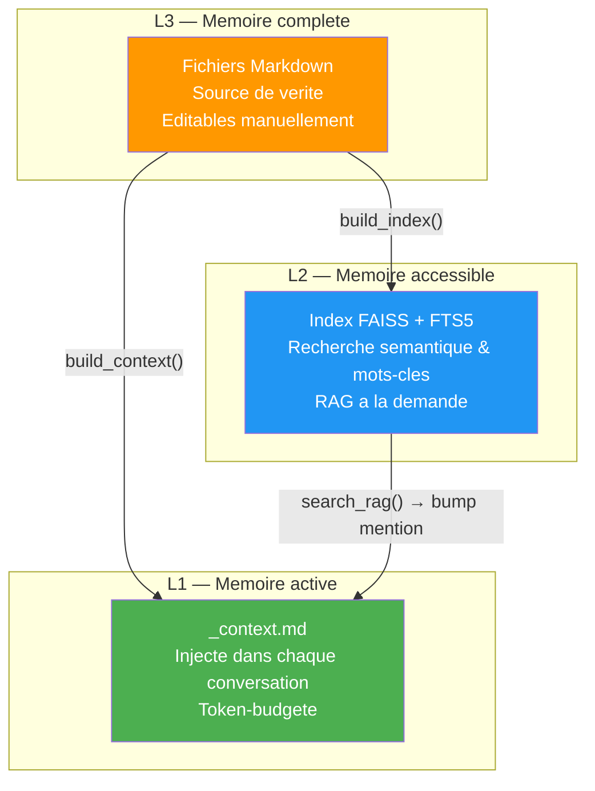
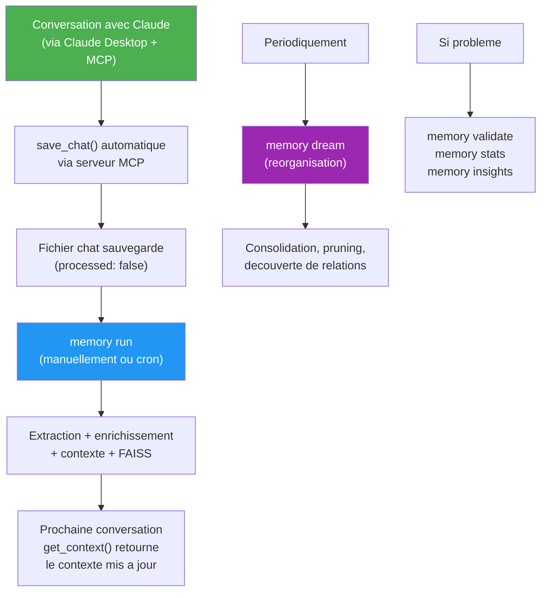
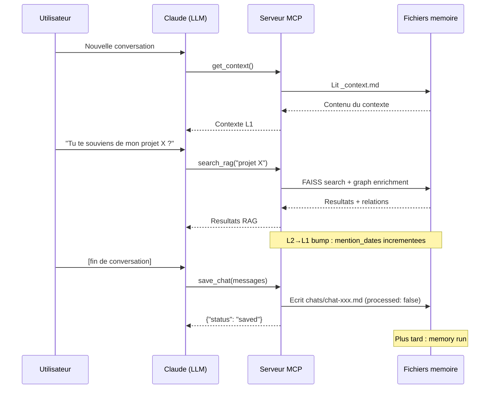
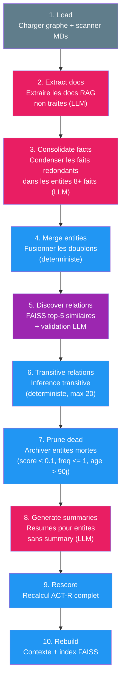

# MyMemory (memory-ai) — Vue d'ensemble du projet

> Systeme de memoire persistante personnelle pour LLMs.
> Local-first, base Markdown, inspire des sciences cognitives.

---

## Table des matieres

1. [Introduction](#1-introduction)
2. [Architecture globale](#2-architecture-globale)
3. [Installation et configuration](#3-installation-et-configuration)
4. [Utilisation quotidienne](#4-utilisation-quotidienne)
5. [Serveur MCP](#5-serveur-mcp)
6. [Format des fichiers](#6-format-des-fichiers)
7. [Mode Dream](#7-mode-dream)

---

## 1. Introduction

### 1.1 Qu'est-ce que MyMemory ?

MyMemory (nom de package : `memory-ai`) est un systeme de memoire persistante concu pour les grands modeles de langage (LLMs). Il resout un probleme fondamental : **les LLMs n'ont pas de memoire entre les conversations**. Chaque nouvelle session repart de zero, sans aucun souvenir des echanges precedents.

MyMemory comble ce manque en :

- **Extrayant** automatiquement les connaissances structurees (entites, relations, observations) a partir des conversations
- **Stockant** ces connaissances sous forme de fichiers Markdown lisibles et editables
- **Scorant** chaque souvenir avec un modele cognitif ACT-R (Adaptive Control of Thought -- Rational) qui simule la memoire humaine
- **Servant** le contexte pertinent a chaque nouvelle conversation via le protocole MCP (Model Context Protocol)

### 1.2 Philosophie du projet

Trois principes guident la conception de MyMemory :

#### Local-first

Toutes les donnees restent sur votre machine. Aucun serveur cloud n'est requis (sauf si vous choisissez un fournisseur LLM distant). Le systeme fonctionne parfaitement avec des modeles locaux via Ollama, LM Studio ou vLLM.

#### Markdown comme source de verite

Chaque entite memorisee est un fichier Markdown standard avec un frontmatter YAML. Vous pouvez lire, editer, versionner et sauvegarder ces fichiers avec n'importe quel outil. Aucun format proprietaire, aucune base de donnees opaque.

#### Inspire des sciences cognitives

Le systeme de scoring reproduit les mecanismes de la memoire humaine :

- **ACT-R** (base-level activation) : les souvenirs frequemment et recemment accedes restent actifs ; les autres s'estompent naturellement
- **Activation diffusante** (spreading activation) : les entites liees se renforcent mutuellement
- **Apprentissage hebbien** : "les neurones qui s'activent ensemble se connectent ensemble" -- les relations co-mentionnees se renforcent
- **Depression a long terme** (LTD) : les connexions inutilisees s'affaiblissent progressivement
- **Modulation emotionnelle** : les souvenirs a valence negative (diagnostics, vigilances) persistent plus longtemps, simulant la consolidation amygdale-hippocampe

### 1.3 Langue du domaine

Par defaut, MyMemory est configure en francais (`user_language: fr`). Cela signifie que le contenu genere par les LLMs (extractions, resumes, contexte) sera en francais. Cependant, tout le code source, les cles de configuration, les noms de sections et les constantes sont en **anglais**. Le template de contexte reste en anglais -- c'est le LLM recepteur qui traduit automatiquement grace a la variable `{user_language_name}`.

---

## 2. Architecture globale

### 2.1 Memoire a 3 niveaux

MyMemory organise les souvenirs en trois niveaux hierarchiques, inspires de l'architecture de la memoire humaine (memoire de travail, memoire a moyen terme, memoire a long terme) :



| Niveau | Stockage | Role | Acces |
|--------|----------|------|-------|
| **L1** | `_context.md` | Memoires actives injectees dans chaque conversation | Automatique (MCP `get_context()`) |
| **L2** | Index FAISS + FTS5 | Memoires accessibles par recherche RAG | Sur demande (MCP `search_rag()`) |
| **L3** | Fichiers Markdown | Base de connaissances complete, source de verite | Lecture directe / edition manuelle |

#### Re-emergence L2 vers L1

Lorsqu'une recherche RAG (`search_rag()`) retrouve une entite, ses `mention_dates` sont incrementees. Au prochain recalcul des scores (via `memory run` ou `memory dream`), le score ACT-R de cette entite remonte naturellement, et elle peut reintegrer le contexte L1. C'est le mecanisme de **re-emergence** : un souvenir oublie peut revenir a la surface s'il redevient pertinent.

Le re-ranking hybride utilise la fusion RRF (Reciprocal Rank Fusion) quand l'index FTS5 existe, combinant trois signaux :

- Similarite semantique (FAISS, vecteurs)
- Correspondance par mots-cles (FTS5)
- Score ACT-R (pertinence cognitive)

Sans index FTS5, un re-ranking lineaire est applique (60% vecteur + 40% ACT-R).

### 2.2 Pipeline complet (flux de donnees)

Voici le chemin parcouru par une conversation depuis sa capture jusqu'a son integration dans le contexte :


#### Etape 1 -- Extraction (`pipeline/extractor.py`)

L'extracteur envoie le contenu de la conversation au LLM avec le prompt `prompts/extract_facts.md`. Il produit une `RawExtraction` contenant des entites, des relations et un resume.

Mecanismes cles :

- **Segmentation automatique** : si le contenu depasse 70% de `context_window`, il est decoupe en segments chevauchants, chacun traite separement puis fusionne via `_merge_extractions()` (deduplication par slug/tuple de relation)
- **Detection de stall** : un thread watchdog surveille la progression des tokens en streaming. Si aucun token n'est recu pendant `timeout` secondes, une `StallError` est levee (`core/llm.py::_call_with_stall_detection()`)
- **Sanitisation post-extraction** : `sanitize_extraction()` corrige les types invalides produits par les petits modeles -- mapping flou des types de relation inventes, repli sur des valeurs par defaut, clampage de l'importance a [0, 1]
- **Fallback sur timeout** : apres 2 echecs, le pipeline bascule sur `doc_ingest` (chunking + indexation FAISS directe, sans creation d'entites). Les echecs sont enregistres dans `_retry_ledger.json`

#### Etape 2 -- Resolution (`pipeline/resolver.py`)

Le resolveur determine si chaque entite extraite correspond a une entite existante ou est nouvelle. **Aucun appel LLM** -- resolution purement deterministe.

Ordre de resolution :

1. Correspondance exacte par slug
2. Containment d'alias
3. Similarite FAISS (seuil : 0.75) avec requete enrichie par le contexte (categorie + debut du contenu de la premiere observation)
4. Si aucune correspondance : entite nouvelle

#### Etape 3 -- Arbitrage (`pipeline/arbitrator.py`)

Uniquement pour les entites avec `status="ambiguous"` (FAISS a trouve plusieurs candidats). Le LLM decide si l'entite correspond a un candidat existant ou est nouvelle.

- Prompt : `prompts/arbitrate_entity.md`
- Appel via `core/llm.py::_call_structured()` (pas de detection de stall, appel court)

#### Etape 4 -- Enrichissement (`pipeline/enricher.py`)

L'enrichisseur integre les donnees resolues dans la memoire :

- **Entites existantes** : lecture du MD, ajout des nouvelles observations (avec deduplication), incrementation de `frequency`, mise a jour de `mention_dates` (fenetrage), calcul de moyenne glissante de `importance`
- **Nouvelles entites** : creation du fichier MD dans le dossier mappe par `config.get_folder_for_type()`, ajout au graphe
- **Relations** : resolution des slugs, creation d'entites stub pour les references anticipees, appel de `graph.py::add_relation()` avec renforcement hebbien
- **Scoring** : `scoring.py::recalculate_all_scores()` -- ACT-R + activation diffusante
- **Persistance** : sauvegarde atomique de `_graph.json` (avec `.bak` et lockfile) + `_index.md`

#### Etape 5 -- Decouverte de relations (batch)

Apres l'enrichissement, une passe deterministe (zero LLM) decouvre de nouvelles relations par :

- Similarite FAISS entre entites
- Chevauchement de tags

#### Etape 6 -- Generation du contexte (`memory/context.py`)

Le constructeur de contexte genere `_context.md` a partir du graphe, sans appel LLM (mode `structured`, par defaut).

- Template : `prompts/context_template.md`
- Variables : `{date}`, `{user_language_name}`, `{ai_personality}`, `{sections}`, `{available_entities}`, `{custom_instructions}`
- Selection : les 50 entites avec le score le plus eleve, au-dessus de `min_score_for_context` (defaut : 0.3)

Les entites sont reparties en sections avec un budget de tokens par section (configurable via `context_budget`) :

| Section | Contenu | Budget par defaut |
|---------|---------|-------------------|
| AI Personality | Entites de type `ai_self` | 8% |
| Identity | Entites du dossier `self/` | 10% |
| Work | Types `work`, `organization` | 10% |
| Personal | Types `person`, `animal`, `place` | 10% |
| Top of Mind | Entites restantes a score eleve | 17% |
| Vigilances | Faits de categorie vigilance/diagnosis/treatment | 10% |
| History (recent) | Evenements recents | 12% |
| History (earlier) | Evenements intermediaires | 8% |
| History (longterm) | Evenements anciens | 5% |
| Instructions | Regles personnalisees (`context_instructions.md`) | 10% |

Chaque dossier d'entite est enrichi via `context.py::_enrich_entity()` : lecture des faits depuis le MD, collecte des relations BFS profondeur 1, tri chronologique des faits.

**Mode alternatif : contexte naturel** (`context_format: natural`) : genere le contexte en prose via des appels LLM par section, au lieu du template deterministe.

**Mode LLM par section** (`context_llm_sections: true`) : genere chaque section via LLM avec pre-fetch RAG, tout en gardant les vigilances deterministes.

#### Etape 7 -- Indexation FAISS (`pipeline/indexer.py`)

- `indexer.py::incremental_update()` compare les hash des fichiers au manifeste, reconstruit si necessaire
- `indexer.py::build_index()` : lecture de tous les MDs d'entites, chunking (400 tokens, 80 d'overlap), embedding, construction d'un `faiss.IndexFlatIP` (similarite cosinus sur vecteurs normalises)

### 2.3 Pipeline de fallback (`pipeline/doc_ingest.py`)

Quand l'extraction echoue (timeout, modele defaillant), le pipeline de secours prend le relais :

1. Normalisation du texte
2. Chunking
3. Embedding
4. Ajout direct a FAISS (sans creation d'entite)

L'etat est suivi dans `_ingest_jobs.json` via une machine a etats (`pipeline/ingest_state.py`) :
`pending` -> `running` -> `succeeded` | `failed` | `retriable`

### 2.4 Algorithme de scoring (ACT-R + activation diffusante)

#### Activation de base ACT-R

```
B = ln( SUM( t_j^(-d) ) )
```

Ou :

- `t_j` = nombre de jours depuis chaque mention (minimum 0.5)
- `d` = `decay_factor` (0.5 pour `long_term`, 0.8 pour `short_term`)
- Les sources incluent `mention_dates` (recentes, haute resolution) et `monthly_buckets` (anciennes, agregees)

#### Score final

```
score = sigmoid(B + importance * importance_weight + spreading_weight * S + emotional_boost)
```

Ou :

- `S` = bonus d'activation diffusante (voir ci-dessous)
- `emotional_boost` = `negative_valence_ratio * emotional_boost_weight` (modulation amygdalienne)
- Entites a retention permanente : `score >= permanent_min_score` (plancher 0.5)
- **Seuil de recuperation** : si `score < retrieval_threshold` (defaut 0.05) et non permanent, alors `score = 0.0` (oubli veritable, echec de recuperation ACT-R)

#### Activation diffusante (deux passes)

**Passe 1** : calcul des scores de base pour toutes les entites.

**Passe 2** : pour chaque relation, calcul de la force effective avec decroissance en loi de puissance :

```
eff_strength = rel.strength * (jours_depuis + 0.5)^(-relation_decay_power)
```

Construction d'un graphe bidirectionnel, puis pour chaque entite :

```
spreading_bonus = SUM(eff_strength_i * base_score_voisin_i) / total_strength
```

#### Apprentissage hebbien et depression a long terme

**Renforcement (LTP)** via `graph.py::add_relation()` -- quand deux entites co-apparaissent :

```
mention_count += 1
strength = min(1.0, strength + relation_strength_growth)  # defaut +0.05
last_reinforced = maintenant
```

**Affaiblissement (LTD)** via `scoring.py::_apply_ltd()` -- pendant `recalculate_all_scores()` :

```
si jours_depuis_renforcement > 90 :
    strength = max(0.1, strength * exp(-jours / relation_ltd_halflife))
```

#### Modulation emotionnelle

Le ratio `negative_valence_ratio` est calcule durant `rebuild_from_md()` a partir des faits de l'entite :

- Les faits avec valence `[-]`, ou de categorie `vigilance`, `diagnosis`, `treatment` comptent comme "emotionnels"
- Ratio = faits_emotionnels / total_faits
- Ce ratio booste l'activation via `emotional_boost_weight` (defaut : 0.15)
- Modelise la consolidation amygdale-hippocampe : les souvenirs emotionnels persistent plus longtemps

#### Fenetrage des mentions (`memory/mentions.py`)

- `mentions.py::add_mention()` : ajoute la date aux `mention_dates`
- Quand la liste depasse `window_size` (defaut : 50), `mentions.py::consolidate_window()` deplace les dates les plus anciennes dans `monthly_buckets` (format `YYYY-MM` -> compteur)
- Les deux sources alimentent `calculate_actr_base()` pour le scoring

---

## 3. Installation et configuration

### 3.1 Pre-requis

| Composant | Version minimale | Notes |
|-----------|-----------------|-------|
| Python | 3.11+ | Requis pour les fonctionnalites de typage |
| uv | Derniere version | Gestionnaire de paquets Python |
| Un fournisseur LLM | -- | Ollama (local), LM Studio, OpenAI, Anthropic, OpenRouter |

#### Installation de uv

```bash
# macOS / Linux
curl -LsSf https://astral.sh/uv/install.sh | sh

# ou via pip
pip install uv
```

#### Installation d'un LLM local (optionnel)

```bash
# Avec Ollama (recommande pour debuter)
brew install ollama          # macOS
ollama pull llama3.1:8b      # Telecharger le modele
ollama serve                 # Demarrer le serveur
```

### 3.2 Installation du projet

```bash
# Cloner le depot
git clone <url-du-depot> MyMemory
cd MyMemory

# Installer les dependances (inclut les dependances de developpement)
uv sync --extra dev
```

### 3.3 Configuration

#### Fichier config.yaml

Copiez le fichier d'exemple et adaptez-le a votre configuration :

```bash
cp config.yaml.example config.yaml
```

Voici les sections principales du fichier de configuration :

##### Langue

```yaml
user_language: fr  # Le contenu genere sera en francais
```

##### Fournisseurs LLM

Chaque etape du pipeline peut utiliser un modele different. Les prefixes supportes sont : `ollama/`, `openai/`, `anthropic/`, `openrouter/`. Pour les serveurs locaux (LM Studio, vLLM), utilisez le prefixe `openai/` avec `api_base`.

```yaml
llm:
  extraction:
    model: ollama/llama3.1:8b       # Modele pour l'extraction de faits
    context_window: 8192            # Fenetre de contexte du modele (tokens)
    temperature: 0                  # Temperature (0 = deterministe)
    max_retries: 3                  # Nombre de tentatives
    timeout: 60                     # Timeout en secondes
    # api_base: http://localhost:1234/v1  # Pour LM Studio / vLLM

  arbitration:
    model: ollama/llama3.1:8b
    temperature: 0
    max_retries: 2
    timeout: 30

  context:
    model: ollama/llama3.1:8b
    temperature: 0.3
    max_retries: 2
    timeout: 60

  consolidation:
    model: ollama/llama3.1:8b
    temperature: 0.1
```

Le mode Dream utilise optionnellement une cle `llm.dream`. Sans cette cle, il reprend la configuration de `llm.context` (via `config.llm_dream_effective`).

##### Embeddings

```yaml
embeddings:
  provider: sentence-transformers   # Local, aucune API requise
  model: all-MiniLM-L6-v2
  chunk_size: 400                   # Taille des chunks en tokens
  chunk_overlap: 80                 # Chevauchement entre chunks
```

Pour des embeddings via API :

```yaml
embeddings:
  provider: openai
  model: text-embedding-3-small
  # api_base: http://localhost:1234/v1  # Pour LM Studio
```

##### Stockage memoire

```yaml
memory:
  path: ./memory                    # Repertoire racine des donnees
  context_max_tokens: 3000          # Budget total du contexte L1
  context_narrative: false          # Prose narrative au lieu de sections structurees
  context_budget:                   # Repartition du budget par section (%)
    ai_personality: 8
    identity: 10
    work: 10
    personal: 10
    top_of_mind: 17
    vigilances: 10
    history_recent: 12
    history_earlier: 8
    history_longterm: 5
    instructions: 10
```

##### Scoring ACT-R

```yaml
scoring:
  model: act_r
  decay_factor: 0.5                # Decroissance standard ACT-R
  decay_factor_short_term: 0.8     # Decroissance rapide pour short_term
  importance_weight: 0.3           # Poids de l'importance evaluee par le LLM
  spreading_weight: 0.2            # Poids du bonus d'activation diffusante
  permanent_min_score: 0.5         # Score plancher pour les entites permanentes
  relation_strength_base: 0.5      # Force initiale des relations
  relation_decay_halflife: 180     # Demi-vie en jours (activation diffusante)
  relation_strength_growth: 0.05   # Increment hebbien par co-occurrence
  relation_ltd_halflife: 360       # Demi-vie LTD en jours (force stockee)
  relation_decay_power: 0.3        # Exposant loi de puissance (activation diffusante)
  retrieval_threshold: 0.05        # Sous ce seuil → oubli veritable
  emotional_boost_weight: 0.15     # Modulation amygdalienne
  window_size: 50                  # Nombre de mention_dates recentes conservees
  min_score_for_context: 0.3       # Score minimum pour apparaitre dans L1
```

##### Tache planifiee

```yaml
job:
  schedule: "0 3 * * *"            # Expression cron (ici : 3h du matin)
  idle_trigger_minutes: 10         # Declenchement apres N minutes d'inactivite
  max_chats_per_run: 20            # Maximum de chats traites par execution
```

##### Index FAISS

```yaml
faiss:
  index_path: ./memory/_memory.faiss
  mapping_path: ./memory/_memory.pkl
  manifest_path: ./memory/_faiss_manifest.json
  top_k: 5                         # Nombre de resultats par recherche
```

##### Serveur MCP

```yaml
mcp:
  transport: stdio                 # stdio (defaut) ou sse
  host: 0.0.0.0                    # Adresse de bind SSE (LAN)
  port: 8765                       # Port SSE
```

##### NLP (optionnel)

```yaml
nlp:
  enabled: true
  model: fr_core_news_sm           # Modele spaCy (requiert: python -m spacy download fr_core_news_sm)
  dedup_threshold: 0.85            # Seuil de similarite pour deduplication d'observations
  date_extraction: true            # Extraction de dates depuis le texte francais
  pre_ner: true                    # Detection de noms propres comme indices pour le resolveur
```

##### Recherche hybride

```yaml
search:
  hybrid_enabled: true             # Active le re-ranking hybride RRF
  fts_db_path: _fts.db             # Chemin de la base FTS5
  rrf_k: 60                        # Parametre k de la fusion RRF
  weight_semantic: 0.5             # Poids du signal semantique
  weight_keyword: 0.3              # Poids du signal mots-cles
  weight_actr: 0.2                 # Poids du signal ACT-R
```

##### Limite de faits par type d'entite

```yaml
max_facts:
  default: 50                      # Limite par defaut
  ai_self: 20                      # Limite specifique pour ai_self
```

##### Categories (doivent rester synchronisees avec `core/models.py`)

```yaml
categories:
  observations:
    - fact
    - preference
    - diagnosis
    - treatment
    - progression
    - technique
    - vigilance
    - decision
    - emotion
    - interpersonal
    - skill
    - project
    - context
    - rule
    - ai_style
    - user_reaction
    - interaction_rule

  entity_types:
    - person
    - health
    - work
    - project
    - interest
    - place
    - animal
    - organization
    - ai_self

  relation_types:
    - affects
    - improves
    - worsens
    - requires
    - linked_to
    - lives_with
    - works_at
    - parent_of
    - friend_of
    - uses
    - part_of
    - contrasts_with
    - precedes

  folders:
    person: close_ones
    health: self
    work: work
    project: projects
    interest: interests
    place: interests
    animal: close_ones
    organization: work
    ai_self: self
```

##### Fonctionnalites

```yaml
features:
  doc_pipeline: true               # Active le pipeline d'ingestion de documents
```

##### Ingestion (recuperation apres erreur)

```yaml
ingest:
  recovery_threshold_seconds: 300  # Seuil de recuperation (5 min)
  max_retries: 3                   # Nombre maximum de tentatives
  jobs_path: ./memory/_ingest_jobs.json
```

#### Fichier .env

Creez un fichier `.env` a la racine du projet pour les cles API :

```bash
# Pour OpenAI / OpenRouter
OPENAI_API_KEY=sk-...

# Pour Anthropic
ANTHROPIC_API_KEY=sk-ant-...

# Pour LM Studio / serveur local (la valeur peut etre quelconque)
OPENAI_API_KEY=lm-studio
```

### 3.4 Structure du dossier memory/

Le dossier `memory/` est cree automatiquement par `store.py::init_memory_structure()` au premier lancement de toute commande CLI. Voici sa structure :

```
memory/
  self/               # Entites de type health, ai_self
  close_ones/         # Entites de type person, animal
  work/               # Entites de type work, organization
  projects/           # Entites de type project
  interests/          # Entites de type interest, place
  chats/              # Conversations (YAML frontmatter + contenu)
  _inbox/             # Zone de depot pour l'ingestion de fichiers
  _archive/           # Entites archivees (pruning du mode Dream)
  _context.md         # Contexte L1 (genere)
  _index.md           # Index visuel des entites (genere)
  _graph.json         # Index des entites et relations (genere)
  _graph.json.bak     # Sauvegarde du graphe
  _memory.faiss       # Index vectoriel FAISS (genere)
  _memory.pkl         # Mapping des chunks FAISS (genere)
  _faiss_manifest.json # Manifeste FAISS (hash, modele, timestamp)
  _retry_ledger.json  # Suivi des extractions echouees
  _ingest_jobs.json   # Machine a etats d'ingestion de documents
```

Le mapping type d'entite vers sous-dossier est configure dans `categories.folders` du `config.yaml`.

---

## 4. Utilisation quotidienne

### 4.1 Commandes CLI

Le point d'entree CLI est defini dans `pyproject.toml` : `memory = "src.cli:cli"`. Toutes les commandes supportent les flags globaux `-v` / `--verbose` (logs de debug) et `-c` / `--config <chemin>` (chemin vers `config.yaml`).

```bash
# Syntaxe generale
uv run memory [FLAGS_GLOBAUX] <commande> [OPTIONS]
```

#### Commandes principales

##### `memory run` -- Pipeline complet

Traite tous les chats en attente a travers le pipeline complet : extraction, resolution, arbitrage, enrichissement, auto-consolidation des entites avec 8+ faits, generation du contexte et indexation FAISS.

```bash
uv run memory run
```

Le nombre de chats traites par execution est limite par `job.max_chats_per_run` (defaut : 20).

Point d'entree : `cli.py::run()` -> `orchestrator.py::run_pipeline(config, console, consolidate=True)`

##### `memory run-light` -- Pipeline sans consolidation

Identique a `run`, mais saute l'auto-consolidation (pas d'appels LLM pour la fusion de faits). Le contexte genere est purement deterministe.

```bash
uv run memory run-light
```

Point d'entree : `cli.py::run_light()` -> `orchestrator.py::run_pipeline(config, console, consolidate=False)`

##### `memory serve` -- Demarrer le serveur MCP

Lance le serveur MCP qui expose les 7 outils de memoire. Par defaut, utilise le transport `stdio` (adapte a Claude Desktop). Le transport peut etre change via `--transport` ou `config.yaml`.

```bash
# Transport stdio (defaut, pour Claude Desktop)
uv run memory serve

# Transport SSE (pour acces reseau)
uv run memory serve --transport sse
```

Point d'entree : `cli.py::serve()` -> `mcp/server.py::run_server()`

##### `memory stats` -- Metriques

Affiche un tableau recapitulatif de l'etat de la memoire : nombre d'entites (par type), de relations, de chats en attente, et statut des fichiers generes.

```bash
uv run memory stats
```

Exemple de sortie :

```
         memory-ai Statistics
┌──────────────────────────┬───────┐
│ Metric                   │ Value │
├──────────────────────────┼───────┤
│ Total entities (graph)   │ 142   │
│ Total entities (files)   │ 142   │
│ Total relations          │ 87    │
│ Pending chats            │ 3     │
│   └ health               │ 12    │
│   └ person               │ 45    │
│   └ work                 │ 18    │
│ _context.md              │ ok    │
│ _index.md                │ ok    │
│ FAISS index              │ ok    │
└──────────────────────────┴───────┘
```

##### `memory validate` -- Verification de coherence

Verifie la coherence du graphe : relations orphelines, fichiers manquants, references cassees.

```bash
uv run memory validate
```

##### `memory dream` -- Reorganisation cerebrale

Execute le pipeline de reorganisation en 10 etapes (voir [Section 7](#7-mode-dream) pour le detail).

```bash
# Execution complete
uv run memory dream

# Apercu sans modification
uv run memory dream --dry-run

# Execution d'une seule etape (ex: etape 3 = consolidation des faits)
uv run memory dream --step 3
```

##### `memory inbox` -- Traitement de la boite de reception

Traite les fichiers deposes dans `memory/_inbox/`. Les conversations sont sauvegardees comme chats non traites, les documents sont ingeres via `doc_ingest`.

```bash
uv run memory inbox
```

Formats supportes pour l'import JSON (via `pipeline/chat_splitter.py`) :

- **Claude.ai** : `chat_messages` avec `sender: human/assistant`
- **ChatGPT** : arbre `mapping` avec `author.role` et `content.parts`
- **Generique** : tableaux `[{role, content}]`

Chaque conversation est sauvegardee individuellement avec `processed: false`.

##### `memory consolidate` -- Detection de doublons

Detecte les entites potentiellement dupliquees (par nom ou alias).

```bash
# Apercu des doublons
uv run memory consolidate --dry-run

# Consolidation des faits redondants au sein des entites (via LLM)
uv run memory consolidate --facts

# Avec un seuil personnalise (minimum de faits pour declencher)
uv run memory consolidate --facts --min-facts 10
```

##### `memory replay` -- Rejouer les extractions echouees

Retente les extractions qui ont echoue precedemment, en utilisant le pipeline complet (pas le fallback `doc_ingest`).

```bash
# Lister les echecs en attente
uv run memory replay --list

# Rejouer les extractions
uv run memory replay
```

##### `memory context` -- Reconstruire le contexte

Reconstruit `_context.md` a partir du graphe actuel, sans extraction ni appel LLM (en mode `structured`). Recalcule aussi les scores ACT-R.

```bash
uv run memory context
```

##### `memory rebuild-all` -- Reconstruction complete

Reconstruit le graphe depuis les fichiers MD, recalcule les scores, regenere le contexte et reconstruit l'index FAISS. Repare aussi les entites avec des `mention_dates` vides.

```bash
uv run memory rebuild-all
```

##### `memory rebuild-graph` -- Reconstruction du graphe

Reconstruit `_graph.json` uniquement a partir des fichiers MD.

```bash
uv run memory rebuild-graph
```

##### `memory rebuild-faiss` -- Reconstruction de l'index FAISS

Reconstruit completement l'index FAISS.

```bash
uv run memory rebuild-faiss
```

##### `memory graph` -- Visualisation interactive

Genere et ouvre une visualisation interactive du graphe de connaissances dans le navigateur (fichier `_graph.html`).

```bash
uv run memory graph
```

##### `memory clean` -- Nettoyage

Supprime les fichiers generes et les caches. Effectue une sauvegarde avant toute suppression.

```bash
# Apercu de ce qui serait supprime
uv run memory clean --artifacts --dry-run

# Supprimer les artefacts generes (_context.md, _index.md, FAISS, graph)
uv run memory clean --artifacts

# Supprimer tout (artefacts + __pycache__ + inbox traitee)
uv run memory clean --all
```

Les fichiers supprimes sont sauvegardes dans `backups/pre-clean-<timestamp>.tar.gz`.

##### `memory actions` -- Historique des actions

Affiche l'historique centralise des actions effectuees sur la memoire.

```bash
# 20 dernieres actions (defaut)
uv run memory actions

# Filtrer par entite
uv run memory actions --entity "mal-de-dos"

# Filtrer par type d'action
uv run memory actions --action "create"

# Limiter le nombre d'actions affichees
uv run memory actions --last 50
```

##### `memory insights` -- Insights cognitifs

Affiche des insights sur l'etat de la memoire : distribution des scores, courbe d'oubli, points chauds emotionnels, relations faibles, hubs du reseau.

```bash
# Format texte (defaut)
uv run memory insights

# Format JSON (pour traitement automatise)
uv run memory insights --format json
```

### 4.2 Workflow typique

Voici un workflow quotidien type avec MyMemory :



1. **Conversation** : vous discutez avec Claude (ou un autre LLM) via Claude Desktop. Le serveur MCP est actif en arriere-plan.
2. **Sauvegarde** : a la fin de la conversation, le LLM appelle `save_chat()` pour sauvegarder l'echange.
3. **Traitement** : vous lancez `memory run` (manuellement ou via cron a 3h du matin, selon `job.schedule`). Le pipeline extrait les connaissances, enrichit la memoire, et met a jour le contexte.
4. **Prochaine conversation** : le LLM appelle `get_context()` au debut de la session et recoit le contexte mis a jour, avec les souvenirs pertinents.
5. **Recherche** : si le LLM a besoin d'une information specifique, il appelle `search_rag()`. Les entites retrouvees sont "bumpees" pour potentiellement reintegrer le contexte L1.
6. **Maintenance** : periodiquement, lancez `memory dream` pour reorganiser la memoire (consolider les faits, decouvrir de nouvelles relations, elaguer les entites mortes).

### 4.3 Configuration de cron

Pour automatiser le traitement :

```bash
# Editer le crontab
crontab -e

# Ajouter (traitement a 3h du matin chaque jour)
0 3 * * * cd /chemin/vers/MyMemory && uv run memory run >> /var/log/memory-ai.log 2>&1
```

---

## 5. Serveur MCP

### 5.1 Presentation

Le serveur MCP (Model Context Protocol) est l'interface entre MyMemory et les LLMs. Il expose 7 outils qui permettent au LLM de lire, ecrire et modifier la memoire pendant une conversation.

Le serveur est implemente dans `mcp/server.py` avec FastMCP. Le lanceur autonome pour Claude Desktop se trouve dans `mcp_stdio.py` (a la racine du projet, pas sous `src/`).

### 5.2 Les 7 outils MCP

#### `get_context()` -- Lire le contexte

Retourne le contenu de `_context.md`. Si ce fichier n'existe pas, retourne `_index.md` en fallback. Si aucun des deux n'existe, retourne un message invitant a lancer `memory run`.

```
Entree : aucune
Sortie : string (contenu Markdown du contexte)
```

C'est l'outil appele en debut de chaque conversation pour charger les souvenirs actifs.

#### `save_chat(messages)` -- Sauvegarder une conversation

Sauvegarde une conversation pour traitement ulterieur. Les messages sont valides (chaque element doit etre un dict avec `role` et `content` de type string).

```
Entree : messages (list[dict]) — ex: [{"role": "user", "content": "Bonjour"}, ...]
Sortie : dict — {"status": "saved", "file": "chats/chat-2026-03-11-...md"}
```

Le fichier est cree dans `memory/chats/` avec `processed: false` dans le frontmatter YAML.

#### `search_rag(query)` -- Recherche semantique

Effectue une recherche semantique dans la memoire via FAISS, enrichie par les relations du graphe.

```
Entree : query (string) — ex: "problemes de dos"
Sortie : dict — {"query": "...", "results": [...], "total": N}
```

Chaque resultat contient :

- `entity_id` : identifiant de l'entite
- `file` : chemin du fichier MD
- `score` : score de pertinence (apres re-ranking)
- `title` : titre de l'entite
- `type` : type d'entite
- `relations` : liste des relations (entrantes et sortantes)

**Re-ranking hybride** : si l'index FTS5 existe et `search.hybrid_enabled` est `true`, la fusion RRF combine trois signaux (semantique, mots-cles, ACT-R) avec les poids configurables `weight_semantic` (defaut 0.5), `weight_keyword` (0.3), `weight_actr` (0.2). Le parametre `rrf_k` (defaut 60) controle la penalisation du rang.

**Effet L2 vers L1** : apres chaque recherche, les `mention_dates` des entites trouvees sont incrementees et le graphe est sauvegarde. Cela remonte leur score ACT-R au prochain recalcul, leur permettant potentiellement de reintegrer le contexte L1.

#### `delete_fact(entity_name, fact_content)` -- Supprimer un fait

Supprime un fait specifique d'une entite. La correspondance se fait par sous-chaine insensible a la casse sur le contenu.

```
Entree :
  entity_name (string) — titre, slug ou alias de l'entite
  fact_content (string) — contenu du fait a supprimer (correspondance partielle)
Sortie : string (JSON) — {"status": "deleted", "entity": "...", "deleted_fact": "..."}
```

Une entree est ajoutee a la section History du fichier MD.

#### `delete_relation(from_entity, to_entity, relation_type)` -- Supprimer une relation

Supprime une relation entre deux entites, a la fois dans le graphe et dans le fichier MD source.

```
Entree :
  from_entity (string) — entite source
  to_entity (string) — entite cible
  relation_type (string) — type de relation (affects, parent_of, friend_of, etc.)
Sortie : string (JSON) — {"status": "deleted", "from": "...", "to": "...", "type": "..."}
```

#### `modify_fact(entity_name, old_content, new_content)` -- Modifier un fait

Modifie le contenu d'un fait tout en preservant ses metadonnees (categorie, date, valence, tags).

```
Entree :
  entity_name (string) — nom de l'entite
  old_content (string) — contenu a trouver (correspondance partielle)
  new_content (string) — nouveau contenu
Sortie : string (JSON) — {"status": "modified", "entity": "...", "old_fact": "...", "new_fact": "..."}
```

La correspondance utilise `store.py::parse_observation()` pour retrouver le fait, puis `store.py::format_observation()` pour regenerer la ligne avec le nouveau contenu et les metadonnees d'origine.

#### `correct_entity(entity_name, field, new_value)` -- Corriger les metadonnees d'une entite

Corrige les metadonnees d'une entite. Les champs modifiables sont : `title`, `type`, `aliases`, `retention`.

```
Entree :
  entity_name (string) — nom de l'entite
  field (string) — champ a corriger (title | type | aliases | retention)
  new_value (string) — nouvelle valeur (pour aliases : liste separee par des virgules)
Sortie : string (JSON) — {"status": "updated", "entity": "...", "changes": {...}}
```

Cas special : si le `type` est modifie, le fichier MD est deplace dans le dossier correspondant au nouveau type (via `config.get_folder_for_type()`). Le graphe est mis a jour en consequence.

### 5.3 Integration avec Claude Desktop

Pour integrer MyMemory avec Claude Desktop, utilisez le lanceur `mcp_stdio.py` qui se trouve a la racine du projet. Ce fichier injecte `sys.path` et configure le repertoire de travail sans necessiter d'installation pip.

Configuration dans Claude Desktop (`claude_desktop_config.json`) :

```json
{
  "mcpServers": {
    "memory-ai": {
      "command": "uv",
      "args": ["run", "python", "mcp_stdio.py"],
      "cwd": "/chemin/vers/MyMemory"
    }
  }
}
```

Ou pour un transport SSE (acces reseau) :

```bash
uv run memory serve --transport sse
```

Le serveur ecoute alors sur `mcp.host` (defaut : `0.0.0.0`) et `mcp.port` (defaut : `8765`).

### 5.4 Diagramme d'interaction MCP



---

## 6. Format des fichiers

### 6.1 Fichiers d'entites (Markdown)

Chaque entite memorisee est stockee dans un fichier Markdown avec trois sections standardisees. Le fichier est gere par `memory/store.py`.

#### Structure complete

```markdown
---
title: Mal de dos
type: health
retention: long_term
score: 0.72
importance: 0.85
frequency: 12
last_mentioned: "2026-03-07"
created: "2025-09-15"
aliases: [lombalgie, sciatique]
tags: [sante, chronique]
mention_dates: ["2026-03-01", "2026-03-07"]
monthly_buckets: {"2025-06": 3, "2025-09": 5}
summary: "Douleur chronique au dos avec episodes de sciatique."
---
## Facts
- [diagnosis] (2024-03) Sciatique chronique diagnostiquee [-]
- [treatment] (2025-11) Debut de la kinesitherapie [+]
- [fact] Suivi regulier necessaire
- [vigilance] Eviter les mouvements brusques [-] #posture #prevention

## Relations
- affects [[Routine quotidienne]]
- improves [[Natation]]

## History
- 2025-09-15: Created
- 2026-03-07: Modified fact: 'Suivi regulier' -> 'Suivi mensuel'
```

#### Frontmatter YAML

Le frontmatter est defini par le modele `EntityFrontmatter` dans `core/models.py`. Voici les champs :

| Champ | Type | Description |
|-------|------|-------------|
| `title` | string | Nom affichable de l'entite |
| `type` | EntityType | Type d'entite (voir categories) |
| `retention` | string | `long_term` ou `short_term` (affecte le `decay_factor`) |
| `score` | float | Score ACT-R actuel (0.0 - 1.0) |
| `importance` | float | Importance evaluee par le LLM (0.0 - 1.0) |
| `frequency` | int | Nombre total de mentions |
| `last_mentioned` | string | Date ISO de la derniere mention |
| `created` | string | Date ISO de creation |
| `aliases` | list[string] | Noms alternatifs pour la resolution |
| `tags` | list[string] | Tags thematiques |
| `mention_dates` | list[string] | Dates de mentions recentes (fenetrees) |
| `monthly_buckets` | dict | Compteurs mensuels pour les vieilles mentions (YYYY-MM -> count) |
| `summary` | string | Resume genere par le LLM (optionnel) |

#### Format des observations

Chaque ligne de la section `## Facts` suit ce format :

```
- [categorie] (date) contenu [valence] #tag1 #tag2
```

| Composant | Obligatoire | Format | Exemple |
|-----------|-------------|--------|---------|
| Categorie | Oui | `[category]` | `[diagnosis]`, `[fact]`, `[vigilance]` |
| Date | Non | `(YYYY-MM)` ou `(YYYY-MM-DD)` | `(2025-11)`, `(2025-11-15)` |
| Contenu | Oui | Texte libre (max 150 caracteres apres consolidation) | `Debut de la kinesitherapie` |
| Valence | Non | `[+]` positif, `[-]` negatif, `[~]` neutre | `[-]` |
| Tags | Non | `#tag` (max 3 par fait) | `#posture #prevention` |

Les 17 categories d'observation disponibles sont :

`fact`, `preference`, `diagnosis`, `treatment`, `progression`, `technique`, `vigilance`, `decision`, `emotion`, `interpersonal`, `skill`, `project`, `context`, `rule`, `ai_style`, `user_reaction`, `interaction_rule`

#### Section Relations

Chaque ligne de la section `## Relations` utilise le format wiki-link :

```
- type_relation [[Nom de l'entite cible]]
```

Les 13 types de relations disponibles sont :

`affects`, `improves`, `worsens`, `requires`, `linked_to`, `lives_with`, `works_at`, `parent_of`, `friend_of`, `uses`, `part_of`, `contrasts_with`, `precedes`

#### Section History

Journal des modifications, au format :

```
- YYYY-MM-DD: Description de l'action
```

#### Fonctions cles de store.py

| Fonction | Role |
|----------|------|
| `store.py::read_entity(path)` | Lit un fichier MD, retourne `(EntityFrontmatter, sections_dict)` |
| `store.py::write_entity(path, frontmatter, sections)` | Ecrit un fichier MD (ordre des sections : Facts, Relations, History) |
| `store.py::create_entity(memory_path, folder, slug, frontmatter, observations)` | Cree une nouvelle entite dans le dossier specifie |
| `store.py::create_stub_entity()` | Cree une entite minimale pour les references anticipees (short_term, importance 0.3) |
| `store.py::update_entity(path, new_observations, ...)` | Met a jour une entite existante (deduplication, bump frequency) |
| `store.py::_format_observation(obs)` | Convertit un dict en ligne Markdown |
| `store.py::_parse_observation(line)` | Parse une ligne Markdown en dict |
| `store.py::_is_duplicate_observation()` | Detecte les doublons (correspondance categorie + contenu, ignore date/valence) |
| `store.py::init_memory_structure(memory_path)` | Initialise tous les sous-dossiers du repertoire memoire |

### 6.2 Fichiers de conversation (chats)

Les conversations sont stockees dans `memory/chats/` avec un frontmatter YAML :

```markdown
---
source: mcp
processed: false
saved_at: "2026-03-11T14:30:00"
entities_updated: []
entities_created: []
---
user: Bonjour, j'ai eu ma seance de kine aujourd'hui.

assistant: Comment s'est passee la seance ?

user: Bien, on a travaille sur la mobilite du dos. Le kine dit que ca progresse.
```

Apres traitement par le pipeline, `processed` passe a `true` et les listes `entities_updated` / `entities_created` sont renseignees.

Pour les imports JSON (Claude.ai, ChatGPT, generique), le splitter (`pipeline/chat_splitter.py`) ajoute des metadonnees supplementaires :

```yaml
---
source: import
source_title: "Discussion sur le projet X"
processed: false
saved_at: "2026-03-11T15:00:00"
---
```

### 6.3 Fichiers systeme

#### `_graph.json` -- Graphe de connaissances

Fichier JSON central contenant toutes les entites et relations. Defini par le modele `GraphData` dans `core/models.py`.

```json
{
  "generated": "2026-03-11T14:00:00",
  "entities": {
    "mal-de-dos": {
      "file": "self/mal-de-dos.md",
      "type": "health",
      "title": "Mal de dos",
      "score": 0.72,
      "importance": 0.85,
      "frequency": 12,
      "last_mentioned": "2026-03-07",
      "retention": "long_term",
      "aliases": ["lombalgie", "sciatique"],
      "tags": ["sante", "chronique"],
      "mention_dates": ["2026-03-01", "2026-03-07"],
      "monthly_buckets": {"2025-06": 3},
      "created": "2025-09-15",
      "summary": "Douleur chronique au dos.",
      "negative_valence_ratio": 0.4
    }
  },
  "relations": [
    {
      "from": "mal-de-dos",
      "to": "routine-quotidienne",
      "type": "affects",
      "strength": 0.65,
      "created": "2025-09-15",
      "last_reinforced": "2026-03-07",
      "mention_count": 5,
      "context": "Le mal de dos affecte la routine quotidienne"
    }
  ]
}
```

**Atomicite** : la sauvegarde utilise `graph.py::save_graph()` avec ecriture dans un fichier temporaire + `os.replace()` + lockfile (`_graph.lock`, timeout 5 minutes) pour prevenir la corruption. Un backup `.bak` est cree avant chaque sauvegarde.

**Recuperation** : `graph.py::load_graph()` tente d'abord le fichier principal, puis `.bak` en cas de corruption, et enfin `graph.py::rebuild_from_md()` comme dernier recours.

#### `_context.md` -- Contexte L1

Fichier Markdown genere par `context.py::build_context()`, contenant les souvenirs actifs structures par section et budgetes en tokens. C'est ce fichier qui est retourne par l'outil MCP `get_context()`.

Le budget total est controle par `memory.context_max_tokens` (defaut : 3000 tokens). Chaque section recoit un pourcentage de ce budget configure dans `context_budget`.

#### `_index.md` -- Index visuel

Fichier Markdown listant toutes les entites du graphe avec leur score et type. Sert de fallback si `_context.md` n'existe pas.

#### `_retry_ledger.json` -- Registre des echecs

Suivi des extractions echouees pour la commande `memory replay` :

```json
[
  {
    "file": "memory/chats/chat-2026-03-10-abc.md",
    "error": "StallError: no tokens for 60s",
    "attempts": 2,
    "recorded": "2026-03-10T15:30:00"
  }
]
```

#### `_faiss_manifest.json` -- Manifeste FAISS

Suivi des fichiers indexes (hash de contenu) pour l'indexation incrementale :

```json
{
  "model": "all-MiniLM-L6-v2",
  "chunk_size": 400,
  "chunk_overlap": 80,
  "timestamp": "2026-03-11T14:00:00",
  "indexed_files": {
    "self/mal-de-dos.md": "sha256:abc123..."
  }
}
```

#### `_ingest_jobs.json` -- Machine a etats d'ingestion

Suivi des jobs d'ingestion de documents avec etats : `pending`, `running`, `succeeded`, `failed`, `retriable`.

#### `_graph.html` -- Visualisation interactive

Fichier HTML genere par `memory graph`, ouvrant une visualisation interactive du graphe dans le navigateur. Genere a chaque appel, gitignore.

### 6.4 Types d'entites et dossiers

Le mapping entre type d'entite et sous-dossier est configure dans `categories.folders` :

| Type d'entite | Sous-dossier | Description |
|---------------|-------------|-------------|
| `person` | `close_ones/` | Personnes (famille, amis, collegues) |
| `animal` | `close_ones/` | Animaux de compagnie |
| `health` | `self/` | Sujets de sante |
| `ai_self` | `self/` | Identite et personnalite de l'IA |
| `work` | `work/` | Sujets professionnels |
| `organization` | `work/` | Organisations |
| `project` | `projects/` | Projets |
| `interest` | `interests/` | Centres d'interet |
| `place` | `interests/` | Lieux |

---

## 7. Mode Dream

### 7.1 Presentation

Le mode Dream (`memory dream`) est un pipeline de reorganisation de la memoire inspire du role du sommeil dans la consolidation mnesique. Contrairement au pipeline principal (`memory run`) qui integre de nouvelles informations, le mode Dream **reorganise les connaissances existantes** : il consolide, fusionne, decouvre, elague et reconstruit.

Le nom "Dream" fait reference a l'hypothese scientifique selon laquelle le cerveau consolide et reorganise les souvenirs pendant le sommeil, en particulier durant les phases de sommeil paradoxal (REM).

Point d'entree : `cli.py::dream()` -> `pipeline/dream.py::run_dream()`

### 7.2 Les 10 etapes



Legende des couleurs :

- Rouge : etape utilisant le LLM
- Bleu : etape deterministe (zero LLM)
- Violet : etape hybride (FAISS deterministe + validation LLM)

| Etape | Nom | Type | Description |
|-------|-----|------|-------------|
| 1 | **Load** | Deterministe | Charge `_graph.json` et scanne tous les fichiers MD d'entites |
| 2 | **Extract docs** | LLM | Parcourt le manifeste FAISS a la recherche de documents RAG non extraits, puis applique le pipeline complet (`extractor.py::extract_from_chat()`) |
| 3 | **Consolidate facts** | LLM | Pour les entites ayant 8+ faits, appelle `llm.py::call_fact_consolidation()` pour condenser les observations redondantes. Validation deterministe post-consolidation |
| 4 | **Merge entities** | Deterministe | Detecte les doublons par chevauchement slug/alias, fusionne les observations, alias et relations |
| 5 | **Discover relations** | Hybride | Pour chaque entite, recherche les 5 entites les plus similaires via FAISS, puis valide les relations potentielles via LLM (`prompts/discover_relations.md`) |
| 6 | **Transitive relations** | Deterministe | Infere des relations transitives (ex: A affects B, B affects C implique A affects C). Plafonne a 20 nouvelles relations par execution |
| 7 | **Prune dead** | Deterministe | Archive les entites "mortes" dans `_archive/` selon les criteres : `score < 0.1`, `frequency <= 1`, `age > 90 jours`, aucune relation. L'archivage est reversible |
| 8 | **Generate summaries** | LLM | Genere des resumes pour les entites qui n'en ont pas (`prompts/summarize_entity.md`) |
| 9 | **Rescore** | Deterministe | Recalcul complet des scores ACT-R via `scoring.py::recalculate_all_scores()` |
| 10 | **Rebuild** | Deterministe | Reconstruction du contexte (`context.py::build_context()`) et de l'index FAISS (`indexer.py::build_index()`) |

### 7.3 Coordinateur deterministe

Le coordinateur (`dream.py::decide_dream_steps()`) decide quelles etapes executer en fonction de statistiques sur l'etat actuel de la memoire :

```python
# Extrait de dream.py::decide_dream_steps()
si unextracted_docs > 0     → etape 2
si consolidation_candidates >= 3  → etape 3
si merge_candidates >= 2    → etape 4
si relation_candidates >= 5 → etape 5
si transitive_candidates >= 3  → etape 6
si prune_candidates >= 1    → etape 7
si summary_candidates >= 3  → etape 8
si une etape 2-8 est planifiee → etapes 9 + 10
```

L'etape 1 (Load) est toujours executee. Les etapes de finalisation (9, 10) ne sont ajoutees que si au moins une etape de travail (2-8) a ete planifiee.

Les etapes critiques (3, 4, 5) font l'objet d'une validation deterministe post-execution (`dream.py::_validate_step()`) : verification que le nombre total de faits ou d'entites n'a pas diminue de facon anormale.

### 7.4 Tableau de bord Rich

Le mode Dream affiche un tableau de bord en temps reel dans le terminal grace a Rich Live (`pipeline/dream_dashboard.py`). Chaque etape affiche son statut :

- `pending` : en attente
- `running` : en cours (avec indicateur d'activite)
- `done` : termine (avec resume)
- `failed` : echoue (avec message d'erreur)
- `skipped` : ignore (non planifie par le coordinateur)

### 7.5 Configuration LLM dediee

Le mode Dream peut utiliser une configuration LLM separee via la cle `llm.dream` dans `config.yaml` :

```yaml
llm:
  dream:
    model: ollama/llama3.1:8b
    temperature: 0.1
    timeout: 90
```

Sans cette cle, il utilise la configuration de `llm.context` (accessible via `config.llm_dream_effective`).

### 7.6 Quand utiliser le mode Dream

- **Hebdomadaire** : lancez `memory dream` une fois par semaine pour maintenir la memoire en bonne sante
- **Apres un afflux** : si vous avez importe beaucoup de conversations, un Dream consolide les connaissances
- **Avant un audit** : lancez `memory dream --dry-run` pour voir les reorganisations potentielles sans les appliquer
- **Etape specifique** : utilisez `--step N` pour cibler une operation precise (ex: `--step 7` pour le pruning seul)

### 7.7 Rapport de Dream

A la fin de l'execution, un rapport resume les actions effectuees (via `DreamReport`) :

```
Dream report:
  Docs extracted: 2
  Facts consolidated: 15
  Entities merged: 3
  Relations discovered: 7
  Transitive relations: 4
  Entities pruned: 5
  Summaries generated: 8
```

---

## Annexes

### A. Resume des fichiers source

| Fichier | Role |
|---------|------|
| `src/cli.py` | Interface CLI Click (wrappers minces sur l'orchestrateur) |
| `src/core/config.py` | Chargement et validation de la configuration |
| `src/core/llm.py` | Abstraction LLM (Instructor, streaming anti-stall, reparation JSON) |
| `src/core/models.py` | Modeles de donnees Pydantic (entites, relations, graphe) |
| `src/core/utils.py` | Utilitaires centralises (slugify, estimate_tokens, parse_frontmatter) |
| `src/pipeline/extractor.py` | Etape 1 : extraction LLM depuis les conversations |
| `src/pipeline/resolver.py` | Etape 2 : resolution deterministe (slug, alias, FAISS) |
| `src/pipeline/arbitrator.py` | Etape 3 : arbitrage LLM pour les entites ambigues |
| `src/pipeline/enricher.py` | Etape 4 : enrichissement memoire (MD + graphe + scoring) |
| `src/pipeline/indexer.py` | Indexation FAISS (incrementale + construction complete) |
| `src/pipeline/orchestrator.py` | Orchestration du pipeline (logique metier extraite du CLI) |
| `src/pipeline/dream.py` | Mode Dream (10 etapes de reorganisation) |
| `src/pipeline/dream_dashboard.py` | Tableau de bord Rich Live pour le mode Dream |
| `src/pipeline/doc_ingest.py` | Pipeline de fallback (chunking + FAISS direct) |
| `src/pipeline/inbox.py` | Traitement de la boite de reception |
| `src/pipeline/chat_splitter.py` | Import JSON (Claude.ai, ChatGPT, generique) |
| `src/pipeline/ingest_state.py` | Machine a etats pour l'ingestion de documents |
| `src/memory/graph.py` | Gestion du graphe (load, save, add_relation, rebuild, validate) |
| `src/memory/store.py` | I/O Markdown (lecture, ecriture, creation d'entites) |
| `src/memory/context.py` | Generation du contexte L1 (deterministe ou LLM) |
| `src/memory/scoring.py` | Calcul des scores ACT-R + activation diffusante + LTD |
| `src/memory/mentions.py` | Fenetrage des mention_dates + monthly_buckets |
| `src/memory/insights.py` | Insights cognitifs (distribution, oubli, hubs) |
| `src/mcp/server.py` | Serveur MCP FastMCP (7 outils) |
| `mcp_stdio.py` | Lanceur autonome MCP pour Claude Desktop |

### B. Categories completes

#### Types d'entites (9)

`person`, `health`, `work`, `project`, `interest`, `place`, `animal`, `organization`, `ai_self`

#### Categories d'observations (17)

`fact`, `preference`, `diagnosis`, `treatment`, `progression`, `technique`, `vigilance`, `decision`, `emotion`, `interpersonal`, `skill`, `project`, `context`, `rule`, `ai_style`, `user_reaction`, `interaction_rule`

#### Types de relations (13)

`affects`, `improves`, `worsens`, `requires`, `linked_to`, `lives_with`, `works_at`, `parent_of`, `friend_of`, `uses`, `part_of`, `contrasts_with`, `precedes`

### C. Parametres de scoring (valeurs par defaut)

| Parametre | Valeur | Description |
|-----------|--------|-------------|
| `decay_factor` | 0.5 | Decroissance ACT-R standard (long_term) |
| `decay_factor_short_term` | 0.8 | Decroissance rapide (short_term) |
| `importance_weight` | 0.3 | Poids de l'importance LLM |
| `spreading_weight` | 0.2 | Poids de l'activation diffusante |
| `permanent_min_score` | 0.5 | Score plancher pour retention permanente |
| `relation_strength_base` | 0.5 | Force initiale des relations |
| `relation_decay_halflife` | 180 | Demi-vie de la force effective (jours) |
| `relation_strength_growth` | 0.05 | Increment hebbien par co-occurrence |
| `relation_ltd_halflife` | 360 | Demi-vie LTD de la force stockee (jours) |
| `relation_decay_power` | 0.3 | Exposant loi de puissance (activation diffusante) |
| `retrieval_threshold` | 0.05 | Seuil de recuperation (en dessous = oubli) |
| `emotional_boost_weight` | 0.15 | Boost emotionnel (modulation amygdalienne) |
| `window_size` | 50 | Nombre de mention_dates conservees |
| `min_score_for_context` | 0.3 | Score minimum pour le contexte L1 |

---

*Document genere pour le projet MyMemory (memory-ai). Derniere mise a jour : mars 2026.*
