# Algorithmes et Methodes

Documentation technique des algorithmes, modeles cognitifs et methodes implementes dans MyMemory.

---

## Table des matieres

1. [Modele cognitif ACT-R](#1-modele-cognitif-act-r)
2. [Activation par propagation (Spreading Activation)](#2-activation-par-propagation-spreading-activation)
3. [Apprentissage Hebbien (LTP/LTD)](#3-apprentissage-hebbien-ltpltd)
4. [Modulation emotionnelle](#4-modulation-emotionnelle)
5. [Score final (sigmoid)](#5-score-final-sigmoid)
6. [Fenetrage des mentions](#6-fenetrage-des-mentions)
7. [Extraction LLM (stall-aware streaming)](#7-extraction-llm-stall-aware-streaming)
8. [Resolution d'entites](#8-resolution-dentites)
9. [Indexation FAISS](#9-indexation-faiss)
10. [Recherche hybride (RRF)](#10-recherche-hybride-rrf)
11. [Generation de contexte](#11-generation-de-contexte)
12. [Consolidation de faits](#12-consolidation-de-faits)
13. [Pipeline Dream (10 etapes)](#13-pipeline-dream-10-etapes)
14. [Ecriture atomique et integrite](#14-ecriture-atomique-et-integrite)
15. [JSON repair thread-safe](#15-json-repair-thread-safe)

---

## 1. Modele cognitif ACT-R

### 1.1 Theorie

Le systeme de scoring de MyMemory repose sur le modele cognitif **ACT-R** (Adaptive Control of Thought -- Rational), developpe par John R. Anderson. Ce modele simule les mecanismes de la memoire humaine, ou les souvenirs recemment et frequemment rappeles sont plus facilement accessibles.

L'idee centrale est l'**activation de base** (Base-Level Activation) : chaque souvenir possede un niveau d'activation qui decroit avec le temps selon une loi de puissance (power-law decay), mais qui se renforce a chaque rappel.

### 1.2 Formule mathematique

L'activation de base B est calculee comme suit :

```
B = ln( SUM( t_j^(-d) ) )
```

Ou :
- `t_j` = nombre de jours ecoules depuis chaque mention (minimum 0.5 pour eviter la division par zero)
- `d` = facteur de decroissance (decay factor)
- La somme porte sur **toutes** les mentions de l'entite, recentes et archivees

### 1.3 Parametres de decroissance

Le facteur de decroissance `d` varie selon le type de retention de l'entite :

| Retention     | Parametre                   | Valeur par defaut | Effet                                    |
|---------------|-----------------------------|-------------------|------------------------------------------|
| `long_term`   | `scoring.decay_factor`      | **0.5**           | Decroissance lente, souvenirs persistants |
| `short_term`  | `scoring.decay_factor_short_term` | **0.8**     | Decroissance rapide, oubli accelere       |

Un `d` plus eleve signifie un oubli plus rapide. Les entites `long_term` conservent donc leur activation bien plus longtemps que les entites `short_term`.

### 1.4 Sources de donnees temporelles

L'activation de base s'alimente de deux sources complementaires :

1. **`mention_dates`** : liste des dates de mention recentes (haute resolution, fenetre glissante de `window_size` elements, par defaut 50)
2. **`monthly_buckets`** : dictionnaire `{YYYY-MM: count}` pour les mentions consolidees plus anciennes (basse resolution, illimitee)

Pour les `monthly_buckets`, chaque bucket utilise le 15 du mois comme date representative, et le compteur sert de multiplicateur.

### 1.5 Implementation

L'implementation se trouve dans `src/memory/scoring.py` :

```python
def calculate_actr_base(
    mention_dates: list[str],
    monthly_buckets: dict[str, int],
    decay_factor: float,
    today: date,
) -> float:
    """ACT-R base-level activation: B = ln(sum(t_j^(-d)))."""
    summation = 0.0

    # Mentions recentes (haute resolution)
    for ds in mention_dates:
        try:
            d = datetime.fromisoformat(ds).date() if "T" in ds else date.fromisoformat(ds)
            days = max((today - d).days, 0) + 0.5  # minimum 0.5
            summation += days ** (-decay_factor)
        except (ValueError, TypeError):
            continue

    # Mentions archivees (basse resolution, mid-month)
    for bucket_key, count in monthly_buckets.items():
        try:
            parts = bucket_key.split("-")
            year, month = int(parts[0]), int(parts[1])
            mid = date(year, month, 15)
            days = max((today - mid).days, 0) + 0.5
            summation += count * (days ** (-decay_factor))
        except (ValueError, TypeError, IndexError):
            continue

    if summation <= 0:
        return -5.0  # Activation tres basse si aucune mention

    return math.log(summation)
```

### 1.6 Seuil de recuperation (Retrieval Threshold)

ACT-R definit un **seuil de recuperation** en dessous duquel un souvenir est considere comme irrecuperable -- c'est l'**oubli veritable**. Dans MyMemory :

- Parametre : `scoring.retrieval_threshold` (defaut : **0.05**)
- Si `score < retrieval_threshold` et l'entite n'est pas `permanent` : `score = 0.0`
- L'entite existe toujours dans les fichiers Markdown (L3), mais elle disparait du contexte actif (L1) et n'influence plus les scores de propagation

```python
# Retrieval threshold: below tau -> true forgetting (ACT-R retrieval failure)
if entity.retention != "permanent" and score < s.retrieval_threshold:
    score = 0.0
```

### 1.7 Diagramme du flux de calcul ACT-R

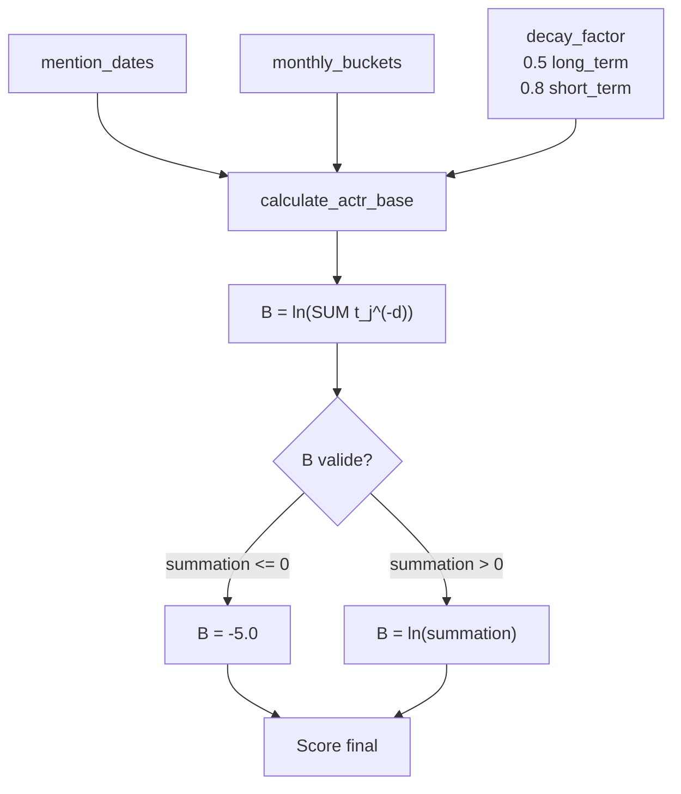

---

## 2. Activation par propagation (Spreading Activation)

### 2.1 Principe

L'activation par propagation modelise le fait que les souvenirs lies entre eux se renforcent mutuellement. Si vous pensez souvent a votre travail, les entites liees (collegues, projets, outils) recoivent un bonus d'activation meme si elles n'ont pas ete mentionnees directement.

### 2.2 Algorithme en deux passes

L'algorithme se deroule en deux passes distinctes :

**Passe 1 -- Scores de base :** Calcul du score ACT-R de base + importance pour chaque entite, passe a travers la sigmoide :

```python
base_scores[eid] = sigmoid(B + importance * importance_weight)
```

**Passe 2 -- Propagation :** Pour chaque entite, calcul du bonus de propagation a partir de ses voisins dans le graphe :

```python
S_i = SUM(w_ij * A_j) / SUM(w_ij)
```

Ou :
- `w_ij` = force effective de la relation entre i et j
- `A_j` = score de base du voisin j (calcule en Passe 1)
- La normalisation par `SUM(w_ij)` empeche les entites tres connectees d'avoir un avantage disproportionne

### 2.3 Decroissance temporelle des relations (Power-Law)

La force effective d'une relation decroit dans le temps selon une **loi de puissance** :

```
eff_strength = strength * (days_since + 0.5)^(-relation_decay_power)
```

| Parametre                     | Valeur par defaut | Role                                       |
|-------------------------------|-------------------|---------------------------------------------|
| `relation_decay_power`        | **0.3**           | Exposant de la decroissance temporelle       |
| `relation_strength_base`      | **0.5**           | Force initiale d'une nouvelle relation       |

Cette decroissance est **complementaire** a la LTD (Long-Term Depression, cf. section 3) : la LTD modifie la force stockee (`strength`), tandis que la power-law decay module la force effective utilisee pour la propagation.

### 2.4 Bidirectionnalite

Les relations sont traitees de maniere **bidirectionnelle** : une relation `A -> affects -> B` propage l'activation dans les deux sens. L'adjacence est construite symetriquement :

```python
adjacency[rel.to_entity].append((rel.from_entity, effective_strength))
adjacency[rel.from_entity].append((rel.to_entity, effective_strength))
```

### 2.5 Implementation complete

```python
def spreading_activation(
    graph: GraphData, config: Config, today: date | None = None,
) -> dict[str, float]:
    """Compute spreading activation bonus for all entities."""
    s = config.scoring

    # Passe 1 : scores de base
    base_scores: dict[str, float] = {}
    for eid, entity in graph.entities.items():
        decay = s.decay_factor_short_term if entity.retention == "short_term" else s.decay_factor
        B = calculate_actr_base(entity.mention_dates, entity.monthly_buckets, decay, today)
        beta = entity.importance * s.importance_weight
        base_scores[eid] = _sigmoid(B + beta)

    # Construction de l'adjacence bidirectionnelle avec forces effectives
    adjacency: dict[str, list[tuple[str, float]]] = defaultdict(list)
    for rel in graph.relations:
        days_since = 0.0
        if rel.last_reinforced:
            try:
                d = date.fromisoformat(rel.last_reinforced)
                days_since = max((today - d).days, 0)
            except (ValueError, TypeError):
                days_since = 365.0

        effective_strength = rel.strength * (days_since + 0.5) ** (-s.relation_decay_power)

        adjacency[rel.to_entity].append((rel.from_entity, effective_strength))
        adjacency[rel.from_entity].append((rel.to_entity, effective_strength))

    # Passe 2 : bonus de propagation
    spreading: dict[str, float] = {}
    for eid in graph.entities:
        if eid not in adjacency:
            spreading[eid] = 0.0
            continue
        neighbors = adjacency[eid]
        total_strength = sum(eff for _, eff in neighbors)
        if total_strength <= 0:
            spreading[eid] = 0.0
            continue
        bonus = 0.0
        for neighbor_id, eff in neighbors:
            if neighbor_id in base_scores:
                bonus += eff * base_scores[neighbor_id]
        spreading[eid] = bonus / total_strength

    return spreading
```

### 2.6 Diagramme de propagation

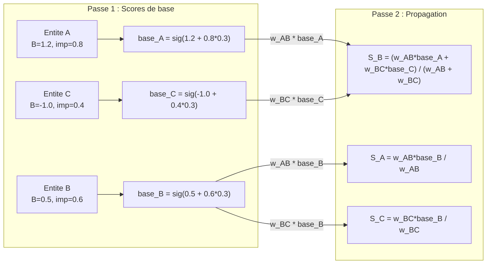

---

## 3. Apprentissage Hebbien (LTP/LTD)

### 3.1 Principe neurobiologique

"Les neurones qui s'activent ensemble se lient ensemble" -- cette regle de Hebb est le fondement de la plasticite synaptique. MyMemory implemente les deux faces de cette plasticite :

- **LTP (Long-Term Potentiation)** : le renforcement synaptique quand deux entites sont co-mentionnees
- **LTD (Long-Term Depression)** : l'affaiblissement synaptique quand une connexion n'est plus utilisee

### 3.2 LTP -- Renforcement Hebbien

Quand deux entites co-occurrent (dans un meme chat, ou lors d'une decouverte de relation), la relation existante est **renforcee** :

```python
def add_relation(graph: GraphData, relation: GraphRelation,
                 *, strength_growth: float = 0.05) -> GraphData:
    """Add a relation, or reinforce existing duplicate (same from+to+type)."""
    for existing in graph.relations:
        if (existing.from_entity == relation.from_entity
                and existing.to_entity == relation.to_entity
                and existing.type == relation.type):
            # Renforcement Hebbien
            existing.mention_count += 1
            existing.last_reinforced = datetime.now().isoformat()
            existing.strength = min(1.0, existing.strength + strength_growth)
            if relation.context and not existing.context:
                existing.context = relation.context
            return graph
    # Nouvelle relation
    if not relation.created:
        relation.created = datetime.now().isoformat()
    if not relation.last_reinforced:
        relation.last_reinforced = relation.created
    graph.relations.append(relation)
    return graph
```

| Parametre                       | Valeur par defaut | Role                                          |
|---------------------------------|-------------------|-----------------------------------------------|
| `relation_strength_growth`      | **0.05**          | Increment de force par co-occurrence           |
| `relation_strength_base`        | **0.5**           | Force initiale d'une nouvelle relation         |
| Plafond de force                | **1.0**           | Saturation maximale (min dans le code)         |

### 3.3 LTD -- Depression a long terme

Les relations non renforcees pendant plus de 90 jours subissent une decroissance exponentielle de leur force stockee :

```python
def _apply_ltd(graph: GraphData, config: Config, today: date) -> None:
    """Apply Long-Term Depression to relation strengths."""
    s = config.scoring
    for rel in graph.relations:
        if not rel.last_reinforced:
            continue
        try:
            d = date.fromisoformat(rel.last_reinforced)
            days = (today - d).days
        except (ValueError, TypeError):
            continue
        if days > 90:
            decay = math.exp(-days / s.relation_ltd_halflife)
            rel.strength = round(max(0.1, rel.strength * decay), 4)
```

| Parametre                  | Valeur par defaut | Role                                              |
|----------------------------|-------------------|----------------------------------------------------|
| `relation_ltd_halflife`    | **360**           | Demi-vie de la LTD en jours                        |
| Seuil de declenchement     | **90 jours**      | Delai avant le debut de la LTD                     |
| Plancher de force          | **0.1**           | Force minimale (la relation ne disparait jamais)    |

### 3.4 Interaction LTP/LTD

La LTD est appliquee a chaque recalcul des scores (`recalculate_all_scores()`), avant le calcul de la propagation. Le cycle complet :

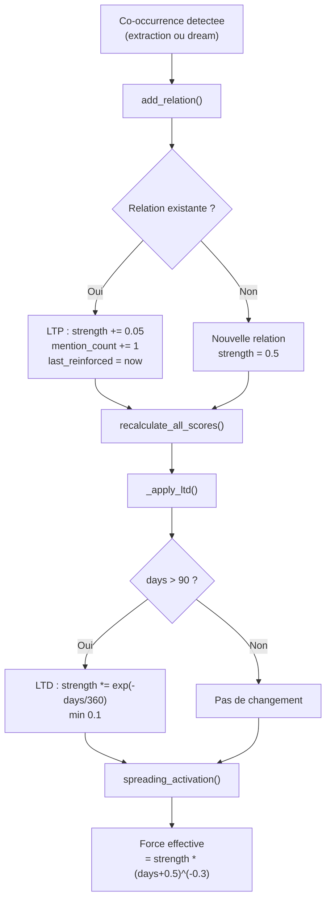

### 3.5 Double decroissance des relations

Les relations subissent donc deux mecanismes de decroissance distincts :

1. **LTD (stockee)** : modifie la valeur `strength` dans `_graph.json` -- c'est un changement **permanent** qui ne se produit qu'apres 90 jours sans renforcement
2. **Power-law decay (effective)** : calcule a la volee lors de la propagation -- c'est un effet **instantane** qui reduit l'influence des relations non-recentes

Les deux mecanismes se combinent multiplicativement : une relation non renforcee depuis longtemps voit sa force stockee baisser (LTD) ET sa force effective baisser encore plus (power-law).

---

## 4. Modulation emotionnelle

### 4.1 Modele amygdale-hippocampe

Les neurosciences montrent que les souvenirs a forte charge emotionnelle sont mieux consolides grace a l'interaction entre l'amygdale (traitement emotionnel) et l'hippocampe (formation des souvenirs). MyMemory modelise cet effet via un **boost emotionnel**.

### 4.2 Calcul du ratio de valence negative

Le `negative_valence_ratio` est calcule lors de la reconstruction du graphe a partir des fichiers Markdown (`rebuild_from_md()`). Il represente la proportion de faits "emotionnels" dans une entite :

```python
def _compute_negative_valence_ratio(body: str) -> float:
    """Compute ratio of negative/vigilance/diagnosis facts."""
    _EMOTIONAL_CATEGORIES = {"vigilance", "diagnosis", "treatment"}
    in_facts = False
    total = 0
    negative_count = 0
    for line in body.split("\n"):
        if line.startswith("## Facts"):
            in_facts = True
            continue
        if line.startswith("## ") and in_facts:
            break
        if in_facts and line.strip().startswith("- ["):
            total += 1
            if "[-]" in line:
                negative_count += 1
            else:
                cat_match = re.match(r"- \[(\w+)\]", line.strip())
                if cat_match and cat_match.group(1) in _EMOTIONAL_CATEGORIES:
                    negative_count += 1
    if total == 0:
        return 0.0
    return round(negative_count / total, 4)
```

Sont consideres comme "emotionnels" :
- Les faits avec une valence negative `[-]`
- Les faits de categorie `vigilance`, `diagnosis` ou `treatment` (quelle que soit leur valence)

### 4.3 Boost dans le score final

```python
emotional_boost = entity.negative_valence_ratio * s.emotional_boost_weight
```

| Parametre                  | Valeur par defaut | Role                                          |
|----------------------------|-------------------|------------------------------------------------|
| `emotional_boost_weight`   | **0.15**          | Poids du boost emotionnel dans l'activation    |

### 4.4 Effet pratique

Une entite dont 50% des faits sont emotionnels recevra un boost de `0.5 * 0.15 = 0.075` dans son activation totale. Apres passage par la sigmoide, cela peut faire la difference entre un score en dessous et au-dessus du seuil `min_score_for_context` (defaut 0.3), garantissant que les souvenirs emotionnellement charges restent plus longtemps dans le contexte actif.

---

## 5. Score final (sigmoid)

### 5.1 Formule complete

Le score final d'une entite combine tous les composants via une **fonction sigmoide** :

```
score = sigmoid( B + beta + spreading_weight * S + emotional_boost )
```

Ou :
- `B` = activation de base ACT-R (cf. section 1)
- `beta = importance * importance_weight` (boost d'importance)
- `S` = bonus de propagation (cf. section 2)
- `emotional_boost = negative_valence_ratio * emotional_boost_weight` (cf. section 4)

La sigmoide `sigma(x) = 1 / (1 + e^(-x))` garantit que le score final est toujours dans l'intervalle `(0, 1)`.

### 5.2 Tableau des parametres

| Parametre              | Valeur par defaut | Role                                          |
|------------------------|-------------------|------------------------------------------------|
| `importance_weight`    | **0.3**           | Poids de l'importance dans l'activation        |
| `spreading_weight`     | **0.2**           | Poids de la propagation dans l'activation      |
| `emotional_boost_weight` | **0.15**        | Poids du boost emotionnel                      |
| `permanent_min_score`  | **0.5**           | Score plancher pour les entites permanentes     |
| `retrieval_threshold`  | **0.05**          | Seuil d'oubli veritable                        |
| `min_score_for_context`| **0.3**           | Score minimum pour apparaitre dans _context.md |

### 5.3 Implementation

```python
def calculate_score(
    entity: GraphEntity, config: Config, today: date | None = None,
    spreading_bonus: float = 0.0,
) -> float:
    s = config.scoring

    # Facteur de decroissance selon retention
    decay = s.decay_factor_short_term if entity.retention == "short_term" else s.decay_factor

    # Activation de base ACT-R
    B = calculate_actr_base(entity.mention_dates, entity.monthly_buckets, decay, today)

    # Boost d'importance
    beta = entity.importance * s.importance_weight

    # Modulation emotionnelle (amygdale)
    emotional_boost = entity.negative_valence_ratio * s.emotional_boost_weight

    # Activation combinee
    activation = B + beta + s.spreading_weight * spreading_bonus + emotional_boost

    score = _sigmoid(activation)

    # Plancher pour entites permanentes
    if entity.retention == "permanent":
        score = max(score, s.permanent_min_score)

    # Seuil de recuperation : oubli veritable
    if entity.retention != "permanent" and score < s.retrieval_threshold:
        score = 0.0

    return round(score, 4)
```

### 5.4 Pipeline de recalcul complet

La fonction `recalculate_all_scores()` orchestre le recalcul :

```python
def recalculate_all_scores(graph, config, today=None):
    # 1. LTD : affaiblir les relations non renforcees
    _apply_ltd(graph, config, today)
    # 2. Spreading activation : calculer les bonus de propagation
    bonuses = spreading_activation(graph, config, today)
    # 3. Score final : combiner tous les composants
    for entity_id, entity in graph.entities.items():
        bonus = bonuses.get(entity_id, 0.0)
        entity.score = calculate_score(entity, config, today, spreading_bonus=bonus)
    return graph
```

### 5.5 Diagramme du flux de scoring complet

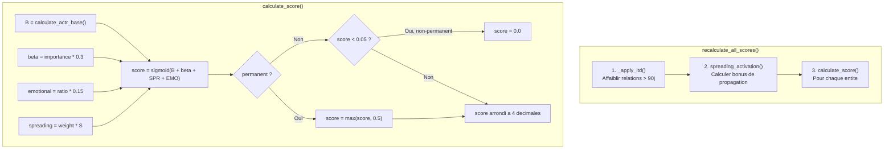

---

## 6. Fenetrage des mentions

### 6.1 Probleme resolu

Sans fenetrage, la liste `mention_dates` croitrait indefiniment, ralentissant le calcul ACT-R et consommant de l'espace dans les fichiers Markdown et le graphe JSON.

### 6.2 Mecanisme de fenetre glissante

Le module `src/memory/mentions.py` implemente un systeme de fenetre glissante :

- **`window_size`** (defaut : **50**) : nombre maximum de dates individuelles conservees dans `mention_dates`
- Quand la fenetre deborde, les dates les plus anciennes sont **consolidees** en `monthly_buckets`

### 6.3 Implementation

```python
def add_mention(
    date_iso: str,
    mention_dates: list[str],
    monthly_buckets: dict[str, int],
    window_size: int = 50,
) -> tuple[list[str], dict[str, int]]:
    """Add a mention date and consolidate if window overflows."""
    mention_dates.append(date_iso)
    if len(mention_dates) > window_size:
        mention_dates, monthly_buckets = consolidate_window(
            mention_dates, monthly_buckets, window_size
        )
    return mention_dates, monthly_buckets


def consolidate_window(
    mention_dates: list[str],
    monthly_buckets: dict[str, int],
    window_size: int = 50,
) -> tuple[list[str], dict[str, int]]:
    """Move oldest dates beyond window_size into monthly_buckets."""
    if len(mention_dates) <= window_size:
        return mention_dates, monthly_buckets

    mention_dates.sort()
    overflow = len(mention_dates) - window_size
    to_consolidate = mention_dates[:overflow]
    remaining = mention_dates[overflow:]

    for d in to_consolidate:
        month_key = d[:7]  # "YYYY-MM"
        monthly_buckets[month_key] = monthly_buckets.get(month_key, 0) + 1

    return remaining, monthly_buckets
```

### 6.4 Flux de donnees

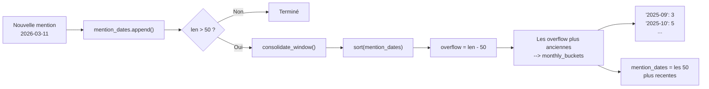

### 6.5 Impact sur le scoring

Les deux structures alimentent `calculate_actr_base()` :
- `mention_dates` : traitement date par date, haute precision temporelle
- `monthly_buckets` : utilisation du milieu du mois (15), le compteur sert de multiplicateur dans la somme ACT-R

Ce systeme offre un compromis entre precision (dates recentes) et efficacite (dates anciennes agregees), sans perte d'information significative pour le calcul ACT-R (les vieilles mentions contribuent peu au score de toute facon).

---

## 7. Extraction LLM (stall-aware streaming)

### 7.1 Probleme des stalls

Les LLM locaux (via Ollama, LM Studio) peuvent se bloquer ("stall") pendant la generation -- le modele cesse de produire des tokens sans signaler d'erreur. Un simple timeout ne suffit pas : les longues reponses legitimes seraient tuees, tandis que les stalls courts passeraient inapercuts.

### 7.2 Architecture worker + watchdog

MyMemory utilise un systeme a deux threads :

1. **Thread worker** : execute l'appel LLM en streaming, met a jour un compteur `last_activity` a chaque token recu
2. **Thread watchdog** (principal) : verifie periodiquement (toutes les 2 secondes) si le worker a produit des tokens recemment

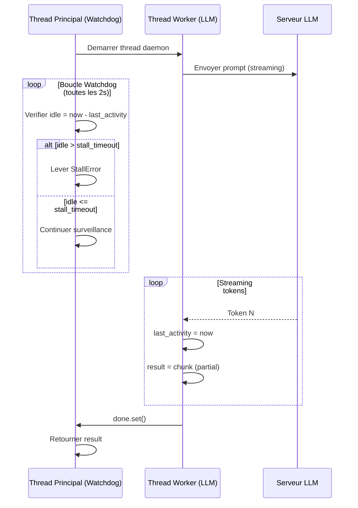

### 7.3 Grace period pour le premier token

Les modeles de raisonnement (Qwen3, DeepSeek-R1) et les grands prompts necessitent plus de temps pour produire le premier token. MyMemory applique un **multiplicateur x2** sur le timeout avant l'arrivee du premier token :

```python
effective_timeout = stall_timeout if got_first else stall_timeout * 2
```

### 7.4 Implementation cle

```python
def _call_with_stall_detection(
    step_config: LLMStepConfig, prompt: str,
    response_model: type[T], stall_timeout: int = 30,
) -> T:
    result: T | None = None
    error: Exception | None = None
    last_activity = time.monotonic()
    first_token_received = False
    lock = threading.Lock()
    done = threading.Event()

    def _do_call():
        nonlocal result, error, last_activity, first_token_received
        try:
            client = _get_client(step_config)
            kwargs = {
                "model": step_config.model,
                "messages": [{"role": "user", "content": prompt}],
                "response_model": response_model,
                "max_retries": step_config.max_retries,
                "temperature": step_config.temperature,
                "stream": True,
            }
            if step_config.api_base:
                kwargs["api_base"] = step_config.api_base
            kwargs["timeout"] = step_config.timeout * 3

            partial = client.chat.completions.create_partial(**kwargs)
            for chunk in partial:
                with lock:
                    last_activity = time.monotonic()
                    first_token_received = True
                result = chunk  # Garder le dernier partial valide
        except Exception as e:
            error = e
        finally:
            done.set()

    worker = threading.Thread(target=_do_call, daemon=True)
    worker.start()

    # Watchdog
    while not done.is_set():
        done.wait(timeout=2.0)
        if done.is_set():
            break
        with lock:
            idle = time.monotonic() - last_activity
            got_first = first_token_received
        effective_timeout = stall_timeout if got_first else stall_timeout * 2
        if idle > effective_timeout:
            error = StallError(...)
            done.set()
            break

    if error is not None:
        raise error
    return result
```

### 7.5 Segmentation des longs chats

Quand le contenu d'un chat depasse 70% de la fenetre de contexte du modele, l'extracteur le decoupe en segments avec recouvrement :

```python
def extract_from_chat(chat_content: str, config: Config) -> RawExtraction:
    content_tokens = _estimate_tokens(chat_content)
    prompt_overhead = 1500
    context_window = config.llm_extraction.context_window
    threshold = int(context_window * 0.7)

    if content_tokens + prompt_overhead < threshold:
        return call_extraction(chat_content, config)

    # Decoupage avec recouvrement
    segment_tokens = int(context_window * 0.5)
    segments = _split_text(chat_content, segment_tokens, overlap_tokens=200)

    extractions = []
    for segment in segments:
        ext = call_extraction(segment, config)
        extractions.append(ext)

    return _merge_extractions(extractions)
```

| Parametre               | Valeur                          |
|-------------------------|---------------------------------|
| Seuil de segmentation   | 70% de `context_window`         |
| Taille de segment       | 50% de `context_window`         |
| Recouvrement            | 200 tokens                      |

### 7.6 Fusion des extractions

La fusion des segments (`_merge_extractions()`) deduplique par :
- **Entites** : par slug (cle de deduplication), fusion des observations
- **Relations** : par tuple `(from_slug, to_slug, type)`
- **Sommaires** : concatenation simple

### 7.7 Sanitisation post-extraction

Apres chaque extraction, `sanitize_extraction()` corrige les erreurs typiques des petits LLM :

```python
# Mapping de correction pour les types de relations inventes
_RELATION_FALLBACK = {
    "prescrit_par": "linked_to",
    "prescribed_by": "linked_to",
    "travaille_a": "works_at",
    "ami_de": "friend_of",
    "cause": "affects",
    "ameliore": "improves",
    "aggrave": "worsens",
    # ...
}
```

Corrections appliquees :
- Types de relation invalides : mappes via `_RELATION_FALLBACK` ou fallback a `linked_to`
- Types d'entite invalides : fallback a `interest`
- Categories d'observation invalides : fallback a `fact`
- Importance clampee a `[0.0, 1.0]`
- Champs `None` coerces aux valeurs par defaut (chaines vides, listes vides)
- Entites ou relations avec references vides supprimees

### 7.8 Support des modeles de raisonnement

La fonction `strip_thinking()` supprime les balises `<think>...</think>` emises par certains modeles (Qwen3, DeepSeek-R1) :

```python
def strip_thinking(text: str) -> str:
    return re.sub(r"<think>.*?</think>", "", text, flags=re.DOTALL).strip()
```

---

## 8. Resolution d'entites

### 8.1 Chaine de resolution

La resolution d'entites est un processus **deterministe** (zero token LLM) qui mappe les noms extraits vers des entites existantes ou determine qu'il s'agit de nouvelles entites. La chaine de resolution suit 4 etapes ordonnees :

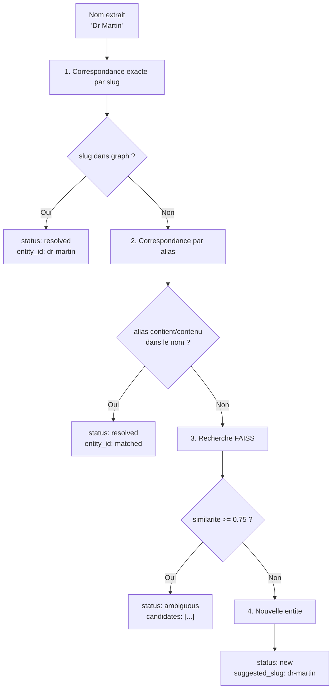

### 8.2 Etape 1 -- Correspondance par slug

Le nom est converti en slug via `slugify()` (normalisation Unicode, lowercase, remplacement des espaces par des tirets) et compare directement aux cles du graphe :

```python
slug = slugify(name)
if slug in graph.entities:
    return Resolution(status="resolved", entity_id=slug)
```

### 8.3 Etape 2 -- Correspondance par alias

Verification bidirectionnelle par containment (le nom contient un alias OU un alias contient le nom) :

```python
name_lower = name.lower()
for entity_id, meta in graph.entities.items():
    for alias in meta.aliases:
        alias_lower = alias.lower()
        if alias_lower in name_lower or name_lower in alias_lower:
            return Resolution(status="resolved", entity_id=entity_id)
    if meta.title.lower() in name_lower or name_lower in meta.title.lower():
        return Resolution(status="resolved", entity_id=entity_id)
```

### 8.4 Etape 3 -- Recherche FAISS contextuelle

Si les methodes deterministes echouent, une recherche semantique FAISS est effectuee avec un **seuil de similarite de 0.75**. La requete est enrichie avec le contexte de la premiere observation pour desambiguiser les homonymes :

```python
if faiss_search_fn is not None:
    # Enrichissement contextuel : "Apple fruit pomme" vs "Apple tech company"
    query = f"{name} {observation_context}".strip() if observation_context else name
    similar = faiss_search_fn(query, top_k=3, threshold=0.75)
    if similar:
        candidates = [s["entity_id"] for s in similar if "entity_id" in s]
        if candidates:
            return Resolution(status="ambiguous", candidates=candidates)
```

Le contexte d'observation est construit a partir de la premiere observation de l'entite :

```python
if entity.observations:
    obs = entity.observations[0]
    obs_context = f"{obs.category} {obs.content[:50]}"
```

### 8.5 Etape 4 -- Nouvelle entite

Si aucune correspondance n'est trouvee, l'entite est marquee comme nouvelle :

```python
return Resolution(status="new", suggested_slug=slug)
```

### 8.6 Arbitration LLM (pour les cas ambigus)

Les entites avec `status="ambiguous"` passent ensuite par l'**arbitrateur** (Etape 3 du pipeline principal) qui utilise un LLM pour choisir parmi les candidats FAISS. Ce traitement est couvert dans le fichier `src/pipeline/arbitrator.py`.

---

## 9. Indexation FAISS

### 9.1 Vue d'ensemble

FAISS (Facebook AI Similarity Search) est utilise pour l'indexation vectorielle des entites, permettant la recherche semantique rapide. MyMemory utilise `IndexFlatIP` (Inner Product) sur des vecteurs L2-normalises, ce qui equivaut a une **similarite cosinus**.

### 9.2 Processus de chunking

Les fichiers Markdown des entites sont decoupes en chunks avec recouvrement :

```python
def chunk_text(text: str, chunk_size: int = 400, overlap: int = 80) -> list[str]:
    """Split text into overlapping chunks by approximate token count."""
    words = text.split()
    approx_tokens_per_word = 1.3
    words_per_chunk = int(chunk_size / approx_tokens_per_word)
    words_overlap = int(overlap / approx_tokens_per_word)

    if len(words) <= words_per_chunk:
        return [text] if text.strip() else []

    chunks = []
    start = 0
    while start < len(words):
        end = start + words_per_chunk
        chunk = " ".join(words[start:end])
        if chunk.strip():
            chunks.append(chunk)
        start = end - words_overlap
        if start >= len(words):
            break

    return chunks if chunks else ([text] if text.strip() else [])
```

| Parametre                   | Valeur par defaut | Configuration           |
|-----------------------------|-------------------|--------------------------|
| `chunk_size`                | **400** tokens    | `embeddings.chunk_size`  |
| `chunk_overlap`             | **80** tokens     | `embeddings.chunk_overlap`|
| Ratio mots/tokens           | **1.3**           | Heuristique fixe         |

### 9.3 Normalisation L2

Tous les vecteurs d'embeddings sont L2-normalises avant insertion dans l'index, garantissant que le produit scalaire (`IndexFlatIP`) equivaut a la similarite cosinus :

```python
def _normalize_l2(vectors: np.ndarray) -> np.ndarray:
    """L2-normalize vectors for cosine similarity with IndexFlatIP."""
    norms = np.linalg.norm(vectors, axis=1, keepdims=True)
    norms = np.where(norms > 0, norms, 1.0)
    return (vectors / norms).astype(np.float32)
```

### 9.4 Fournisseurs d'embeddings

MyMemory supporte trois fournisseurs d'embeddings, configures via `embeddings.provider` :

| Fournisseur           | Configuration        | Normalisation               |
|-----------------------|----------------------|------------------------------|
| `sentence-transformers` | Modele local        | `normalize_embeddings=True` + L2 |
| `ollama`              | API locale (11434)   | L2 post-embedding            |
| `openai`              | API OpenAI/compatible| L2 post-embedding            |

### 9.5 Construction de l'index

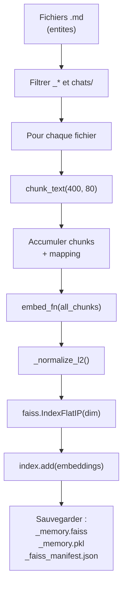

### 9.6 Mise a jour incrementale

La mise a jour incrementale (`incremental_update()`) compare les hashes SHA256 des fichiers avec le manifest existant :

```python
def incremental_update(memory_path: Path, config: Config) -> dict:
    manifest = load_manifest(config.faiss.manifest_path)

    # Changement de modele → reconstruction complete
    current_model = f"{config.embeddings.provider}/{config.embeddings.model}"
    if manifest.get("embedding_model") != current_model:
        return build_index(memory_path, config)

    # Detecter les fichiers modifies
    files = _get_entity_files(memory_path)
    changed_files = []
    for md_file in files:
        rel_path = str(md_file.relative_to(memory_path))
        file_hash = _file_hash(md_file)
        indexed = manifest.get("indexed_files", {}).get(rel_path)
        if not indexed or indexed.get("hash") != file_hash:
            changed_files.append(md_file)

    if not changed_files:
        return manifest  # Rien a mettre a jour

    # V1 : reconstruction complete si quoi que ce soit a change
    return build_index(memory_path, config)
```

**Note :** La version actuelle (v1) fait une reconstruction complete de l'index meme pour un seul fichier modifie. Cela simplifie l'implementation au prix de la performance. Une vraie mise a jour incrementale remplacerait selectivement les vecteurs.

### 9.7 Manifest FAISS

Le manifest (`_faiss_manifest.json`) suit l'etat de l'index :

```json
{
  "embedding_model": "sentence-transformers/all-MiniLM-L6-v2",
  "last_build": "2026-03-11T10:30:00",
  "indexed_files": {
    "self/sante.md": {
      "hash": "abc123...",
      "chunks": 3,
      "ids": [0, 1, 2]
    }
  }
}
```

### 9.8 Recherche

```python
def search(query: str, config: Config, memory_path: Path,
           top_k: int | None = None) -> list[SearchResult]:
    index = faiss.read_index(str(index_path))
    with open(mapping_path, "rb") as f:
        chunk_mapping = pickle.load(f)

    embed_fn = get_embedding_fn(config)
    query_vec = embed_fn([query]).astype(np.float32)

    k = min(top_k, index.ntotal)
    scores, indices = index.search(query_vec, k)

    results = []
    for score, idx in zip(scores[0], indices[0]):
        if idx < 0 or idx >= len(chunk_mapping):
            continue
        mapping = chunk_mapping[idx]
        results.append(SearchResult(
            entity_id=mapping["entity_id"],
            file=mapping["file"],
            chunk=f"[chunk {mapping['chunk_idx']}]",
            score=float(score),
        ))
    return results
```

---

## 10. Recherche hybride (RRF)

### 10.1 Trois signaux de recherche

MyMemory combine trois signaux de pertinence pour le re-classement des resultats de recherche :

| Signal    | Source          | Poids par defaut | Role                                    |
|-----------|-----------------|------------------|-----------------------------------------|
| Semantique| FAISS           | **0.5**          | Similarite de sens                      |
| Mot-cle   | FTS5 (SQLite)   | **0.3**          | Correspondance exacte de termes         |
| ACT-R     | Graphe          | **0.2**          | Pertinence memorielle (recence/frequence)|

### 10.2 Algorithme RRF (Reciprocal Rank Fusion)

Le RRF combine les classements de chaque signal via la formule :

```
score_RRF(e) = w_sem / (k + rank_sem(e)) + w_kw / (k + rank_kw(e)) + w_actr / (k + rank_actr(e))
```

Ou :
- `rank_X(e)` = rang de l'entite e dans le classement du signal X (1 = premier)
- `k` = constante de lissage (defaut : **60**, configurable via `search.rrf_k`)
- `w_sem`, `w_kw`, `w_actr` = poids de chaque signal

### 10.3 Implementation

```python
def _rrf_fusion(
    faiss_results: list[SearchResult],
    keyword_results,
    graph,
    k: int = 60,
    w_sem: float = 0.5,
    w_kw: float = 0.3,
    w_actr: float = 0.2,
) -> list[tuple[str, float]]:
    """Reciprocal Rank Fusion combining semantic, keyword, and ACT-R signals."""
    sem_ranks = {r.entity_id: i + 1 for i, r in enumerate(faiss_results)}
    kw_ranks = {r.entity_id: i + 1 for i, r in enumerate(keyword_results)}

    all_ids = set(sem_ranks) | set(kw_ranks)

    # Classement ACT-R
    actr_scores = {}
    for eid in all_ids:
        e = graph.entities.get(eid)
        actr_scores[eid] = e.score if e else 0.0
    sorted_actr = sorted(actr_scores.items(), key=lambda x: x[1], reverse=True)
    actr_ranks = {eid: i + 1 for i, (eid, _) in enumerate(sorted_actr)}

    # Rang par defaut pour les signaux manquants
    default_rank = max(len(faiss_results), len(keyword_results), len(all_ids)) + 10

    scored = []
    for eid in all_ids:
        sr = sem_ranks.get(eid, default_rank)
        kr = kw_ranks.get(eid, default_rank)
        ar = actr_ranks.get(eid, default_rank)
        score = w_sem / (k + sr) + w_kw / (k + kr) + w_actr / (k + ar)
        scored.append((eid, score))

    return sorted(scored, key=lambda x: x[1], reverse=True)
```

### 10.4 Fallback lineaire

Quand l'index FTS5 n'existe pas ou que la recherche hybride est desactivee, un re-classement lineaire est utilise :

```python
result.score = result.score * 0.6 + graph_score * 0.4
```

### 10.5 Re-emergence L2 vers L1

Apres chaque recherche RAG, les entites retrouvees recoivent un **bump de mention** qui augmente leur score ACT-R. Ce mecanisme permet aux souvenirs oublies (L2/FAISS) de remonter naturellement dans le contexte actif (L1/_context.md) :

```python
# L2 -> L1 re-emergence : bump mention_dates
today = date_type.today().isoformat()
for result in results:
    entity_id = result.entity_id
    if entity_id in graph.entities:
        entity = graph.entities[entity_id]
        entity.mention_dates, entity.monthly_buckets = add_mention(
            today, entity.mention_dates, entity.monthly_buckets,
            window_size=config.scoring.window_size,
        )
        entity.last_mentioned = today
```

Le graphe est sauvegarde apres le bump (si le lock est disponible). Les scores sont recalcules au prochain `memory run` ou `memory dream`.

### 10.6 Diagramme du flux de recherche

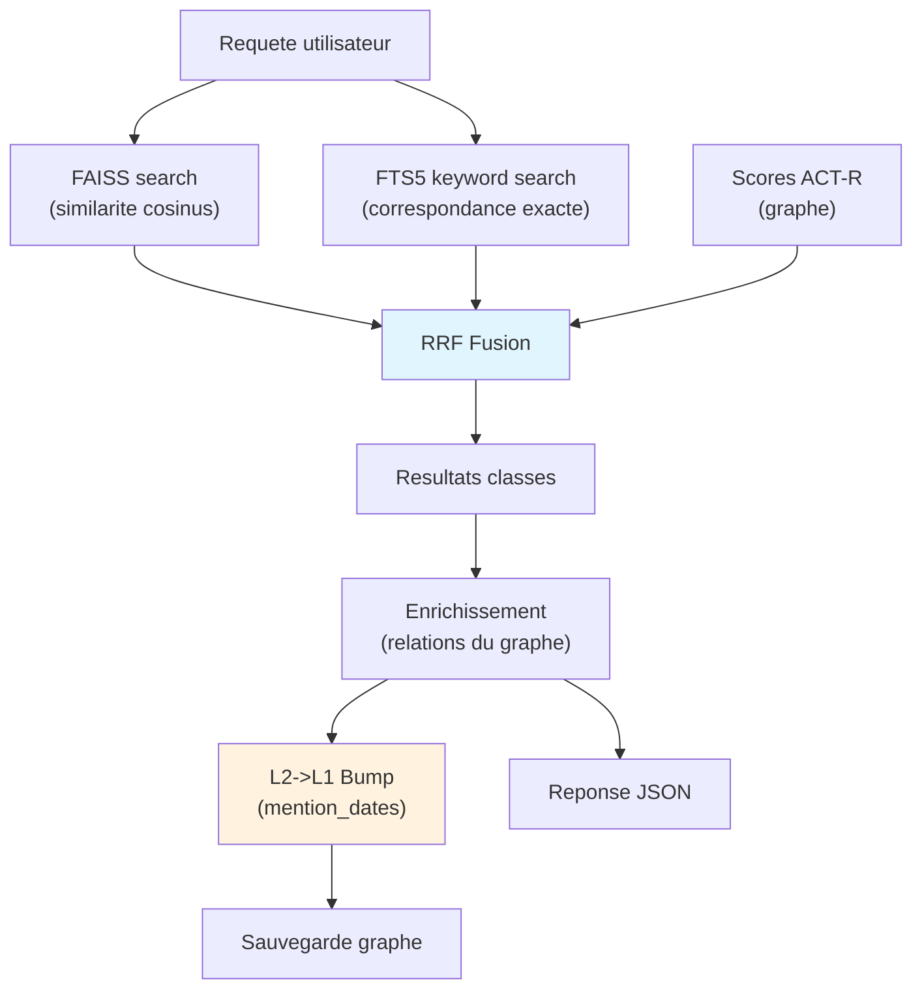

---

## 11. Generation de contexte

### 11.1 Trois modes de generation

MyMemory supporte trois modes de generation pour `_context.md`, configures via `context_format` et `context_llm_sections` :

| Mode                    | Config                                      | LLM ?      | Fonction                    |
|-------------------------|---------------------------------------------|------------|-----------------------------|
| **Deterministe**        | `context_format: structured`                | Non        | `build_context()`           |
| **Naturel**             | `context_format: natural`                   | Optionnel  | `build_natural_context()`   |
| **LLM par section**     | `context_llm_sections: true`                | Oui        | `build_context_with_llm()`  |

### 11.2 Mode deterministe (structured)

Le mode par defaut construit le contexte sans aucun appel LLM. Il utilise un template Markdown avec substitution de variables :

#### Sections

Le contexte est organise en sections thematiques :

| Section              | Critere de selection                                                | Budget par defaut |
|----------------------|---------------------------------------------------------------------|-------------------|
| **AI Personality**   | `entity.type == "ai_self"`                                         | Variable          |
| **Identity**         | Fichier dans `self/`, type != `ai_self`                            | `identity`        |
| **Work context**     | `type in (work, organization)`                                     | `work`            |
| **Personal context** | `type in (person, animal, place)`                                  | `personal`        |
| **Top of mind**      | Tout le reste, trie par score, limite a 10, groupe par cluster     | `top_of_mind`     |
| **Vigilances**       | Faits [vigilance], [diagnosis], [treatment] des entites affichees  | N/A               |
| **Brief history**    | Entites restantes, divisees en recent/earlier/longterm             | `history_*`       |

#### Budgeting en tokens

Chaque section dispose d'un budget en tokens, calcule en pourcentage de `context_max_tokens` :

```python
reserved = 500
total_budget = max(config.context_max_tokens - reserved, 1000)
budget = config.context_budget or {}

def section_budget(key: str) -> int:
    pct = budget.get(key, 10)  # defaut 10%
    return int(total_budget * pct / 100)
```

#### Enrichissement des entites

Chaque entite selectionnee est enrichie via `_enrich_entity()` :

1. Lecture des faits depuis le fichier Markdown (avec garde de traversee de chemin)
2. Filtrage des faits supersedes (`[superseded]`)
3. Tri chronologique des faits
4. Deduplication des faits (similarite Jaccard mot + trigramme, seuil 0.35)
5. Plafonnement par categorie (5 faits max, 3 pour `ai_self`)
6. Groupement par categorie pour un affichage structure
7. Collecte des relations du graphe (filtrage force >= 0.3, age < 365 jours)

#### Deduplication des faits pour le contexte

La deduplication utilise une **similarite blended** combinant Jaccard sur mots filtres (sans stopwords) et Jaccard sur trigrammes de caracteres :

```python
def _content_similarity(text_a: str, text_b: str) -> float:
    """50% stopword-filtered word Jaccard + 50% trigram Jaccard."""
    words_a = {w for w in text_a.lower().split() if w not in _STOPWORDS and len(w) > 1}
    words_b = {w for w in text_b.lower().split() if w not in _STOPWORDS and len(w) > 1}
    word_jaccard = len(words_a & words_b) / len(words_a | words_b)
    tri_a = _trigrams(" ".join(sorted(words_a)))
    tri_b = _trigrams(" ".join(sorted(words_b)))
    tri_jaccard = len(tri_a & tri_b) / len(tri_a | tri_b) if (tri_a | tri_b) else 0.0
    return 0.5 * word_jaccard + 0.5 * tri_jaccard
```

#### Groupement par cluster

Les entites "Top of mind" sont triees par **composante connexe** du graphe, de sorte que les entites liees apparaissent adjacentes dans le contexte :

```python
top_entities = _sort_by_cluster(top_entities, graph)
```

### 11.3 Mode naturel

Le mode naturel genere des bullet points en langage naturel au lieu de dossiers structures. Les entites sont classees temporellement plutot que thematiquement :

- **Long terme** : personnes/animaux stables (retention long_term, frequence >= 5) ou mentionnees > 30 jours
- **Moyen terme** : mentionnees entre 7 et 30 jours
- **Court terme** : mentionnees dans les 7 derniers jours

Quand `use_llm=True`, chaque section est traitee par le LLM (`call_natural_context_section()`) pour generer un narratif fluide, avec fallback deterministe en cas d'echec.

### 11.4 Mode LLM par section

Ce mode utilise le dossier enrichi de chaque section comme input pour un appel LLM dedie. Chaque section est generee independamment :

1. Construction du dossier enrichi (meme que le mode deterministe)
2. **Pre-fetch RAG** : recherche FAISS des faits lies aux entites de la section (max 2 resultats par entite, 15 total)
3. Appel LLM avec le prompt `context_section.md`
4. En cas d'echec : fallback vers le dossier brut deterministe

**Les vigilances restent toujours deterministes** (pas d'appel LLM) pour garantir la fiabilite des donnees medicales critiques.

### 11.5 Diagramme du flux de generation

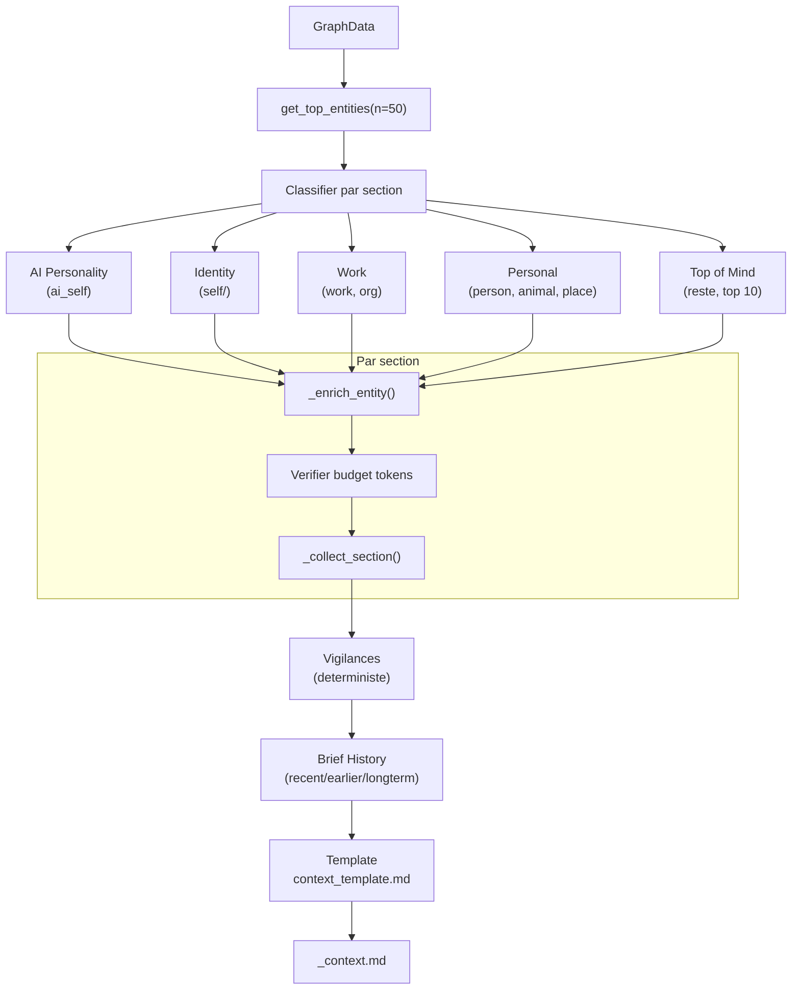

---

## 12. Consolidation de faits

### 12.1 Probleme resolu

Au fil des conversations, les entites accumulent des observations redondantes ou obsoletes. La consolidation reduit le nombre de faits tout en preservant l'information essentielle.

### 12.2 Detection des candidats

La consolidation se declenche quand une entite depasse `max_facts` pour son type :

```python
max_facts = config.get_max_facts(entity.type)
live_facts = [f for f in facts if "[superseded]" not in f]
if len(live_facts) > max_facts:
    # Consolider
```

### 12.3 Pipeline en deux phases

#### Phase 1 -- Deduplication deterministe (sans LLM)

Une premiere passe utilise `SequenceMatcher` de `difflib` pour detecter les quasi-doublons :

```python
def _dedup_facts_deterministic(facts: list[str], threshold: float = 0.85) -> list[str]:
    """Remove near-duplicate facts using sequence similarity."""
    from difflib import SequenceMatcher
    kept = []
    for fact in facts:
        is_dup = False
        for existing in kept:
            ratio = SequenceMatcher(None, fact.lower(), existing.lower()).ratio()
            if ratio >= threshold:
                is_dup = True
                break
        if not is_dup:
            kept.append(fact)
    return kept
```

Si la deduplication deterministe ramene le nombre de faits sous `max_facts`, **l'appel LLM est evite entierement**.

#### Phase 2 -- Consolidation LLM

Si la Phase 1 ne suffit pas, les faits dedupliques sont envoyes au LLM via `call_fact_consolidation()` :

```python
# Construction du texte indexe pour le LLM
indexed_text = "\n".join(f"{i}: {f}" for i, f in enumerate(live_facts))

result = call_fact_consolidation(
    frontmatter.title, frontmatter.type, indexed_text, config,
    max_facts=effective_max,
)
```

### 12.4 Garde-fous post-consolidation

- **Longueur maximale** : 150 caracteres par fait consolide (tronque avec `...`)
- **Tags** : maximum 3 par fait
- **Faits supersedes** : preserves separement (non envoyes au LLM)
- **Historique** : entree ajoutee dans la section History

### 12.5 Auto-consolidation dans le pipeline

La commande `memory run` declenche automatiquement la consolidation des entites avec 8+ faits via `auto_consolidate()` dans `pipeline/orchestrator.py`. La commande `memory run-light` saute cette etape.

### 12.6 Diagramme de la consolidation

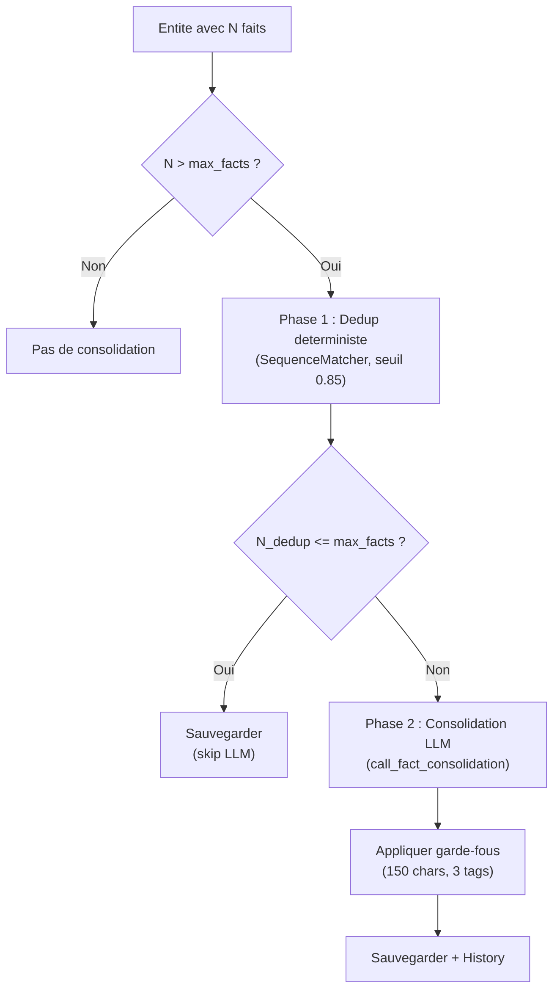

---

## 13. Pipeline Dream (10 etapes)

### 13.1 Vue d'ensemble

Le mode Dream reorganise la memoire existante, a la maniere de la consolidation memorielle qui se produit pendant le sommeil. Il n'introduit pas de nouvelles informations (sauf l'etape 2 qui extrait des documents RAG non traites).

### 13.2 Coordinateur deterministe

Le coordinateur decide quelles etapes executer en fonction des statistiques de la memoire :

```python
def decide_dream_steps(stats: dict) -> list[int]:
    """Deterministic dream step selection."""
    steps = [1]  # Load toujours
    if stats.get("unextracted_docs", 0) > 0:
        steps.append(2)
    if stats.get("consolidation_candidates", 0) >= 3:
        steps.append(3)
    if stats.get("merge_candidates", 0) >= 2:
        steps.append(4)
    if stats.get("relation_candidates", 0) >= 5:
        steps.append(5)
    if stats.get("transitive_candidates", 0) >= 3:
        steps.append(6)
    if stats.get("prune_candidates", 0) >= 1:
        steps.append(7)
    if stats.get("summary_candidates", 0) >= 3:
        steps.append(8)
    if any(s in steps for s in [2, 3, 4, 5, 6, 7, 8]):
        steps.extend([9, 10])  # Rescore + Rebuild si du travail a ete fait
    return sorted(set(steps))
```

### 13.3 Les 10 etapes

#### Etape 1 -- Chargement

Charge le graphe et mappe les IDs d'entites vers leurs chemins fichier.

- **Type** : deterministe
- **LLM** : non

#### Etape 2 -- Extraction de documents

Scanne le manifest FAISS pour les documents RAG non extraits et les traite via le pipeline complet (extraction + resolution + enrichissement).

- **Type** : LLM
- **Declenchement** : `unextracted_docs > 0`

#### Etape 3 -- Consolidation de faits

Consolide les entites ayant plus de `max_facts` observations (cf. section 12).

- **Type** : deterministe + LLM (si la phase 1 ne suffit pas)
- **Declenchement** : `consolidation_candidates >= 3`
- **Validation** : verifie que le nombre de faits n'a pas augmente

```python
def validate_dream_step(step: int, before_state, after_state):
    if step == 3:  # Consolidation
        if after_state.get("total_facts", 0) > before_state.get("total_facts", 0):
            issues.append("Consolidation increased fact count")
```

#### Etape 4 -- Fusion d'entites

Detecte et fusionne les entites dupliquees en deux phases :

1. **Phase deterministe** : correspondance slug/alias entre entites de meme type
2. **Phase FAISS + LLM** : detection de doublons semantiques via FAISS (seuil 0.80) + confirmation LLM (`call_dedup_check()`, seuil de confiance 0.7)

Lors de la fusion :
- L'entite avec le score le plus eleve est conservee
- Les alias, faits, tags, mention_dates sont fusionnes
- Les relations sont redirigees vers l'entite conservee
- L'entite supprimee est deplacee dans `_archive/`

- **Type** : deterministe + LLM (pour les candidats FAISS)
- **Declenchement** : `merge_candidates >= 2`
- **Validation** : verifie que le nombre d'entites n'a pas augmente

#### Etape 5 -- Decouverte de relations

Pour chaque entite, recherche les 5 entites les plus similaires via FAISS. Si aucune relation n'existe entre la paire, le LLM evalue s'il faut en creer une :

```python
proposal = call_relation_discovery(
    entity_a.title, entity_a.type, dossier_a,
    entity_b.title, entity_b.type, dossier_b,
    config,
)
if proposal.action == "relate" and proposal.relation_type:
    # Creer la relation
```

- **Type** : FAISS + LLM
- **Declenchement** : `relation_candidates >= 5`
- **Validation** : alerte si plus de 50 nouvelles relations (anormal)

#### Etape 6 -- Relations transitives

Infere des relations par transitivite, sans appel LLM. Regles implementees :

```python
_TRANSITIVE_RULES = {
    ("affects", "affects"): "affects",
    ("part_of", "part_of"): "part_of",
    ("requires", "requires"): "requires",
    ("improves", "affects"): "improves",
    ("worsens", "affects"): "worsens",
    ("uses", "part_of"): "uses",
}
```

Contraintes :
- Seules les relations avec `strength >= 0.4` sont considerees
- Maximum 20 nouvelles relations par execution
- La force inferee = `min(strength_AB, strength_BC) * 0.5`
- Le contexte de la relation porte la trace de la transitivite

- **Type** : deterministe
- **Declenchement** : `transitive_candidates >= 3`

#### Etape 7 -- Elagage (Pruning)

Archive les entites "mortes" repondant a tous ces criteres :
- `score < 0.1`
- `frequency <= 1`
- `retention != permanent`
- Aucune relation dans le graphe
- Age > 90 jours

Les entites sont deplacees dans `memory/_archive/` (reversible). Les relations orphelines sont nettoyees.

- **Type** : deterministe
- **Declenchement** : `prune_candidates >= 1`

#### Etape 8 -- Generation de resumes

Genere des resumes (1-3 phrases) pour les entites qui n'en ont pas, via `call_entity_summary()` :

```python
summary = call_entity_summary(
    entity.title, entity.type, live_facts, relations, entity.tags, config,
)
```

- **Type** : LLM
- **Declenchement** : `summary_candidates >= 3`

#### Etape 9 -- Recalcul des scores

Recalcule tous les scores ACT-R + spreading activation via `recalculate_all_scores()` (cf. section 5.4).

- **Type** : deterministe
- **Declenchement** : si au moins une etape 2-8 a ete executee

#### Etape 10 -- Reconstruction

Reconstruit `_context.md`, `_index.md` et l'index FAISS.

- **Type** : deterministe (ou LLM si mode natural/LLM sections)
- **Declenchement** : si au moins une etape 2-8 a ete executee

### 13.4 Dashboard Rich

L'execution du Dream affiche un dashboard en temps reel via **Rich Live**, montrant l'etat de chaque etape (pending/running/done/failed/skipped).

### 13.5 Diagramme du pipeline Dream

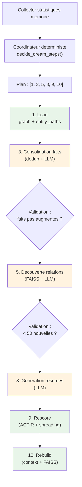

Legende : vert = deterministe, orange = implique un LLM

---

## 14. Ecriture atomique et integrite

### 14.1 Ecriture atomique des fichiers

Toutes les ecritures de fichiers dans MyMemory utilisent un pattern d'**ecriture atomique** via fichier temporaire + `os.replace()` :

```python
def _atomic_write_text(filepath: Path, content: str) -> None:
    """Write content to file atomically via temp file + os.replace."""
    filepath.parent.mkdir(parents=True, exist_ok=True)
    fd, tmp = tempfile.mkstemp(dir=filepath.parent, suffix=".tmp")
    try:
        os.write(fd, content.encode("utf-8"))
        os.close(fd)
        os.replace(tmp, filepath)  # Atomique sur POSIX
    except BaseException:
        try:
            os.close(fd)
        except OSError:
            pass
        try:
            os.unlink(tmp)
        except OSError:
            pass
        raise
```

Proprietes garanties :
- **Atomicite** : `os.replace()` est atomique sur les systemes POSIX -- le fichier destination est soit l'ancienne version complete, soit la nouvelle version complete, jamais un etat intermediaire
- **Nettoyage** : en cas d'erreur, le fichier temporaire est supprime
- **Robustesse** : les erreurs de fermeture de descripteur sont silencieusement ignorees

Cette fonction est utilisee par :
- `store.py` : ecriture des fichiers Markdown d'entites et de chats
- `graph.py` : ecriture de `_graph.json`
- `context.py` : ecriture de `_context.md` et `_index.md`

### 14.2 Sauvegarde du graphe avec lockfile

Le graphe (`_graph.json`) beneficie d'une protection supplementaire via un lockfile :

```python
def save_graph(memory_path: Path, graph: GraphData) -> None:
    """Save _graph.json with .bak backup, atomic writes, and lockfile protection."""
    graph_path = memory_path / "_graph.json"
    lock_path = memory_path / "_graph.lock"

    _acquire_lock(lock_path)
    try:
        # Backup existant
        if graph_path.exists():
            shutil.copy2(graph_path, memory_path / "_graph.json.bak")
        # Ecriture atomique
        graph.generated = datetime.now().isoformat()
        data = graph.model_dump(by_alias=True)
        _atomic_write(graph_path, json.dumps(data, indent=2, ensure_ascii=False))
    finally:
        _release_lock(lock_path)
```

### 14.3 Mecanisme de lockfile

```python
LOCK_TIMEOUT_SECONDS = 300  # 5 minutes

def _acquire_lock(lock_path: Path) -> None:
    """Acquire lockfile atomically. Delete stale locks (> 5 min)."""
    if lock_path.exists():
        try:
            age = time.time() - lock_path.stat().st_mtime
            if age > LOCK_TIMEOUT_SECONDS:
                lock_path.unlink()  # Stale lock
            else:
                raise RuntimeError(f"Graph is locked by another process")
        except FileNotFoundError:
            pass  # Race condition

    # Creation atomique : O_CREAT|O_EXCL echoue si le fichier existe deja
    content = f"pid={os.getpid()}\ntime={datetime.now().isoformat()}\n".encode("utf-8")
    try:
        fd = os.open(str(lock_path), os.O_CREAT | os.O_EXCL | os.O_WRONLY)
        os.write(fd, content)
        os.close(fd)
    except FileExistsError:
        raise RuntimeError(f"Graph is locked by another process")
```

Proprietes :
- **Exclusion mutuelle** : `O_CREAT | O_EXCL` est atomique au niveau du noyau
- **Detection des locks orphelins** : un lock de plus de 5 minutes est considere comme "stale" et supprime
- **Information de debug** : le PID et le timestamp sont ecrits dans le fichier lock

### 14.4 Strategie de recuperation du graphe

En cas de corruption du fichier principal, `load_graph()` tente une recuperation en cascade :

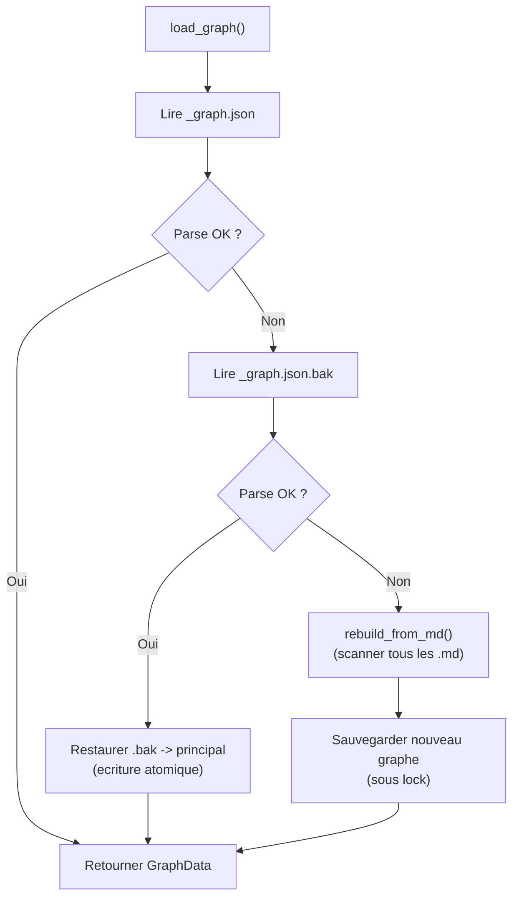

### 14.5 Backup automatique

A chaque sauvegarde, l'ancien `_graph.json` est copie en `_graph.json.bak` avant ecriture du nouveau fichier. Cela garantit qu'au moins une version valide du graphe est toujours disponible.

---

## 15. JSON repair thread-safe

### 15.1 Probleme resolu

Les petits LLM locaux (7B-20B parametres) produisent souvent du JSON malformed -- accolades manquantes, virgules en trop, guillemets non fermes. La librairie `json-repair` peut corriger ces erreurs, mais son integration avec Instructor (qui utilise `json.loads` internement) necessite un mecanisme de monkey-patching thread-safe.

### 15.2 Architecture thread-local

La solution utilise `threading.local()` pour isoler l'activation du repair par thread :

```python
_repair_local = threading.local()

@contextmanager
def _repaired_json():
    """Patch json.loads to auto-repair malformed LLM JSON output.
    Uses thread-local storage so concurrent threads don't interfere."""
    if _repair_json is None:
        yield
        return

    original = json.loads
    repair_count = 0

    def _patched(s, *args, **kwargs):
        nonlocal repair_count
        # Seulement actif si ce thread a opte pour le repair
        if not getattr(_repair_local, 'active', False):
            return original(s, *args, **kwargs)
        try:
            return original(s, *args, **kwargs)
        except json.JSONDecodeError:
            repair_count += 1
            if repair_count == 1:
                logger.warning("JSON parse failed, attempting repair...")
            # Desactiver temporairement pour eviter la recursion
            _repair_local.active = False
            try:
                repaired = _repair_json(s, return_objects=False)
            finally:
                _repair_local.active = True
            return original(repaired, *args, **kwargs)

    _repair_local.active = True
    json.loads = _patched
    try:
        yield
    finally:
        _repair_local.active = False
        json.loads = original
```

### 15.3 Mecanisme anti-recursion

La librairie `json-repair` appelle elle-meme `json.loads` en interne. Sans precaution, cela creerait une boucle infinie :

1. Instructor appelle `json.loads` -> echec JSON
2. `_patched` appelle `_repair_json()` -> repair appelle `json.loads`
3. -> `_patched` est appele a nouveau -> echec -> repair -> ...

La solution : desactiver temporairement le flag `_repair_local.active` pendant l'appel a `_repair_json()` :

```python
_repair_local.active = False  # Desactiver le repair
try:
    repaired = _repair_json(s, return_objects=False)
finally:
    _repair_local.active = True  # Reactiver apres
```

### 15.4 Mode Instructor MD_JSON

MyMemory utilise le mode **MD_JSON** d'Instructor, qui extrait le JSON depuis des blocs de code Markdown :

```python
client = instructor.from_litellm(
    litellm.completion,
    mode=instructor.Mode.MD_JSON,
)
```

Ce mode evite le parametre `response_format` qui n'est pas supporte par certains modeles locaux (Ollama, LM Studio avec modeles non-OpenAI). Le LLM peut generer du texte libre autour du JSON, Instructor extraira le bloc de code.

### 15.5 Utilisation dans les deux modes d'appel

Le context manager `_repaired_json()` enveloppe les deux modes d'appel LLM :

1. **`_call_structured()`** : appel standard Instructor (arbitration, resume, consolidation)

```python
def _call_structured(step_config, prompt, response_model):
    client = _get_client(step_config)
    with _repaired_json():
        return client.chat.completions.create(...)
```

2. **`_call_with_stall_detection()`** : appel avec detection de stall (extraction)

```python
def _call_with_stall_detection(step_config, prompt, response_model, stall_timeout):
    with _repaired_json():
        # ... worker thread + watchdog ...
```

### 15.6 Diagramme du flux de repair

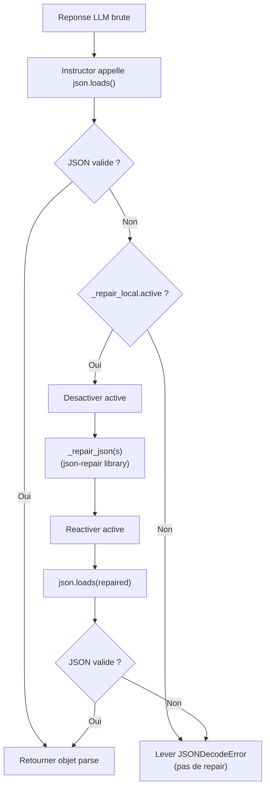

### 15.7 Gestion de l'absence de json-repair

Si la librairie `json-repair` n'est pas installee, le context manager est un no-op :

```python
try:
    from json_repair import repair_json as _repair_json
except ImportError:
    _repair_json = None  # Fallback : pas de repair disponible
```

---

## Annexe : Memoire a 3 niveaux

L'architecture de MyMemory repose sur un modele de memoire a 3 niveaux, inspire de la hierarchie de la memoire humaine (memoire de travail, memoire a long terme declarative, memoire a long terme procedurale) :

| Niveau | Stockage             | Acces                  | Analogie cognitive           |
|--------|----------------------|------------------------|------------------------------|
| **L1** | `_context.md`        | Injection directe      | Memoire de travail           |
| **L2** | Index FAISS + FTS5   | Recherche RAG          | Rappel indice (cued recall)  |
| **L3** | Fichiers Markdown    | Lecture directe        | Stockage a long terme        |

### Flux entre les niveaux

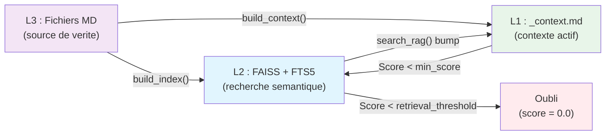

**Transitions cles :**
- **L3 -> L1** : Lors de `build_context()`, les entites avec `score >= min_score_for_context` (0.3) sont incluses dans `_context.md`
- **L3 -> L2** : Lors de `build_index()`, tous les fichiers Markdown sont indexes dans FAISS
- **L2 -> L1** : Lors de `search_rag()`, les entites retrouvees recoivent un bump de mention qui augmente leur score ACT-R, les faisant potentiellement remonter dans le contexte actif au prochain rebuild
- **L1 -> L2** : Naturellement, quand le score d'une entite descend sous `min_score_for_context`, elle sort du contexte actif mais reste accessible par recherche
- **L2 -> Oubli** : Quand le score descend sous `retrieval_threshold` (0.05), l'entite est effectivement oubliee (score = 0.0), bien que ses fichiers Markdown persistent

### Estimation des tokens

L'estimation des tokens est utilisee a plusieurs endroits (budgeting du contexte, seuil de segmentation des chats, chunking FAISS). Elle repose sur une heuristique simple :

```python
def estimate_tokens(text: str) -> int:
    """Rough token estimate: words * 1.3."""
    return int(len(text.split()) * 1.3)
```

Le ratio 1.3 mots/tokens est une approximation raisonnable pour le francais et l'anglais avec les tokenizers de type BPE (GPT, LLaMA). Il est utilise de maniere coherente dans tout le codebase.

### Slugification

La conversion nom -> slug est la brique de base de l'identification des entites :

```python
def slugify(text: str) -> str:
    """Convert a title to a slug (lowercase, hyphens, ASCII)."""
    text = unicodedata.normalize("NFKD", text)
    text = text.encode("ascii", "ignore").decode("ascii")  # Strip accents
    text = re.sub(r"[^\w\s-]", "", text.lower())
    text = re.sub(r"[-\s]+", "-", text).strip("-")
    return text
```

Exemples :
- `"Dr. Jean-Pierre Martin"` -> `"dr-jean-pierre-martin"`
- `"Ecole polytechnique"` -> `"ecole-polytechnique"`
- `"cafe creme"` -> `"cafe-creme"`

La normalisation NFKD decompose les caracteres accentues (e -> e + accent combinant), puis l'encodage ASCII les supprime. Cela garantit des slugs sans accents, comparables de maniere deterministe.

---

## Annexe A -- Parametres de scoring (reference rapide)

| Parametre                       | Defaut   | Fichier                  | Section |
|---------------------------------|----------|--------------------------|---------|
| `decay_factor`                  | 0.5      | `scoring.py`             | 1       |
| `decay_factor_short_term`       | 0.8      | `scoring.py`             | 1       |
| `importance_weight`             | 0.3      | `scoring.py`             | 5       |
| `spreading_weight`              | 0.2      | `scoring.py`             | 2       |
| `permanent_min_score`           | 0.5      | `scoring.py`             | 5       |
| `retrieval_threshold`           | 0.05     | `scoring.py`             | 1       |
| `min_score_for_context`         | 0.3      | `context.py`             | 11      |
| `relation_strength_base`        | 0.5      | `graph.py`               | 3       |
| `relation_strength_growth`      | 0.05     | `graph.py`               | 3       |
| `relation_decay_power`          | 0.3      | `scoring.py`             | 2       |
| `relation_decay_halflife`       | 180      | Config                   | 2       |
| `relation_ltd_halflife`         | 360      | `scoring.py`             | 3       |
| `emotional_boost_weight`        | 0.15     | `scoring.py`             | 4       |
| `window_size`                   | 50       | `mentions.py`            | 6       |
| `chunk_size`                    | 400      | `indexer.py`             | 9       |
| `chunk_overlap`                 | 80       | `indexer.py`             | 9       |
| `rrf_k`                        | 60       | `server.py`              | 10      |
| `weight_semantic`               | 0.5      | `server.py`              | 10      |
| `weight_keyword`                | 0.3      | `server.py`              | 10      |
| `weight_actr`                   | 0.2      | `server.py`              | 10      |

## Annexe B -- Formules mathematiques resumees

### Score ACT-R de base

```
B = ln( SUM_j( t_j^(-d) ) )
```

- `t_j` = jours depuis mention j (min 0.5)
- `d` = 0.5 (long_term) ou 0.8 (short_term)

### Force effective d'une relation

```
eff_strength = strength * (days_since + 0.5)^(-relation_decay_power)
```

- `relation_decay_power` = 0.3

### Bonus de propagation

```
S_i = SUM_j( eff_strength_ij * base_score_j ) / SUM_j( eff_strength_ij )
```

### LTD (apres 90 jours)

```
strength_new = max(0.1, strength * exp(-days / relation_ltd_halflife))
```

- `relation_ltd_halflife` = 360

### Score final

```
score = sigmoid( B + importance * 0.3 + spreading_weight * S + negative_valence_ratio * 0.15 )
```

### RRF

```
score_RRF(e) = w_sem / (k + rank_sem) + w_kw / (k + rank_kw) + w_actr / (k + rank_actr)
```

- `k` = 60, `w_sem` = 0.5, `w_kw` = 0.3, `w_actr` = 0.2

---

## Annexe C -- Fichiers source references

| Fichier                        | Contenu principal                                       |
|--------------------------------|---------------------------------------------------------|
| `src/memory/scoring.py`        | ACT-R, sigmoide, spreading activation, LTD, scoring     |
| `src/memory/graph.py`          | CRUD graphe, LTP Hebbien, ecriture atomique, lockfile   |
| `src/memory/mentions.py`       | Fenetrage des mentions, consolidation window            |
| `src/memory/context.py`        | Generation de contexte (3 modes), enrichissement        |
| `src/memory/store.py`          | CRUD Markdown, consolidation de faits, ecriture atomique|
| `src/core/llm.py`              | Abstraction LLM, stall detection, JSON repair           |
| `src/core/utils.py`            | slugify(), estimate_tokens(), parse_frontmatter()       |
| `src/pipeline/extractor.py`    | Extraction LLM, segmentation, sanitisation              |
| `src/pipeline/resolver.py`     | Resolution d'entites (deterministe)                     |
| `src/pipeline/indexer.py`      | Indexation FAISS, chunking, recherche                   |
| `src/pipeline/dream.py`        | Pipeline Dream 10 etapes, coordinateur                  |
| `src/mcp/server.py`            | Serveur MCP, RRF, re-emergence L2->L1                  |

## Annexe D -- Glossaire

| Terme                      | Definition                                                                                        |
|----------------------------|---------------------------------------------------------------------------------------------------|
| **ACT-R**                  | Adaptive Control of Thought -- Rational, modele cognitif de la memoire humaine                    |
| **Activation de base (B)** | Niveau d'accessibilite d'un souvenir, calcule a partir de la recence et frequence des rappels     |
| **Spreading Activation**   | Propagation de l'activation a travers les relations du graphe de connaissances                    |
| **LTP**                    | Long-Term Potentiation, renforcement synaptique par co-activation repetee                         |
| **LTD**                    | Long-Term Depression, affaiblissement synaptique par absence d'utilisation                         |
| **Retrieval Threshold**    | Seuil en dessous duquel un souvenir est considere comme irrecuperable (oubli veritable)           |
| **Sigmoide**               | Fonction de normalisation qui projette une valeur reelle dans l'intervalle (0, 1)                 |
| **FAISS**                  | Facebook AI Similarity Search, bibliotheque d'indexation vectorielle pour recherche semantique     |
| **IndexFlatIP**            | Type d'index FAISS utilisant le produit scalaire (equivalent cosinus sur vecteurs normalises)      |
| **RRF**                    | Reciprocal Rank Fusion, methode de fusion de classements multiples                                |
| **FTS5**                   | Extension SQLite pour la recherche plein texte                                                    |
| **Chunk**                  | Fragment de texte decoupe pour l'indexation vectorielle                                           |
| **Slug**                   | Identifiant normalise d'une entite (lowercase, tirets, ASCII)                                     |
| **Stall**                  | Blocage du LLM pendant la generation (aucun token produit pendant un delai prolonge)              |
| **Watchdog**               | Thread de surveillance qui detecte les stalls dans la generation LLM                              |
| **Dream mode**             | Mode de reorganisation de la memoire, inspire de la consolidation memorielle du sommeil            |
| **L1/L2/L3**               | Les trois niveaux de memoire : contexte actif, index recherchable, fichiers source                |
| **Valence**                | Charge emotionnelle d'un fait : positive [+], negative [-], neutre [~]                            |
| **Window size**            | Taille maximale de la fenetre de mentions recentes avant consolidation en buckets mensuels         |
| **Hebbian learning**       | "Les neurones qui s'activent ensemble se lient ensemble" -- regle d'apprentissage de Hebb         |
| **Power-law decay**        | Decroissance en loi de puissance, modele mathematique de l'oubli humain                           |
| **Manifest**               | Fichier JSON qui suit l'etat de l'index FAISS (hashes, modele, timestamps)                        |
| **Lockfile**               | Fichier de verrouillage empechant les ecritures concurrentes sur le graphe                        |
