# 03 — Interactions entre modules et pipelines

> Documentation technique des flux de donnees, interactions entre modules et pipelines de MyMemory.
> Mise a jour : 2026-03-11

---

## Table des matieres

1. [Carte des modules](#1-carte-des-modules)
2. [Pipeline principal (`memory run`)](#2-pipeline-principal-memory-run)
3. [Pipeline de fallback (doc_ingest)](#3-pipeline-de-fallback-doc_ingest)
4. [Pipeline Inbox](#4-pipeline-inbox)
5. [Pipeline Dream](#5-pipeline-dream)
6. [Flux de donnees : cycle de vie des entites](#6-flux-de-donnees--cycle-de-vie-des-entites)
7. [Flux de donnees : relations](#7-flux-de-donnees--relations)
8. [Flux de donnees : scoring](#8-flux-de-donnees--scoring)
9. [Flux de donnees : FAISS](#9-flux-de-donnees--faiss)
10. [Flux de donnees : contexte](#10-flux-de-donnees--contexte)
11. [Propagation de la configuration](#11-propagation-de-la-configuration)
12. [Concurrence et securite](#12-concurrence-et-securite)
13. [Gestion d'erreurs](#13-gestion-derreurs)

---

## 1. Carte des modules

Le projet s'organise en 4 couches. Chaque couche ne depend que des couches inferieures.


```mermaid
graph TB
    subgraph CLI ["Couche CLI (src/cli.py)"]
        cli_run["cli.run()"]
        cli_run_light["cli.run_light()"]
        cli_dream["cli.dream()"]
        cli_inbox["cli.inbox()"]
        cli_serve["cli.serve()"]
        cli_replay["cli.replay()"]
        cli_rebuild["cli.rebuild_all()"]
        cli_context["cli.context()"]
        cli_consolidate["cli.consolidate()"]
        cli_stats["cli.stats()"]
        cli_validate["cli.validate()"]
        cli_graph["cli.graph()"]
    end

    subgraph Pipeline ["Couche Pipeline"]
        orch["orchestrator.py"]
        extractor["extractor.py"]
        resolver["resolver.py"]
        arbitrator["arbitrator.py"]
        enricher["enricher.py"]
        dream["dream.py"]
        inbox["inbox.py"]
        doc_ingest["doc_ingest.py"]
        indexer["indexer.py"]
        chat_splitter["chat_splitter.py"]
        router["router.py"]
        ingest_state["ingest_state.py"]
        keyword_idx["keyword_index.py"]
    end

    subgraph Memory ["Couche Memory"]
        graph_mod["graph.py"]
        scoring["scoring.py"]
        context["context.py"]
        store["store.py"]
        mentions["mentions.py"]
    end

    subgraph Core ["Couche Core"]
        config["config.py"]
        llm["llm.py"]
        models["models.py"]
        utils["utils.py"]
    end

    subgraph MCP ["Serveur MCP"]
        server["server.py"]
    end

    %% CLI -> Pipeline
    cli_run --> orch
    cli_run_light --> orch
    cli_dream --> dream
    cli_inbox --> inbox
    cli_serve --> server
    cli_replay --> extractor
    cli_replay --> resolver
    cli_replay --> enricher
    cli_rebuild --> graph_mod
    cli_rebuild --> scoring
    cli_rebuild --> context
    cli_rebuild --> indexer
    cli_context --> graph_mod
    cli_context --> scoring
    cli_context --> context
    cli_consolidate --> orch

    %% Pipeline -> Pipeline
    orch --> extractor
    orch --> resolver
    orch --> arbitrator
    orch --> enricher
    orch --> indexer
    orch --> doc_ingest
    orch --> ingest_state
    inbox --> router
    inbox --> chat_splitter
    inbox --> doc_ingest
    inbox --> ingest_state
    dream --> extractor
    dream --> resolver
    dream --> enricher
    dream --> indexer

    %% Pipeline -> Memory
    extractor --> llm
    arbitrator --> llm
    enricher --> graph_mod
    enricher --> store
    enricher --> scoring
    enricher --> context
    resolver --> utils
    indexer --> config
    doc_ingest --> indexer

    %% Pipeline -> Core
    orch --> config
    extractor --> config
    enricher --> config
    dream --> config
    dream --> llm

    %% Memory internal
    graph_mod --> models
    graph_mod --> utils
    scoring --> models
    scoring --> config
    context --> scoring
    context --> store
    context --> graph_mod
    context --> llm
    store --> models
    store --> utils

    %% MCP -> Memory + Pipeline
    server --> graph_mod
    server --> store
    server --> indexer
    server --> mentions
    server --> config
    server --> keyword_idx

    %% Core (base)
    llm --> config
    llm --> models
    config --> utils
```

### Legende des dependances principales

| Module source | Modules cibles | Nature de la dependance |
|---|---|---|
| `cli.py` | `orchestrator`, `dream`, `inbox`, `server` | Point d'entree, delegation |
| `orchestrator.py` | `extractor`, `resolver`, `arbitrator`, `enricher`, `indexer`, `doc_ingest` | Orchestration du pipeline |
| `enricher.py` | `graph.py`, `store.py`, `scoring.py` | Ecriture des donnees |
| `context.py` | `scoring.py`, `store.py`, `graph.py`, `llm.py` | Lecture + generation |
| `server.py` | `graph.py`, `store.py`, `indexer.py`, `mentions.py` | Lecture + mise a jour L2->L1 |
| `dream.py` | `extractor`, `resolver`, `enricher`, `indexer`, `scoring`, `context`, `graph`, `store`, `llm` | Reorganisation complete |

---

## 2. Pipeline principal (`memory run`)

### Vue d'ensemble

Le pipeline principal traite les chats en attente, extrait les connaissances structurees, les enrichit dans le graphe, puis reconstruit le contexte et l'index FAISS.

### Diagramme de sequence

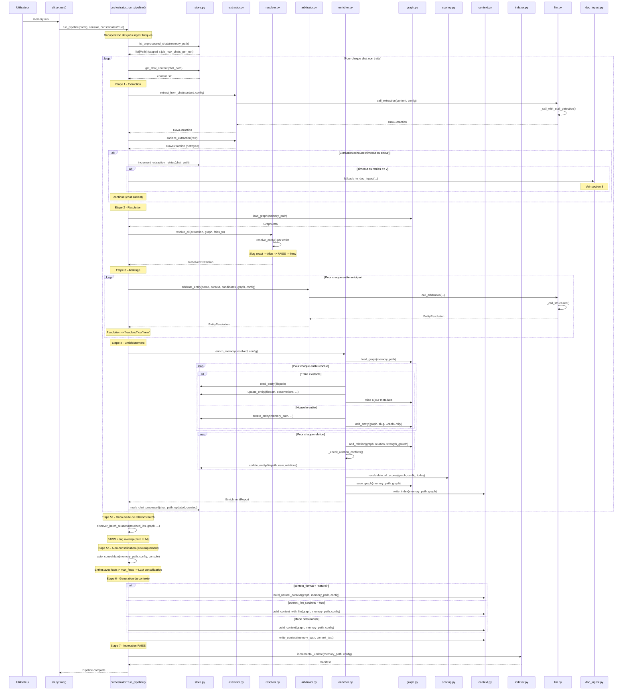
```mermaid
sequenceDiagram
    participant User as Utilisateur
    participant CLI as cli.py::run()
    participant Orch as orchestrator::run_pipeline()
    participant Store as store.py
    participant Ext as extractor.py
    participant Res as resolver.py
    participant Arb as arbitrator.py
    participant Enr as enricher.py
    participant Graph as graph.py
    participant Score as scoring.py
    participant Ctx as context.py
    participant Idx as indexer.py
    participant LLM as llm.py
    participant DocIng as doc_ingest.py

    User->>CLI: memory run
    CLI->>Orch: run_pipeline(config, console, consolidate=True)

    Note over Orch: Recuperation des jobs ingest bloques
    Orch->>Store: list_unprocessed_chats(memory_path)
    Store-->>Orch: list[Path] (capped a job_max_chats_per_run)

    loop Pour chaque chat non traite
        Orch->>Store: get_chat_content(chat_path)
        Store-->>Orch: content: str

        Note over Orch: Etape 1 - Extraction
        Orch->>Ext: extract_from_chat(content, config)
        Ext->>LLM: call_extraction(content, config)
        LLM->>LLM: _call_with_stall_detection()
        LLM-->>Ext: RawExtraction
        Ext-->>Orch: RawExtraction
        Orch->>Ext: sanitize_extraction(raw)
        Ext-->>Orch: RawExtraction (nettoyee)

        alt Extraction echouee (timeout ou erreur)
            Orch->>Store: increment_extraction_retries(chat_path)
            alt Timeout ou retries >= 2
                Orch->>DocIng: fallback_to_doc_ingest(...)
                Note over DocIng: Voir section 3
            end
            Note over Orch: continue (chat suivant)
        end

        Note over Orch: Etape 2 - Resolution
        Orch->>Graph: load_graph(memory_path)
        Graph-->>Orch: GraphData
        Orch->>Res: resolve_all(extraction, graph, faiss_fn)
        Res->>Res: resolve_entity() par entite
        Note over Res: Slug exact -> Alias -> FAISS -> New
        Res-->>Orch: ResolvedExtraction

        Note over Orch: Etape 3 - Arbitrage
        loop Pour chaque entite ambigue
            Orch->>Arb: arbitrate_entity(name, context, candidates, graph, config)
            Arb->>LLM: call_arbitration(...)
            LLM->>LLM: _call_structured()
            LLM-->>Arb: EntityResolution
            Arb-->>Orch: EntityResolution
            Note over Orch: Resolution -> "resolved" ou "new"
        end

        Note over Orch: Etape 4 - Enrichissement
        Orch->>Enr: enrich_memory(resolved, config)
        Enr->>Graph: load_graph(memory_path)
        loop Pour chaque entite resolue
            alt Entite existante
                Enr->>Store: read_entity(filepath)
                Enr->>Store: update_entity(filepath, observations, ...)
                Enr->>Graph: mise a jour metadata
            else Nouvelle entite
                Enr->>Store: create_entity(memory_path, ...)
                Enr->>Graph: add_entity(graph, slug, GraphEntity)
            end
        end
        loop Pour chaque relation
            Enr->>Graph: add_relation(graph, relation, strength_growth)
            Enr->>Enr: _check_relation_conflicts()
            Enr->>Store: update_entity(filepath, new_relations)
        end
        Enr->>Score: recalculate_all_scores(graph, config, today)
        Enr->>Graph: save_graph(memory_path, graph)
        Enr->>Ctx: write_index(memory_path, graph)
        Enr-->>Orch: EnrichmentReport

        Orch->>Store: mark_chat_processed(chat_path, updated, created)
    end

    Note over Orch: Etape 5a - Decouverte de relations batch
    Orch->>Orch: discover_batch_relations(touched_ids, graph, ...)
    Note over Orch: FAISS + tag overlap (zero LLM)

    Note over Orch: Etape 5b - Auto-consolidation (run uniquement)
    Orch->>Orch: auto_consolidate(memory_path, config, console)
    Note over Orch: Entites avec facts > max_facts -> LLM consolidation

    Note over Orch: Etape 6 - Generation du contexte
    alt context_format = "natural"
        Orch->>Ctx: build_natural_context(graph, memory_path, config)
    else context_llm_sections = true
        Orch->>Ctx: build_context_with_llm(graph, memory_path, config)
    else Mode deterministe
        Orch->>Ctx: build_context(graph, memory_path, config)
    end
    Orch->>Ctx: write_context(memory_path, context_text)

    Note over Orch: Etape 7 - Indexation FAISS
    Orch->>Idx: incremental_update(memory_path, config)
    Idx-->>Orch: manifest

    Orch-->>CLI: Pipeline complete
```

### Entrees et sorties par fonction

| Etape | Fonction | Entree | Sortie | LLM ? |
|---|---|---|---|---|
| 1 | `extract_from_chat(content, config)` | `str`, `Config` | `RawExtraction` | Oui (stall-aware streaming) |
| 1b | `sanitize_extraction(raw)` | `RawExtraction` ou `dict` | `RawExtraction` (validee) | Non |
| 2 | `resolve_all(extraction, graph, faiss_fn)` | `RawExtraction`, `GraphData`, `Callable` | `ResolvedExtraction` | Non |
| 3 | `arbitrate_entity(name, context, candidates, graph, config)` | `str`, `str`, `list[str]`, `GraphData`, `Config` | `EntityResolution` | Oui (`_call_structured`) |
| 4 | `enrich_memory(resolved, config, today)` | `ResolvedExtraction`, `Config`, `str` | `EnrichmentReport` | Non |
| 5a | `discover_batch_relations(touched_ids, graph, config, ...)` | `list[str]`, `GraphData`, `Config`, `Path` | `int` (nombre decouvertes) | Non |
| 5b | `auto_consolidate(memory_path, config, console)` | `Path`, `Config`, `Console` | `None` | Oui |
| 6 | `build_context(graph, memory_path, config)` | `GraphData`, `Path`, `Config` | `str` | Non (ou Oui si LLM sections) |
| 7 | `incremental_update(memory_path, config)` | `Path`, `Config` | `dict` (manifest) | Non |

### Flux de resolution detaille

La resolution (`resolver.py`) suit un ordre de priorite strict, sans aucun appel LLM :

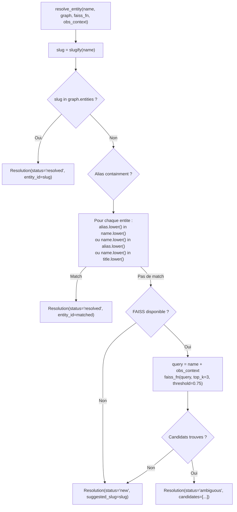
```mermaid
flowchart TD
    A["resolve_entity(name, graph, faiss_fn, obs_context)"] --> B["slug = slugify(name)"]
    B --> C{slug in graph.entities ?}
    C -->|Oui| D["Resolution(status='resolved', entity_id=slug)"]
    C -->|Non| E{Alias containment ?}
    E --> E1["Pour chaque entite :<br/>alias.lower() in name.lower()<br/>ou name.lower() in alias.lower()<br/>ou name.lower() in title.lower()"]
    E1 -->|Match| F["Resolution(status='resolved', entity_id=matched)"]
    E1 -->|Pas de match| G{FAISS disponible ?}
    G -->|Non| H["Resolution(status='new', suggested_slug=slug)"]
    G -->|Oui| I["query = name + obs_context<br/>faiss_fn(query, top_k=3, threshold=0.75)"]
    I --> J{Candidats trouves ?}
    J -->|Oui| K["Resolution(status='ambiguous', candidates=[...])"]
    J -->|Non| H
```

**Enrichissement contextuel FAISS** : la requete est enrichie avec `{category} {content[:50]}` de la premiere observation pour desambiguer les homonymes (ex: "Apple" fruit vs entreprise).

### Differences `run` vs `run-light`

| Aspect | `memory run` | `memory run-light` |
|---|---|---|
| Extraction | Oui | Oui |
| Resolution + Arbitrage | Oui | Oui |
| Enrichissement | Oui | Oui |
| Auto-consolidation | Oui (LLM) | Non |
| Contexte LLM per-section | Oui (si `context_llm_sections: true`) | Non |
| Contexte deterministe | Oui | Oui |
| FAISS | Oui | Oui |

---

## 3. Pipeline de fallback (doc_ingest)

### Declenchement

Le fallback vers `doc_ingest` est declenche par `orchestrator.py::fallback_to_doc_ingest()` dans deux cas :

1. **Timeout** : `is_timeout_error(exc)` detecte un `StallError` ou des exceptions contenant "timeout"
2. **Retries epuises** : `retries >= EXTRACTION_MAX_RETRIES` (defaut : 2)

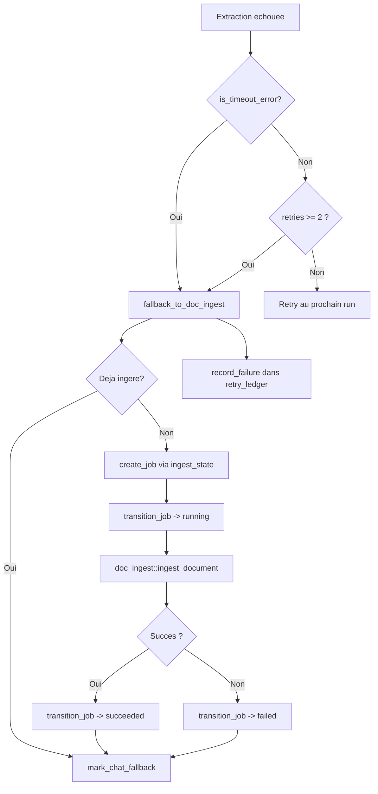
```mermaid
flowchart TD
    A[Extraction echouee] --> B{is_timeout_error?}
    B -->|Oui| D[fallback_to_doc_ingest]
    B -->|Non| C{retries >= 2 ?}
    C -->|Oui| D
    C -->|Non| E[Retry au prochain run]
    D --> F{Deja ingere?}
    F -->|Oui| G[mark_chat_fallback]
    F -->|Non| H[create_job via ingest_state]
    H --> I[transition_job -> running]
    I --> J[doc_ingest::ingest_document]
    J --> K{Succes ?}
    K -->|Oui| L[transition_job -> succeeded]
    K -->|Non| M[transition_job -> failed]
    L --> G
    M --> G
    D --> N[record_failure dans retry_ledger]
```

### Fonction `ingest_document()`

```python
def ingest_document(
    source_id: str,
    content: str,
    ingest_key: IngestKey,
    memory_path: Path,
    config: Config,
) -> dict:
```

**Flux interne** :

1. `_normalize_text(content)` : suppression du frontmatter YAML, normalisation des espaces
2. `chunk_text(normalized, chunk_size, chunk_overlap)` : decoupage en chunks chevauches (400 tokens, 80 overlap)
3. `get_embedding_fn(config)(chunks)` : vectorisation des chunks
4. Chargement de l'index FAISS existant ou creation d'un nouveau `IndexFlatIP`
5. **Garde d'upsert** : si le `content_hash` est identique, pas de re-indexation
6. `index.add(embeddings)` : ajout des vecteurs
7. Mise a jour du manifest avec `source_type: "document"`
8. Sauvegarde index + mapping + manifest

### Machine a etats (ingest_state.py)

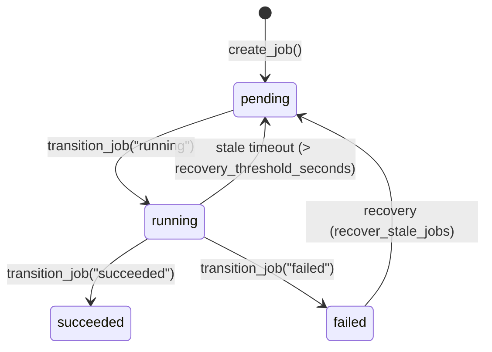
```mermaid
stateDiagram-v2
    [*] --> pending : create_job()
    pending --> running : transition_job("running")
    running --> succeeded : transition_job("succeeded")
    running --> failed : transition_job("failed")
    failed --> pending : recovery (recover_stale_jobs)
    running --> pending : stale timeout (> recovery_threshold_seconds)
```

**Cle d'idempotence** : `IngestKey` = `(source_id, content_hash, chunk_policy_version)`. La fonction `has_been_ingested(key, config)` empeche les doubles ingestions.

### Comparaison extraction vs doc_ingest

| Aspect | Pipeline extraction (normal) | Pipeline doc_ingest (fallback) |
|---|---|---|
| Entites creees | Oui (structurees) | Non |
| Relations creees | Oui | Non |
| Observations extraites | Oui (category, valence, tags) | Non |
| Accessible via FAISS | Oui (apres indexation) | Oui (immediat) |
| Accessible via graphe | Oui | Non |
| Apparait dans _context.md | Oui (si score suffisant) | Non |
| Recoverabilite | Via `memory replay` | Via Dream step 2 (extract docs) |

Le doc_ingest garantit un acces rapide au contenu via recherche semantique, meme quand l'extraction structuree echoue. Le mode Dream (step 2) peut ensuite tenter d'extraire des entites a partir de ces documents RAG.

---

## 4. Pipeline Inbox

### Vue d'ensemble

`process_inbox()` traite les fichiers deposes dans `memory/_inbox/` et les route vers le bon pipeline.

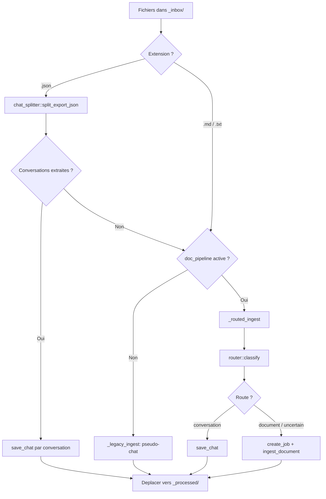
```mermaid
flowchart TD
    A[Fichiers dans _inbox/] --> B{Extension ?}
    B -->|.json| C[chat_splitter::split_export_json]
    B -->|.md / .txt| D{doc_pipeline active ?}

    C --> C1{Conversations extraites ?}
    C1 -->|Oui| C2[save_chat par conversation]
    C1 -->|Non| D

    D -->|Non| E[_legacy_ingest: pseudo-chat]
    D -->|Oui| F[_routed_ingest]

    F --> G[router::classify]
    G --> H{Route ?}
    H -->|conversation| I[save_chat]
    H -->|document / uncertain| J[create_job + ingest_document]

    C2 --> K[Deplacer vers _processed/]
    E --> K
    I --> K
    J --> K
```

### Import JSON multi-conversations (`chat_splitter.py`)

La fonction `split_export_json(filepath, memory_path) -> list[Path]` detecte automatiquement le format :

| Format | Detection | Structure |
|---|---|---|
| **Claude.ai** | `chat_messages` ou `uuid` dans le premier element | `sender: human/assistant`, `text` |
| **ChatGPT** | `mapping` dans le premier element | arbre de noeuds, `author.role`, `content.parts` |
| **Generique** | tableau de `{role, content}` | liste directe de messages |

**Post-traitement** : `_patch_chat_frontmatter()` ajoute les metadonnees d'export (`source: import`, `source_title`, `date`) dans le frontmatter YAML du chat sauvegarde.

### Classification (`router.py`)

`classify(content, source_filename) -> RouteDecision` utilise des heuristiques deterministes (pas de LLM) pour router vers :
- `conversation` : dialogues avec alternance question/reponse
- `document` : contenu textuel continu
- `uncertain` : route vers document par defaut (acces immediat via FAISS)

---

## 5. Pipeline Dream

### Vue d'ensemble

Le mode Dream reorganise les connaissances existantes en 10 etapes. Un coordinateur deterministe (`decide_dream_steps()`) selectionne les etapes a executer selon les statistiques memoire.

### Diagramme de dependances des etapes

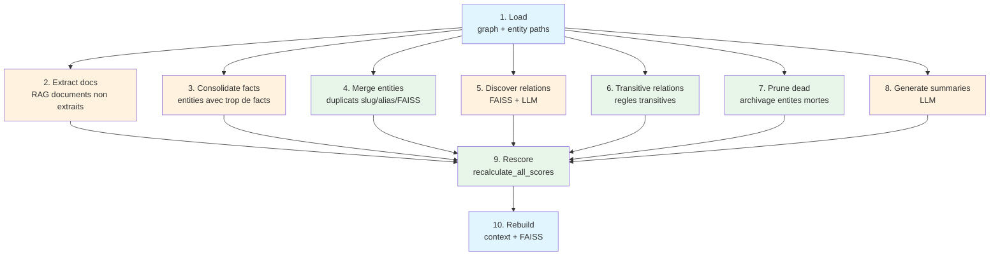
```mermaid
flowchart TD
    S1[1. Load<br/>graph + entity paths] --> S2[2. Extract docs<br/>RAG documents non extraits]
    S1 --> S3[3. Consolidate facts<br/>entities avec trop de facts]
    S1 --> S4[4. Merge entities<br/>duplicats slug/alias/FAISS]
    S1 --> S5[5. Discover relations<br/>FAISS + LLM]
    S1 --> S6[6. Transitive relations<br/>regles transitives]
    S1 --> S7[7. Prune dead<br/>archivage entites mortes]
    S1 --> S8[8. Generate summaries<br/>LLM]

    S2 --> S9[9. Rescore<br/>recalculate_all_scores]
    S3 --> S9
    S4 --> S9
    S5 --> S9
    S6 --> S9
    S7 --> S9
    S8 --> S9

    S9 --> S10[10. Rebuild<br/>context + FAISS]

    style S1 fill:#e1f5fe
    style S2 fill:#fff3e0
    style S3 fill:#fff3e0
    style S4 fill:#e8f5e9
    style S5 fill:#fff3e0
    style S6 fill:#e8f5e9
    style S7 fill:#e8f5e9
    style S8 fill:#fff3e0
    style S9 fill:#e8f5e9
    style S10 fill:#e1f5fe
```

**Legende des couleurs** :
- Bleu : etapes systeme (load/rebuild)
- Orange : etapes avec LLM
- Vert : etapes deterministes (zero LLM)

### Detail des 10 etapes

| Etape | Fonction | LLM ? | Modules utilises | Entree | Sortie |
|---|---|---|---|---|---|
| 1 | `_step_load()` | Non | `graph.py` | `memory_path` | `(GraphData, dict[str, Path])` |
| 2 | `_step_extract_documents()` | Oui | `indexer`, `extractor`, `resolver`, `enricher` | documents FAISS non extraits | entites creees |
| 3 | `_step_consolidate_facts()` | Oui | `store.consolidate_entity_facts`, `llm.call_fact_consolidation` | entites avec facts > max_facts | facts consolides |
| 4 | `_step_merge_entities()` | Oui (FAISS candidates) | `store`, `graph`, `llm.call_dedup_check` | paires duplicats | entites fusionnees |
| 5 | `_step_discover_relations()` | Oui | `indexer.search`, `llm.call_relation_discovery` | paires FAISS similaires | relations creees |
| 6 | `_step_transitive_relations()` | Non | `graph.add_relation` | triples A->B->C | relations inferees (max 20) |
| 7 | `_step_prune_dead()` | Non | `graph`, `store` | `score < 0.1, freq <= 1, age > 90j` | entites archivees |
| 8 | `_step_generate_summaries()` | Oui | `store`, `llm.call_entity_summary` | entites sans summary | summaries generes |
| 9 | `recalculate_all_scores()` | Non | `scoring.py` | graph complet | scores mis a jour |
| 10 | `_step_rebuild()` | Non (ou Oui si natural) | `context`, `indexer`, `graph` | graph + entites | `_context.md` + FAISS |

### Coordinateur deterministe

```python
def decide_dream_steps(stats: dict) -> list[int]:
```

Le coordinateur selectionne les etapes selon des seuils sur les statistiques collectees par `_collect_dream_stats()` :

| Condition | Etape ajoutee |
|---|---|
| `unextracted_docs > 0` | 2 |
| `consolidation_candidates >= 3` | 3 |
| `merge_candidates >= 2` | 4 |
| `relation_candidates >= 5` | 5 |
| `transitive_candidates >= 3` | 6 |
| `prune_candidates >= 1` | 7 |
| `summary_candidates >= 3` | 8 |
| Si au moins une etape 2-8 | 9, 10 |

L'etape 1 (Load) est toujours executee.

### Validation deterministe

`validate_dream_step(step, before_state, after_state) -> (bool, list[str])` verifie les invariants apres chaque etape critique :

- **Etape 3** : le nombre total de facts ne doit pas augmenter
- **Etape 4** : le nombre total d'entites ne doit pas augmenter
- **Etape 5** : pas plus de 50 nouvelles relations d'un coup

### Dashboard

Le `DreamDashboard` (Rich Live) affiche en temps reel l'avancement via des callbacks :
- `start_step(n)` : etape en cours
- `complete_step(n, summary)` : etape terminee
- `fail_step(n, error)` : etape echouee
- `skip_step(n)` : etape ignoree par le coordinateur

---

## 6. Flux de donnees : cycle de vie des entites

### Diagramme d'etat d'une entite

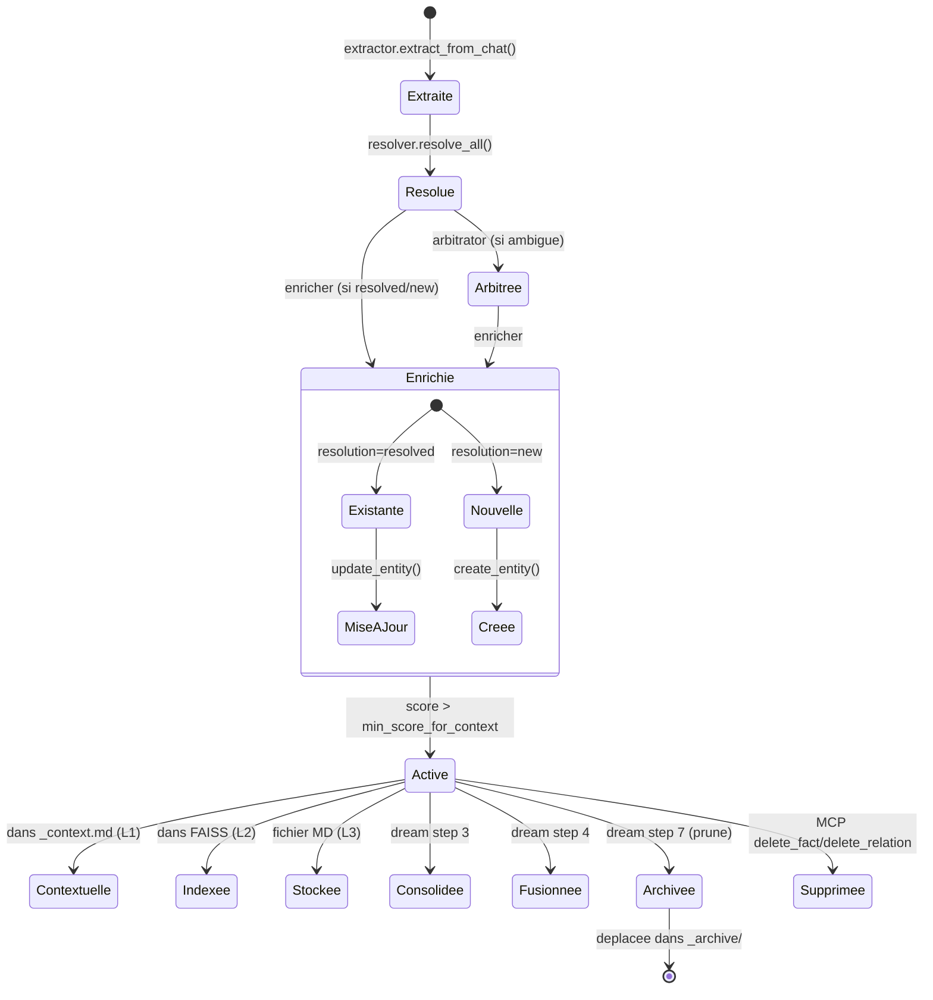
```mermaid
stateDiagram-v2
    [*] --> Extraite : extractor.extract_from_chat()
    Extraite --> Resolue : resolver.resolve_all()
    Resolue --> Arbitree : arbitrator (si ambigue)
    Resolue --> Enrichie : enricher (si resolved/new)
    Arbitree --> Enrichie : enricher

    state Enrichie {
        [*] --> Existante : resolution=resolved
        [*] --> Nouvelle : resolution=new
        Existante --> MiseAJour : update_entity()
        Nouvelle --> Creee : create_entity()
    }

    Enrichie --> Active : score > min_score_for_context
    Active --> Contextuelle : dans _context.md (L1)
    Active --> Indexee : dans FAISS (L2)
    Active --> Stockee : fichier MD (L3)

    Active --> Consolidee : dream step 3
    Active --> Fusionnee : dream step 4
    Active --> Archivee : dream step 7 (prune)
    Archivee --> [*] : deplacee dans _archive/

    Active --> Supprimee : MCP delete_fact/delete_relation
```

### Creation d'une entite

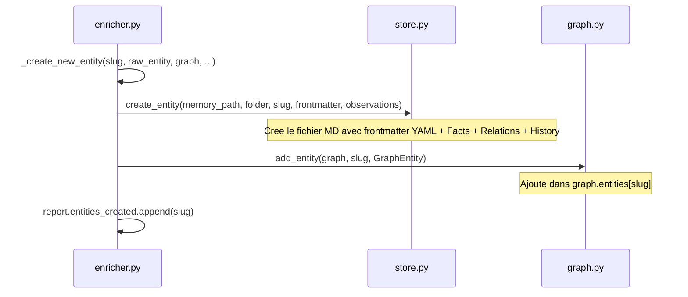
```mermaid
sequenceDiagram
    participant Enr as enricher.py
    participant Store as store.py
    participant Graph as graph.py

    Enr->>Enr: _create_new_entity(slug, raw_entity, graph, ...)
    Enr->>Store: create_entity(memory_path, folder, slug, frontmatter, observations)
    Note over Store: Cree le fichier MD avec frontmatter YAML + Facts + Relations + History
    Enr->>Graph: add_entity(graph, slug, GraphEntity)
    Note over Graph: Ajoute dans graph.entities[slug]
    Enr->>Enr: report.entities_created.append(slug)
```

**Fichier MD cree** (`store.create_entity()`) :
```
---
title: Nom de l'Entite
type: health
retention: short_term
score: 0.0
importance: 0.85
frequency: 1
last_mentioned: "2026-03-11"
created: "2026-03-11"
aliases: []
tags: [health]
mention_dates: ["2026-03-11"]
---
## Facts
- [diagnosis] (2026-03) Contenu de l'observation [-]

## Relations

## History
- 2026-03-11: Created
```

### Mise a jour d'une entite existante

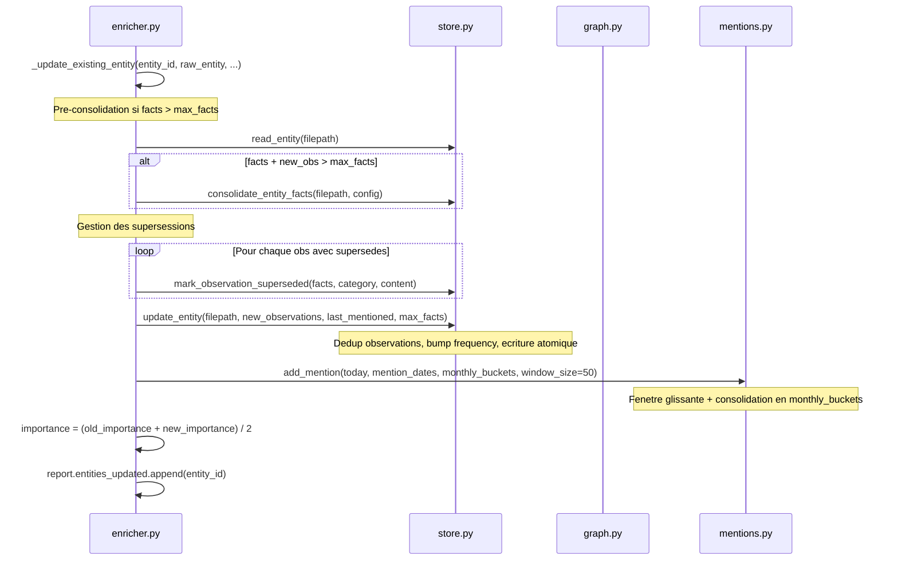
```mermaid
sequenceDiagram
    participant Enr as enricher.py
    participant Store as store.py
    participant Graph as graph.py
    participant Mentions as mentions.py

    Enr->>Enr: _update_existing_entity(entity_id, raw_entity, ...)

    Note over Enr: Pre-consolidation si facts > max_facts
    Enr->>Store: read_entity(filepath)
    alt facts + new_obs > max_facts
        Enr->>Store: consolidate_entity_facts(filepath, config)
    end

    Note over Enr: Gestion des supersessions
    loop Pour chaque obs avec supersedes
        Enr->>Store: mark_observation_superseded(facts, category, content)
    end

    Enr->>Store: update_entity(filepath, new_observations, last_mentioned, max_facts)
    Note over Store: Dedup observations, bump frequency, ecriture atomique

    Enr->>Mentions: add_mention(today, mention_dates, monthly_buckets, window_size=50)
    Note over Mentions: Fenetre glissante + consolidation en monthly_buckets

    Enr->>Enr: importance = (old_importance + new_importance) / 2
    Enr->>Enr: report.entities_updated.append(entity_id)
```

### Fusion (Dream step 4)

La fusion est declenchee par `_step_merge_entities()` dans `dream.py` :

1. **Detection deterministe** : overlap slug/alias entre entites de meme type
2. **Detection FAISS** : `_find_faiss_dedup_candidates()` avec seuil de similarite 0.80
3. **Confirmation LLM** (FAISS uniquement) : `call_dedup_check()` avec seuil de confiance 0.7

**Processus de fusion** (`_do_merge()`) :
- Entite a garder = celle avec le score le plus eleve
- Fusion des aliases, facts, tags, mention_dates
- `importance = max(keep, drop)`, `frequency = keep + drop`
- Retargetage des relations : `drop_id -> keep_id`
- Suppression des auto-references
- Deplacement du fichier drop vers `_archive/`
- Entree d'historique dans l'entite conservee

### Archivage (Dream step 7)

Criteres de pruning (`_step_prune_dead()`) :
- `score < 0.1`
- `frequency <= 1`
- `retention != "permanent"`
- Pas de relations (entite orpheline)
- `age > 90 jours`

**Actions** :
1. Deplacement du fichier MD vers `_archive/`
2. Suppression de `graph.entities[eid]`
3. `remove_orphan_relations(graph)` : nettoyage des relations pendantes
4. `save_graph()` + rebuild FAISS

### Suppression MCP

Le serveur MCP expose 4 outils de modification :

| Outil | Fonction interne | Actions |
|---|---|---|
| `delete_fact(entity_name, fact_content)` | `_delete_fact_impl()` | Supprime le fait du MD, ajoute une entree History |
| `delete_relation(from, to, type)` | `_delete_relation_impl()` | Supprime du graphe + du fichier MD source |
| `modify_fact(entity, old, new)` | `_modify_fact_impl()` | Remplace le contenu en preservant les metadonnees |
| `correct_entity(entity, field, value)` | `_correct_entity_impl()` | Met a jour title/type/aliases/retention, deplace le fichier si type change |

---

## 7. Flux de donnees : relations

### Creation d'une relation

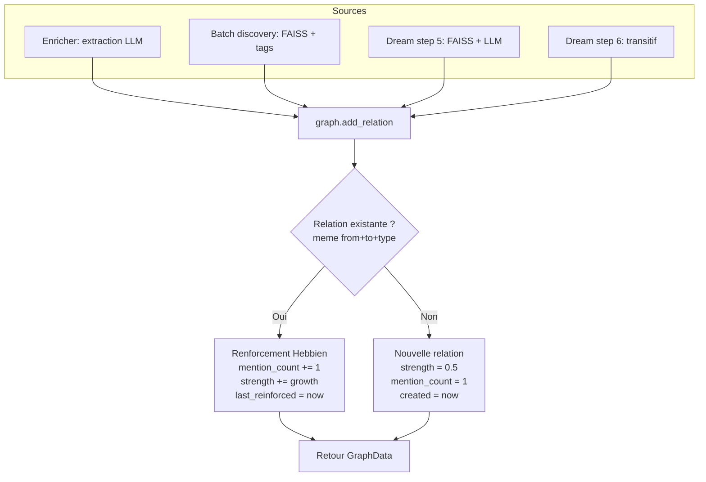
```mermaid
flowchart TD
    subgraph Sources
        A1[Enricher: extraction LLM]
        A2[Batch discovery: FAISS + tags]
        A3[Dream step 5: FAISS + LLM]
        A4[Dream step 6: transitif]
    end

    A1 --> B[graph.add_relation]
    A2 --> B
    A3 --> B
    A4 --> B

    B --> C{Relation existante ?<br/>meme from+to+type}
    C -->|Oui| D[Renforcement Hebbien<br/>mention_count += 1<br/>strength += growth<br/>last_reinforced = now]
    C -->|Non| E[Nouvelle relation<br/>strength = 0.5<br/>mention_count = 1<br/>created = now]

    D --> F[Retour GraphData]
    E --> F
```

### Apprentissage Hebbien (LTP)

A chaque co-occurrence de deux entites (`add_relation()` dans `graph.py`) :

```python
existing.mention_count += 1
existing.strength = min(1.0, existing.strength + strength_growth)  # +0.05 par defaut
existing.last_reinforced = datetime.now().isoformat()
```

### Decouverte batch (orchestrator)

`discover_batch_relations(touched_ids, graph, config, memory_path, console)` :

1. Construit un ensemble de relations existantes pour lookup O(1)
2. Pour chaque entite touchee dans le batch :
   - Recherche FAISS top-3 : `faiss_search(entity.title, config, memory_path, top_k=3)`
   - Filtre : `other_id != eid`, pas deja en relation, dans le graphe
   - Condition : **2+ tags partages** ET **score FAISS >= 0.8**
   - Cree une relation `linked_to` avec contexte `tag overlap: ...`
3. `save_graph()` si au moins une relation decouverte

### Decouverte Dream (step 5)

`_step_discover_relations()` :

1. Recherche FAISS top-5 pour chaque entite
2. Filtre les paires sans relation existante
3. Construction de dossiers compacts (`_build_dossier()` : top 3 facts, tags, summary)
4. **Appel LLM** : `call_relation_discovery(a_title, a_type, a_dossier, b_title, b_type, b_dossier, config)`
5. Validation du type de relation contre `_VALID_RELATION_TYPES`
6. `add_relation()` avec `strength_growth` configure

### Relations transitives (Dream step 6)

Regles transitives definies dans `_TRANSITIVE_RULES` :

| `(type_AB, type_BC)` | `type_AC` infere |
|---|---|
| `(affects, affects)` | `affects` |
| `(part_of, part_of)` | `part_of` |
| `(requires, requires)` | `requires` |
| `(improves, affects)` | `improves` |
| `(worsens, affects)` | `worsens` |
| `(uses, part_of)` | `uses` |

**Conditions** :
- Relations source avec `strength >= 0.4`
- `A != C` et pas de relation existante `(A, C)`
- Force inferee : `min(strength_AB, strength_BC) * 0.5`
- Maximum 20 nouvelles relations par execution

### Depression a Long Terme (LTD)

`_apply_ltd()` dans `scoring.py`, appelee lors de `recalculate_all_scores()` :

```python
if days_since_reinforced > 90:
    strength = max(0.1, strength * exp(-days / relation_ltd_halflife))
```

- **Seuil** : 90 jours sans renforcement
- **Demi-vie** : `relation_ltd_halflife` (defaut 360 jours)
- **Plancher** : `strength >= 0.1` (jamais completement oubliee)

### Conflits de relations exclusives

`enricher.py` definit des familles mutuellement exclusives :

```python
EXCLUSIVE_RELATIONS = [
    {"parent_of", "friend_of"},
    {"improves", "worsens"},
]
```

Quand une nouvelle relation de type X est ajoutee, toute relation existante de type Y (meme famille, meme paire d'entites) est automatiquement supprimee via `_check_relation_conflicts()`.

---

## 8. Flux de donnees : scoring

### Declencheurs du recalcul

```mermaid
flowchart TD
    A[enricher::enrich_memory] -->|apres chaque chat| B[recalculate_all_scores]
    C[dream step 9] -->|apres reorganisation| B
    D[cli::rebuild_all] -->|reconstruction complete| B
    E[cli::context] -->|avant generation contexte| B

    B --> F[_apply_ltd sur relations]
    B --> G[spreading_activation]
    G --> H[calculate_score par entite]
    H --> I[entity.score = round(score, 4)]
    I --> J[save_graph]
    J --> K[Propagation vers context build]
```

### Algorithme complet

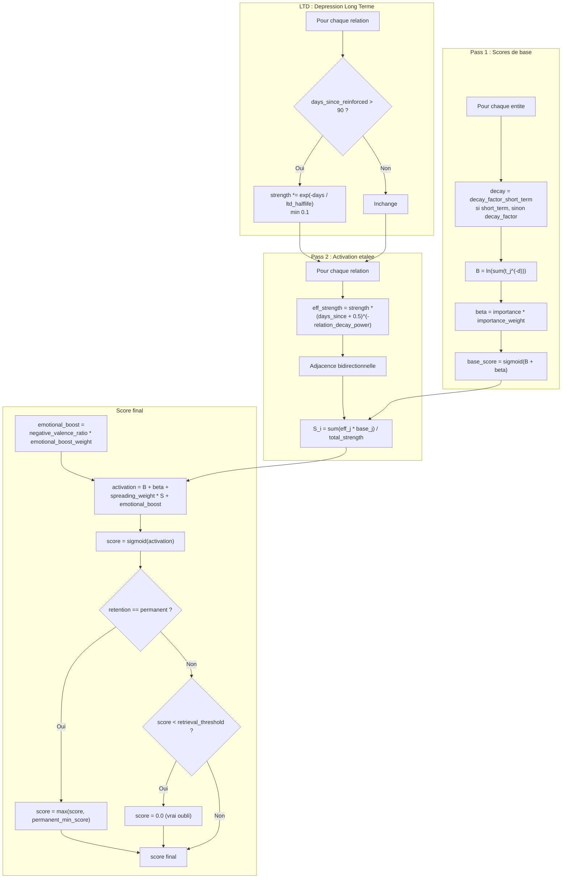
```mermaid
flowchart TD
    subgraph "Pass 1 : Scores de base"
        A1[Pour chaque entite] --> A2[decay = decay_factor_short_term<br/>si short_term, sinon decay_factor]
        A2 --> A3["B = ln(sum(t_j^(-d)))"]
        A3 --> A4["beta = importance * importance_weight"]
        A4 --> A5["base_score = sigmoid(B + beta)"]
    end

    subgraph "LTD : Depression Long Terme"
        B1[Pour chaque relation] --> B2{days_since_reinforced > 90 ?}
        B2 -->|Oui| B3["strength *= exp(-days / ltd_halflife)<br/>min 0.1"]
        B2 -->|Non| B4[Inchange]
    end

    subgraph "Pass 2 : Activation etalee"
        C1[Pour chaque relation] --> C2["eff_strength = strength *<br/>(days_since + 0.5)^(-relation_decay_power)"]
        C2 --> C3[Adjacence bidirectionnelle]
        C3 --> C4["S_i = sum(eff_j * base_j) / total_strength"]
    end

    subgraph "Score final"
        D1["emotional_boost =<br/>negative_valence_ratio * emotional_boost_weight"]
        D2["activation = B + beta +<br/>spreading_weight * S + emotional_boost"]
        D2 --> D3["score = sigmoid(activation)"]
        D3 --> D4{retention == permanent ?}
        D4 -->|Oui| D5["score = max(score, permanent_min_score)"]
        D4 -->|Non| D6{score < retrieval_threshold ?}
        D6 -->|Oui| D7["score = 0.0 (vrai oubli)"]
        D6 -->|Non| D8[score final]
        D5 --> D8
        D7 --> D8
    end

    A5 --> C4
    B3 --> C1
    B4 --> C1
    C4 --> D2
    D1 --> D2
```

### Parametres de scoring (ScoringConfig)

| Parametre | Defaut | Effet |
|---|---|---|
| `decay_factor` | 0.5 | Decroissance pour long_term |
| `decay_factor_short_term` | 0.8 | Decroissance pour short_term (plus agressive) |
| `importance_weight` | 0.3 | Poids de l'importance dans le score |
| `spreading_weight` | 0.2 | Poids de l'activation etalee |
| `permanent_min_score` | 0.5 | Score plancher pour retention permanent |
| `retrieval_threshold` | 0.05 | Sous ce seuil, score = 0 (oubli ACT-R) |
| `relation_decay_power` | 0.3 | Exposant de decroissance en loi de puissance |
| `emotional_boost_weight` | 0.15 | Boost pour les entites emotionnelles |
| `relation_strength_growth` | 0.05 | Increment Hebbien par co-occurrence |
| `relation_ltd_halflife` | 360 | Demi-vie LTD en jours |
| `min_score_for_context` | 0.3 | Score minimum pour apparaitre dans _context.md |

### Systeme de mentions fenetrees

Le module `mentions.py` gere les dates de mention avec une fenetre glissante :

```mermaid
flowchart LR
    A["add_mention(today)"] --> B{len(mention_dates) > window_size ?}
    B -->|Non| C["Append today"]
    B -->|Oui| D["consolidate_window()"]
    D --> E["Dates les plus anciennes -> monthly_buckets<br/>Format: YYYY-MM -> count"]
    E --> F["Garder les window_size dates les plus recentes"]
    F --> C
```

- **`window_size`** : 50 par defaut (configurable via `scoring.window_size`)
- **`mention_dates`** : liste de dates ISO recentes (haute resolution)
- **`monthly_buckets`** : `dict[str, int]` (ex: `{"2025-06": 3, "2025-09": 5}`) pour les mentions anciennes
- Les deux sont utilises par `calculate_actr_base()` pour le calcul du score ACT-R

### Modulation emotionnelle

`negative_valence_ratio` est calcule lors de `rebuild_from_md()` dans `graph.py` :
- Scanne les facts de la section `## Facts`
- Compte les facts avec marqueur `[-]` ou categories `vigilance`, `diagnosis`, `treatment`
- `ratio = emotional_facts / total_facts`
- Modelise la consolidation amygdale-hippocampe : les souvenirs emotionnels persistent plus longtemps

---

## 9. Flux de donnees : FAISS

### Construction de l'index

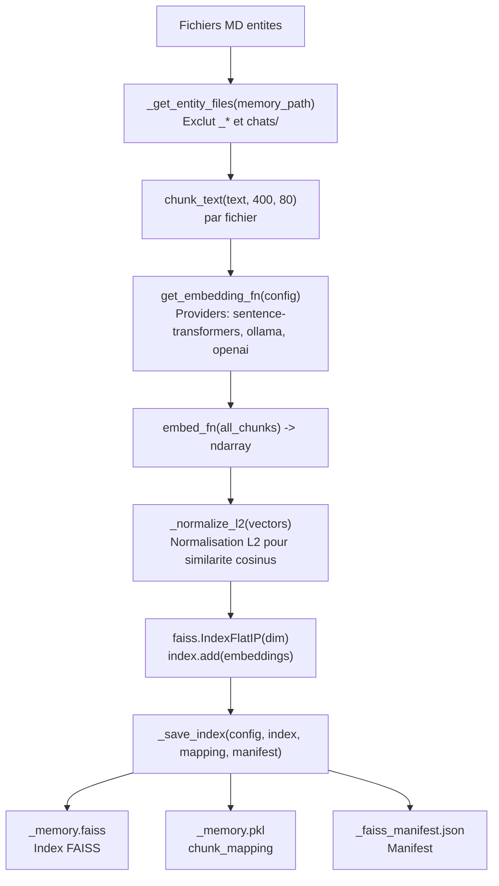
```mermaid
flowchart TD
    A[Fichiers MD entites] --> B["_get_entity_files(memory_path)<br/>Exclut _* et chats/"]
    B --> C["chunk_text(text, 400, 80)<br/>par fichier"]
    C --> D["get_embedding_fn(config)<br/>Providers: sentence-transformers, ollama, openai"]
    D --> E["embed_fn(all_chunks) -> ndarray"]
    E --> F["_normalize_l2(vectors)<br/>Normalisation L2 pour similarite cosinus"]
    F --> G["faiss.IndexFlatIP(dim)<br/>index.add(embeddings)"]
    G --> H["_save_index(config, index, mapping, manifest)"]

    H --> I["_memory.faiss<br/>Index FAISS"]
    H --> J["_memory.pkl<br/>chunk_mapping"]
    H --> K["_faiss_manifest.json<br/>Manifest"]
```

### Mise a jour incrementale

`incremental_update(memory_path, config)` :

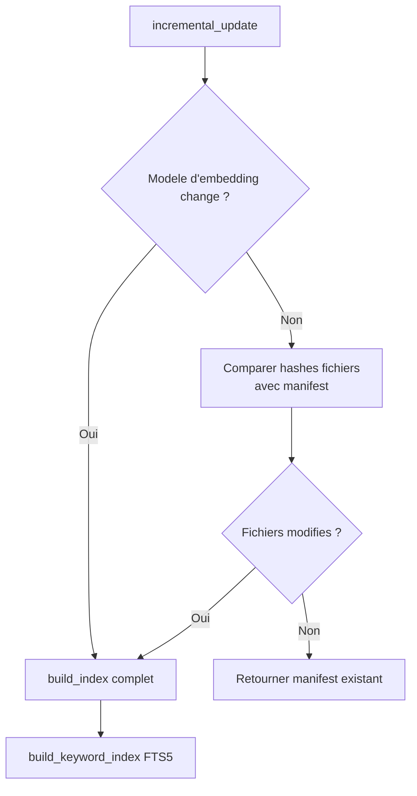
```mermaid
flowchart TD
    A[incremental_update] --> B{Modele d'embedding change ?}
    B -->|Oui| C[build_index complet]
    B -->|Non| D["Comparer hashes fichiers<br/>avec manifest"]
    D --> E{Fichiers modifies ?}
    E -->|Non| F[Retourner manifest existant]
    E -->|Oui| C
    C --> G[build_keyword_index FTS5]
```

**Note** : en v1, toute modification declenche un rebuild complet. Un vrai incremental (remplacement selectif de vecteurs) est prevu en v2.

### Recherche

```python
def search(query: str, config: Config, memory_path: Path, top_k: int | None = None) -> list[SearchResult]:
```

1. Charge l'index FAISS et le mapping (auto-rebuild si absents)
2. `embed_fn([query])` : vectorise la requete
3. `index.search(query_vec, k)` : recherche des k plus proches voisins
4. Retourne `list[SearchResult(entity_id, file, chunk, score)]`

### Consommateurs de FAISS

| Module | Utilisation | Fonction appelee |
|---|---|---|
| `resolver.py` | Resolution d'entites ambigues | `faiss_search_fn(query, top_k=3, threshold=0.75)` via `make_faiss_fn()` |
| `server.py` | Recherche RAG + re-ranking | `faiss_search(query, config, memory_path)` + RRF |
| `orchestrator.py` | Decouverte batch de relations | `faiss_search(entity.title, config, memory_path, top_k=3)` |
| `dream.py` | Decouverte de relations (step 5) | `faiss_search(entity.title, config, memory_path, top_k=5)` |
| `dream.py` | Detection de duplicats (step 4) | `faiss_search(entity.title, config, memory_path, top_k=5)` |
| `context.py` | RAG pre-fetch pour LLM sections | `faiss_search(entity.title, config, memory_path, top_k=2)` |

### Re-ranking hybride (server.py)

Quand l'index FTS5 est disponible et `hybrid_enabled = true` :

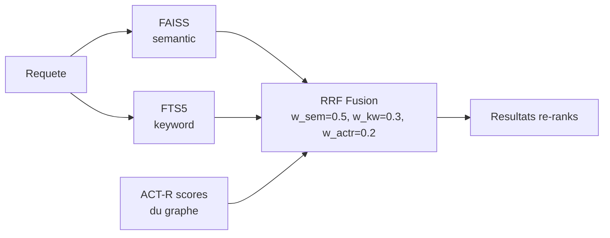
```mermaid
flowchart LR
    A[Requete] --> B[FAISS<br/>semantic]
    A --> C[FTS5<br/>keyword]
    B --> D["RRF Fusion<br/>w_sem=0.5, w_kw=0.3, w_actr=0.2"]
    C --> D
    E[ACT-R scores<br/>du graphe] --> D
    D --> F[Resultats re-ranks]
```

**Formule RRF** :
```
score(eid) = w_sem/(k + rank_sem) + w_kw/(k + rank_kw) + w_actr/(k + rank_actr)
```
avec `k = rrf_k` (defaut 60).

**Fallback sans FTS5** : re-ranking lineaire `score = 0.6 * faiss_score + 0.4 * actr_score`.

---

## 10. Flux de donnees : contexte

### 3 modes de generation

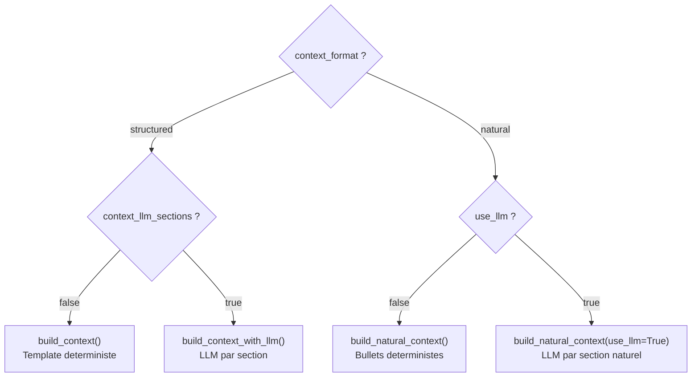
```mermaid
flowchart TD
    A{context_format ?} -->|structured| B{context_llm_sections ?}
    A -->|natural| E{use_llm ?}

    B -->|false| C["build_context()<br/>Template deterministe"]
    B -->|true| D["build_context_with_llm()<br/>LLM par section"]

    E -->|false| F["build_natural_context()<br/>Bullets deterministes"]
    E -->|true| G["build_natural_context(use_llm=True)<br/>LLM par section naturel"]
```

### Mode structure deterministe (`build_context()`)

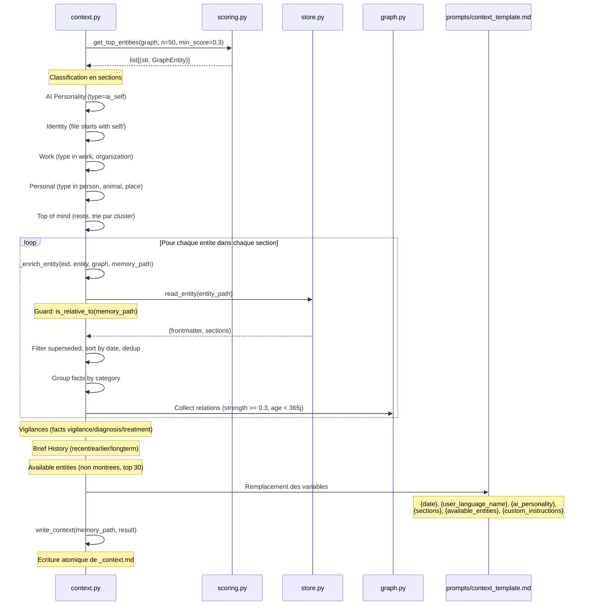
```mermaid
sequenceDiagram
    participant Ctx as context.py
    participant Score as scoring.py
    participant Store as store.py
    participant Graph as graph.py
    participant Template as prompts/context_template.md

    Ctx->>Score: get_top_entities(graph, n=50, min_score=0.3)
    Score-->>Ctx: list[(str, GraphEntity)]

    Note over Ctx: Classification en sections

    Ctx->>Ctx: AI Personality (type=ai_self)
    Ctx->>Ctx: Identity (file starts with self/)
    Ctx->>Ctx: Work (type in work, organization)
    Ctx->>Ctx: Personal (type in person, animal, place)
    Ctx->>Ctx: Top of mind (reste, trie par cluster)

    loop Pour chaque entite dans chaque section
        Ctx->>Ctx: _enrich_entity(eid, entity, graph, memory_path)
        Ctx->>Store: read_entity(entity_path)
        Note over Ctx: Guard: is_relative_to(memory_path)
        Store-->>Ctx: (frontmatter, sections)
        Ctx->>Ctx: Filter superseded, sort by date, dedup
        Ctx->>Ctx: Group facts by category
        Ctx->>Graph: Collect relations (strength >= 0.3, age < 365j)
    end

    Note over Ctx: Vigilances (facts vigilance/diagnosis/treatment)
    Note over Ctx: Brief History (recent/earlier/longterm)
    Note over Ctx: Available entities (non montrees, top 30)

    Ctx->>Template: Remplacement des variables
    Note over Template: {date}, {user_language_name}, {ai_personality},<br/>{sections}, {available_entities}, {custom_instructions}

    Ctx->>Ctx: write_context(memory_path, result)
    Note over Ctx: Ecriture atomique de _context.md
```

### Budget de tokens

Chaque section a un budget en pourcentage de `context_max_tokens - reserved` :

```python
total_budget = max(config.context_max_tokens - 500, 1000)
section_budget = int(total_budget * pct / 100)
```

Le budget est configure dans `config.yaml` sous `context_budget` :
```yaml
context_budget:
  ai_personality: 10
  identity: 15
  work: 15
  personal: 15
  top_of_mind: 15
  history_recent: 10
  history_earlier: 10
  history_longterm: 10
```

### Mode naturel (`build_natural_context()`)

Differences avec le mode structure :

1. **Selection** : `_select_entities_for_natural()` filtre plus strictement (pas d'interets sauf long_term)
2. **Classification temporelle** : `_classify_temporal()` repartit en long_term / medium_term / short_term
3. **Bullets naturels** : `_build_natural_bullet()` genere des phrases avec relations integrees
4. **Template** : `prompts/context_natural.md`

### Mode LLM par section

`build_context_with_llm()` et `build_natural_context(use_llm=True)` :

1. Construction du dossier enrichi par section
2. **RAG pre-fetch** : `_rag_prefetch()` cherche des faits lies dans FAISS (max 15 resultats, 2 par entite)
3. **Appel LLM** : `call_context_section()` ou `call_natural_context_section()`
4. **Fallback** : si le LLM echoue, retour au dossier brut ou aux bullets deterministes
5. **Vigilances** : toujours deterministes (donnees critiques, pas de reinterpretation LLM)

### Deduplication des facts pour le contexte

`_deduplicate_facts_for_context(facts, threshold=0.35, max_per_category=5)` :

- **Similarite mixte** : 50% Jaccard de mots (sans stopwords FR/EN) + 50% trigrammes de caracteres
- **Seuil** : 0.35 (dupliquer au-dessus)
- **Cap par categorie** : 5 facts max (3 pour ai_self)

### Memoire a 3 niveaux et re-emergence L2 -> L1

Le systeme de contexte implemente une memoire a 3 niveaux :

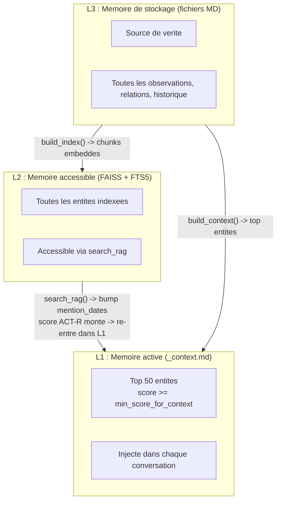
```mermaid
flowchart TD
    subgraph L1 ["L1 : Memoire active (_context.md)"]
        direction LR
        L1a["Top 50 entites<br/>score >= min_score_for_context"]
        L1b["Injecte dans chaque conversation"]
    end

    subgraph L2 ["L2 : Memoire accessible (FAISS + FTS5)"]
        direction LR
        L2a["Toutes les entites indexees"]
        L2b["Accessible via search_rag"]
    end

    subgraph L3 ["L3 : Memoire de stockage (fichiers MD)"]
        direction LR
        L3a["Source de verite"]
        L3b["Toutes les observations, relations, historique"]
    end

    L2 -->|"search_rag() -> bump mention_dates<br/>score ACT-R monte -> re-entre dans L1"| L1
    L3 -->|"build_index() -> chunks embeddes"| L2
    L3 -->|"build_context() -> top entites"| L1
```

**Mecanisme de re-emergence L2 -> L1** dans `server.py::search_rag()` :
1. L'utilisateur effectue une recherche via `search_rag(query)`
2. Les entites trouvees voient leurs `mention_dates` mises a jour via `add_mention()`
3. Leur `last_mentioned` passe a aujourd'hui
4. Le graphe est sauvegarde (avec gestion gracieuse du lock)
5. Au prochain `memory run`, `recalculate_all_scores()` recalcule les scores ACT-R
6. Si le score depasse `min_score_for_context`, l'entite reapparait dans `_context.md`

### Propagation vers le serveur MCP

```mermaid
sequenceDiagram
    participant Client as Client MCP
    participant Server as server.py::get_context()
    participant FS as Filesystem

    Client->>Server: get_context()
    Server->>FS: Lire _context.md
    alt _context.md existe
        FS-->>Server: contenu
    else Fallback
        Server->>FS: Lire _index.md
        FS-->>Server: contenu (ou message d'erreur)
    end
    Server-->>Client: str (contexte memoire)
```

---

## 11. Propagation de la configuration

### Chargement

```mermaid
flowchart TD
    A[".env (dotenv)"] -->|load_dotenv| B["Variables d'environnement<br/>OPENAI_API_KEY, etc."]
    C["config.yaml"] -->|yaml.safe_load| D["Dict brut"]
    D --> E["load_config(config_path, project_root)"]
    B --> E
    E --> F["Config dataclass"]
    F --> G["Sous-configs resolues"]

    G --> G1["LLMStepConfig x4<br/>extraction, arbitration, context, consolidation"]
    G --> G2["ScoringConfig"]
    G --> G3["EmbeddingsConfig"]
    G --> G4["FAISSConfig"]
    G --> G5["CategoriesConfig"]
    G --> G6["FeaturesConfig"]
    G --> G7["IngestConfig"]
    G --> G8["SearchConfig"]
    G --> G9["NLPConfig"]
```

### Hierarchie des dataclasses

```python
@dataclass
class Config:
    user_language: str = "fr"
    llm_extraction: LLMStepConfig       # model, temperature, max_retries, timeout, api_base, context_window
    llm_arbitration: LLMStepConfig
    llm_context: LLMStepConfig
    llm_consolidation: LLMStepConfig
    llm_dream: LLMStepConfig | None     # Fallback vers llm_context via llm_dream_effective
    embeddings: EmbeddingsConfig         # provider, model, chunk_size, chunk_overlap, api_base
    memory_path: Path
    context_max_tokens: int = 3000
    context_budget: dict[str, int]       # Pourcentages par section
    scoring: ScoringConfig               # 15+ parametres ACT-R
    faiss: FAISSConfig                   # index_path, mapping_path, manifest_path, top_k
    categories: CategoriesConfig         # observations, entity_types, relation_types, folders
    features: FeaturesConfig             # doc_pipeline
    ingest: IngestConfig                 # recovery_threshold, max_retries, jobs_path
    search: SearchConfig                 # hybrid_enabled, rrf_k, weights
    nlp: NLPConfig                       # enabled, model, thresholds
    context_format: str                  # "structured" | "natural"
    context_llm_sections: bool           # LLM per-section mode
    max_facts: dict | int                # Limite de facts par type d'entite
    prompts_path: Path                   # Chemin vers les templates de prompts
    mcp_transport: str                   # "stdio" | "sse"
    mcp_host: str
    mcp_port: int
    job_max_chats_per_run: int
```

### Methodes cles

| Methode | Usage |
|---|---|
| `config.user_language_name` | `"fr" -> "French"`, `"en" -> "English"` |
| `config.get_folder_for_type(entity_type)` | Mapping type -> sous-dossier (`person -> close_ones`) |
| `config.get_max_facts(entity_type)` | Limite de facts par type (ou defaut global) |
| `config.llm_dream_effective` | Retourne `llm_dream` si defini, sinon `llm_context` |

### Propagation aux modules

| Module | Config recue via | Sous-configs utilisees |
|---|---|---|
| `extractor.py` | `extract_from_chat(content, config)` | `llm_extraction`, `categories` |
| `resolver.py` | `resolve_all(..., faiss_fn)` | Indirect (via `make_faiss_fn`) |
| `arbitrator.py` | `arbitrate_entity(..., config)` | `llm_arbitration` |
| `enricher.py` | `enrich_memory(resolved, config)` | `memory_path`, `scoring`, `categories.folders` |
| `scoring.py` | `recalculate_all_scores(graph, config)` | `scoring` (tous les parametres ACT-R) |
| `context.py` | `build_context(graph, path, config)` | `context_max_tokens`, `context_budget`, `scoring.min_score_for_context`, `prompts_path` |
| `indexer.py` | `build_index(path, config)` | `embeddings`, `faiss` |
| `server.py` | `_get_config()` (singleton) | `memory_path`, `faiss`, `search`, `scoring.window_size` |
| `dream.py` | `run_dream(config, ...)` | `scoring`, `llm_dream_effective`, `categories` |
| `llm.py` | `load_prompt(name, config)` | `prompts_path`, `user_language`, `categories` |

---

## 12. Concurrence et securite

### Lockfile du graphe

`graph.py` utilise un lockfile pour proteger `_graph.json` contre les acces concurrents :

```mermaid
sequenceDiagram
    participant P1 as Processus 1
    participant Lock as _graph.lock
    participant Graph as _graph.json

    P1->>Lock: _acquire_lock()
    Note over Lock: O_CREAT | O_EXCL (atomique)<br/>Ecrit pid + timestamp

    alt Lock existant
        P1->>Lock: Verifier age
        alt age > 300s (LOCK_TIMEOUT_SECONDS)
            P1->>Lock: unlink() (stale lock)
            P1->>Lock: Reessayer creation
        else Lock recent
            P1-->>P1: RuntimeError("Graph is locked")
        end
    end

    P1->>Graph: Backup -> _graph.json.bak
    P1->>Graph: Atomic write (tempfile + os.replace)
    P1->>Lock: _release_lock() -> unlink()
```

**Points cles** :
- Creation atomique du lock via `os.O_CREAT | os.O_EXCL` (echec si fichier existe)
- Timeout de 5 minutes pour les locks stales
- Contenu du lock : PID + timestamp (pour diagnostics)

### Ecritures atomiques

Tous les fichiers critiques utilisent `_atomic_write()` (temp file + `os.replace()`) :

| Fichier | Module | Fonction |
|---|---|---|
| `_graph.json` | `graph.py` | `save_graph()` via `_atomic_write()` |
| `_context.md` | `context.py` | `write_context()` via `_atomic_write_text()` |
| `_index.md` | `context.py` | `write_index()` via `_atomic_write_text()` |
| Fichiers entites MD | `store.py` | `write_entity()` via `_atomic_write_text()` |

**Procedure** :
1. `tempfile.mkstemp(dir=filepath.parent, suffix=".tmp")`
2. `os.write(fd, content)`
3. `os.close(fd)`
4. `os.replace(tmp, filepath)` (atomique sur le meme filesystem)
5. En cas d'erreur : nettoyage du temp file

### Acces concurrent MCP

Le serveur MCP peut recevoir des requetes concurrentes. Points de contention :

1. **`search_rag()`** : fait un `save_graph()` apres le bump L2->L1
   - Peut echouer si un autre processus detient le lock
   - Fallback gracieux : `except RuntimeError: logger.warning(...)`

2. **`save_chat()`** : cree un fichier unique (pas de contention)

3. **`delete_fact/modify_fact/correct_entity`** : lecture-modification-ecriture
   - Lock implicite via `save_graph()` pour les modifications de graphe
   - Les modifications de fichiers MD ne sont pas verrouillees (risque theorique si deux outils modifient la meme entite simultanement)

### JSON Repair et threading

`_repaired_json()` dans `llm.py` utilise un `threading.local()` pour isoler le patch de `json.loads` :

```python
_repair_local = threading.local()

@contextmanager
def _repaired_json():
    original = json.loads
    _repair_local.active = True
    json.loads = _patched  # Patch thread-safe
    try:
        yield
    finally:
        _repair_local.active = False
        json.loads = original
```

**Protection contre la recursion** : pendant la reparation, `_repair_local.active = False` est temporairement desactive pour que `json-repair` (qui appelle `json.loads` en interne) utilise l'original.

---

## 13. Gestion d'erreurs

### Extraction : retry + fallback

```mermaid
flowchart TD
    A[extract_from_chat] --> B{Succes ?}
    B -->|Oui| C[sanitize_extraction]
    B -->|Non| D{is_timeout_error ?}
    D -->|Oui| E[Fallback immediat]
    D -->|Non| F[increment_extraction_retries]
    F --> G{retries >= 2 ?}
    G -->|Oui| E
    G -->|Non| H[Skip ce chat, retry au prochain run]
    E --> I[fallback_to_doc_ingest]
    E --> J[record_failure dans _retry_ledger.json]
    I --> K[mark_chat_fallback]
```

**`_retry_ledger.json`** : enregistre les echecs avec fichier, erreur, nombre de tentatives, date. La commande `memory replay` permet de retenter l'extraction complete plus tard.

### Detection de stall (llm.py)

```mermaid
flowchart TD
    A["_call_with_stall_detection()"] --> B[Thread worker : streaming LLM]
    A --> C[Thread watchdog : check toutes les 2s]

    B --> D{Token recu ?}
    D -->|Oui| E[Reset last_activity<br/>first_token_received = True]
    D -->|Non| F[Continue streaming]

    C --> G{idle > effective_timeout ?}
    G -->|Oui| H["StallError<br/>(mid-stream ou waiting for first token)"]
    G -->|Non| I[Continue watch]

    Note over C: Grace premier token : 2x stall_timeout<br/>(modeles de raisonnement)
    Note over C: effective_timeout = stall_timeout si first_token,<br/>sinon stall_timeout * 2
```

**Parametres** :
- `stall_timeout` = `config.llm_extraction.timeout` (reuse le timeout comme seuil de stall)
- `timeout` de la requete HTTP = `step_config.timeout * 3` (pour laisser passer les reponses lentes)
- Grace premier token : `2x` le timeout normal

### Recuperation du graphe corrompu

`load_graph()` dans `graph.py` implemente une cascade de recuperation :

```mermaid
flowchart TD
    A["load_graph(memory_path)"] --> B{_graph.json existe ?}
    B -->|Non| C[GraphData vide]
    B -->|Oui| D{Parse JSON valide ?}
    D -->|Oui| E[Retourner GraphData]
    D -->|Non| F{_graph.json.bak existe ?}
    F -->|Oui| G{Parse .bak valide ?}
    G -->|Oui| H[Restaurer .bak -> _graph.json<br/>Retourner GraphData]
    G -->|Non| I[rebuild_from_md]
    F -->|Non| I
    I --> J[Scanner tous les fichiers MD<br/>Reconstruire entites + relations]
    J --> K[Sauvegarder sous lock]
    K --> E
```

### Machine a etats d'ingestion

`ingest_state.py` gere les transitions avec recuperation automatique :

- **`recover_stale_jobs(config)`** : appelee au debut de `run_pipeline()`
  - Detecte les jobs en etat `running` depuis plus de `recovery_threshold_seconds` (defaut 300s)
  - Les retransite vers `pending` pour re-tentative
- **`has_been_ingested(key, config)`** : garde d'idempotence basee sur `(source_id, content_hash)`

### Gestion des erreurs par module

| Module | Type d'erreur | Strategie |
|---|---|---|
| `extractor.py` | `StallError`, Exception | Retry (max 2) puis fallback doc_ingest |
| `arbitrator.py` | Exception | Fallback vers `status="new"` |
| `enricher.py` | Exception par entite | `report.errors.append()`, continue |
| `enricher.py` | Exception globale | Skip le chat, continue le pipeline |
| `orchestrator.py` | Batch relations | Warning, continue |
| `orchestrator.py` | Auto-consolidation | Warning, continue |
| `orchestrator.py` | Context generation | Warning, continue |
| `orchestrator.py` | FAISS indexing | Warning, continue |
| `dream.py` | Exception par etape | `report.errors.append()`, dashboard.fail_step() |
| `server.py` | FAISS search fail | Return empty results |
| `server.py` | Graph load fail | Return results sans enrichment |
| `server.py` | Graph save after L2->L1 | Warning (lock contention) |
| `graph.py` | Corruption | Cascade : .bak -> rebuild_from_md |
| `llm.py` | JSON malformed | `_repaired_json()` via json-repair |
| `llm.py` | Thinking tags | `strip_thinking()` supprime `<think>...</think>` |
| `inbox.py` | Fichier invalide | `logger.error()`, continue au suivant |

### Resilience du pipeline

Le pipeline principal est concu pour etre resilient : chaque etape est encapsulee dans un `try/except` dans `run_pipeline()`. Les erreurs sont reportees en warnings mais n'arretent pas l'execution. Seule une erreur dans l'enrichissement d'un chat specifique fait sauter ce chat (les autres continuent).

Le mode Dream est egalement resilient : chaque etape est independante et une erreur sur une etape n'empeche pas les suivantes. Le dashboard affiche clairement les etapes echouees.

---

## Annexe : Fichiers de donnees generes

| Fichier | Genere par | Consomme par | Contenu |
|---|---|---|---|
| `_graph.json` | `graph.save_graph()` | Tous les modules | Index entites + relations |
| `_graph.json.bak` | `graph.save_graph()` | `graph.load_graph()` (fallback) | Backup du graphe |
| `_graph.lock` | `graph._acquire_lock()` | `graph._acquire_lock()` | Verrou (PID + timestamp) |
| `_context.md` | `context.write_context()` | `server.get_context()` | Contexte L1 |
| `_index.md` | `context.write_index()` | `server.get_context()` (fallback) | Index visuel |
| `_memory.faiss` | `indexer.build_index()` | `indexer.search()` | Index vectoriel FAISS |
| `_memory.pkl` | `indexer.build_index()` | `indexer.search()` | Mapping chunks |
| `_faiss_manifest.json` | `indexer.save_manifest()` | `indexer.incremental_update()` | Hashes + metadata |
| `_retry_ledger.json` | `ingest_state.record_failure()` | `cli.replay()` | Echecs d'extraction |
| `_ingest_jobs.json` | `ingest_state.create_job()` | `ingest_state.transition_job()` | Machine a etats ingest |
| `_memory_fts.db` | `keyword_index.build_keyword_index()` | `server.search_rag()` | Index FTS5 SQLite |

---

## Annexe : Glossaire des types

### Types d'entites (`EntityType`)

| Type | Dossier par defaut | Description |
|---|---|---|
| `person` | `close_ones/` | Personnes (famille, amis, collegues) |
| `health` | `self/` | Sujets de sante |
| `work` | `work/` | Activites professionnelles |
| `project` | `projects/` | Projets en cours |
| `interest` | `interests/` | Centres d'interet |
| `place` | `interests/` | Lieux |
| `animal` | `close_ones/` | Animaux de compagnie |
| `organization` | `work/` | Entreprises, institutions |
| `ai_self` | `self/` | Personnalite de l'IA |

### Types de relations (`RelationType`)

| Type | Semantique |
|---|---|
| `affects` | A affecte B |
| `improves` | A ameliore B |
| `worsens` | A aggrave B |
| `requires` | A necessite B |
| `linked_to` | A est lie a B (generique) |
| `lives_with` | A vit avec B |
| `works_at` | A travaille chez B |
| `parent_of` | A est parent de B |
| `friend_of` | A est ami de B |
| `uses` | A utilise B |
| `part_of` | A fait partie de B |
| `contrasts_with` | A contraste avec B |
| `precedes` | A precede B |

### Categories d'observations (`ObservationCategory`)

| Categorie | Usage | Exemple |
|---|---|---|
| `fact` | Information factuelle | "Ne en 1985" |
| `preference` | Preference utilisateur | "Prefere le cafe noir" |
| `diagnosis` | Diagnostic medical | "Sciatique chronique" |
| `treatment` | Traitement en cours | "Physiotherapie hebdomadaire" |
| `progression` | Evolution dans le temps | "Douleur diminuee depuis mars" |
| `technique` | Technique ou methode | "Utilise la technique Pomodoro" |
| `vigilance` | Point d'attention | "Eviter les positions assises prolongees" |
| `decision` | Decision prise | "A decide de changer de poste" |
| `emotion` | Etat emotionnel | "Anxieux face aux deadlines" |
| `interpersonal` | Relation interpersonnelle | "Tension avec le manager" |
| `skill` | Competence | "Expert Python" |
| `project` | Information de projet | "Sprint en cours sur la V2" |
| `context` | Contexte situationnel | "Travaille en remote depuis Paris" |
| `rule` | Regle ou contrainte | "Ne travaille pas le vendredi" |
| `ai_style` | Style d'interaction IA | "Prefere les reponses concises" |
| `user_reaction` | Reaction utilisateur | "A apprecie la reformulation" |
| `interaction_rule` | Regle d'interaction | "Ne pas utiliser d'emojis" |

---

## Annexe : Commandes CLI et modules invoques

```mermaid
flowchart LR
    subgraph Commandes
        run["memory run"]
        runl["memory run-light"]
        dream_cmd["memory dream"]
        inbox_cmd["memory inbox"]
        serve_cmd["memory serve"]
        replay_cmd["memory replay"]
        rebuild["memory rebuild-all"]
        context_cmd["memory context"]
        consolidate_cmd["memory consolidate"]
        stats_cmd["memory stats"]
        validate_cmd["memory validate"]
        graph_cmd["memory graph"]
    end

    subgraph Modules
        orch_mod["orchestrator"]
        dream_mod["dream"]
        inbox_mod["inbox"]
        server_mod["server"]
        ext_mod["extractor"]
        res_mod["resolver"]
        enr_mod["enricher"]
        graph_mod2["graph"]
        score_mod["scoring"]
        ctx_mod["context"]
        idx_mod["indexer"]
        store_mod["store"]
    end

    run --> orch_mod
    runl --> orch_mod
    dream_cmd --> dream_mod
    inbox_cmd --> inbox_mod
    serve_cmd --> server_mod
    replay_cmd --> ext_mod
    replay_cmd --> res_mod
    replay_cmd --> enr_mod
    rebuild --> graph_mod2
    rebuild --> score_mod
    rebuild --> ctx_mod
    rebuild --> idx_mod
    context_cmd --> graph_mod2
    context_cmd --> score_mod
    context_cmd --> ctx_mod
    consolidate_cmd --> orch_mod
    consolidate_cmd --> store_mod
    stats_cmd --> graph_mod2
    stats_cmd --> store_mod
    validate_cmd --> graph_mod2
    graph_cmd --> graph_mod2
```
